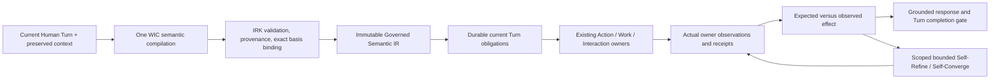

# Intent Realization Kernel

This is the canonical Interaction semantic architecture after the IRK migration.
Earlier WIC/lifecycle documents remain historical architecture evidence. Their
raw-language positive admission and Search routing paths are superseded by this
contract; downstream resource, lifecycle and Human governance checks remain.

## Ownership

IRK owns Human Turn → Governed Semantic IR → current obligations. It does not
own Steering, PWU planning, native execution, Git semantics, Preview runtime,
connector credentials or Human authorization. `IntentOwnerAdapters` are typed
ports to those owners, not agents or language routers.

The normal DeepSeek path performs one semantic compilation. Coalesced response
wording does not become execution truth. A malformed candidate may receive the
existing one bounded structured repair. Direct operations answer deterministically
from owners. General response realization may format already-governed semantics;
it receives no raw current Human text to interpret again. Persisted assessment
and IR identity are reused when an owner is still running; polling is not another
semantic compilation. Transport retries retain their existing separate boundary.

## Contracts and provenance

`SemanticItem` distinguishes operation, production goal, question, analysis,
exploration, design, correction, status, constraint and fact. Every independent
current clause must be represented. Current acquisition and a future unresolved
change are separate items. Creating, switching and creating-and-switching a branch
are distinct canonical operations. Structured operation aliases may be normalized;
Human phrase aliases are not admission authority.

Operational arguments retain individual witnesses. Current Human consent is
independent of an argument cited from an earlier Human record. A model candidate
may propose a bounded retrieval query, but cannot invent repository, branch,
Candidate, manifest or authorization targets. Actual owner observations can bind
one unambiguous exact repository baseline or Candidate. Ambiguity stays unresolved.
A Human source must name an existing Human record and an exact contained span.
An owner source must name evidence in the supplied governed basis.

`observed_facts` contains structured key/value claims. Each key and value must
match the exact referenced observation. A valid citation does not promote model
wording into repository reality. Engineering Semantic Truth remains the fact
owner; new facts additionally retain IR identity and typed witnesses. Historical
facts keep their original provenance without fabricated new origins.

## Current obligations

Operational arguments use closed contracts for the qualified owner adapters.
Unconsumed fields are rejected before persistence or dispatch. Branch targets
are local names, and creating a new target requires literal Human provenance;
an observed existing branch cannot supply authority for a new branch name.
The exact revision/tree bound by IR travels through the durable intake request.
The Asset owner and local Git provider check it before any target branch write.
Baseline drift produces retained evidence, not a silently rebased operation.

`ProductionIntent.unresolved_arguments` distinguishes a missing objective,
primary change, or required repository reference from optional implementation
details. Current missing goal arguments block that goal; independent acquisition
can still proceed. A concrete broad business goal remains production intent.

Current Asset observations may differ from historical acquisition receipts.
Refresh requires actual Git ref/revision/tree matching the existing trusted
Runtime pointer. Old intake records remain unchanged. An untrusted drift or
unavailable checkout blocks current readiness while preserving readable history.

Final responses retain independently satisfied owner effects and each remaining
blocked clause. Work admission cannot erase an unresolved Action; that Action
cannot erase actual Work admission. Constraint-only acknowledgements may include
supporting facts without inventing further execution or retrospective history.

IRK creates Action, Work and Interaction obligations only for current effects.
A Work obligation means **admit the current goal**; its satisfaction never means
that production, Work convergence, Human acceptance or delivery has completed.
Current effect dependencies are durable obligation edges. Already-known facts
remain semantic prerequisites without being invented as executable operations.
Unrequested future execution cannot be a prerequisite of a current effect.

Current readiness considers the current effect and its actual prerequisites.
An unrelated future delivery decision does not block current authorized
production. A prerequisite that truly requires Human decision still blocks its
dependent effect. Reversible assumptions cannot grant irreversible authority.

Each obligation carries expected predicates, exact targets/revisions, actual
owner evidence, state, version and refinement lineage. States are PENDING,
RUNNING, SATISFIED, BLOCKED_WITH_EVIDENCE, REQUIRES_HUMAN and SUPERSEDED.
Satisfaction requires proof; prose, a provider success claim and an empty owner
return are insufficient. RUNNING may retain actual owner-running evidence.
CAS updates and persisted prior-state checks prevent stale or terminal replay.
Supersession requires a persisted subsequent Human correction naming the exact
prior obligation in the same Interaction. An undispatched obligation retains
the ledger's `NOT_DISPATCHED` disposition. An already-running effect requires
its owner's cancellation acknowledgement; withdrawal prose cannot erase it.
The replacement obligation remains blocked when that acknowledgement is absent.
Turn completion requires every expected obligation to exist and have a valid
terminal outcome. Blocked completion reports the actual blocker, not success.

Examples: acquisition requires exact source plus ready commit/tree; branch
creation requires actual existence and preserved baseline; switching requires
the observed current branch, including an existing Work's selected binding;
Search requires retrieved evidence for the requested source; Preview requires
READY, served verification PASS and the exact Candidate revision; acceptance
requires the actual Human authorization receipt; push requires exact remote
revision and target branch. A PR cannot silently supply an omitted push request.

## Recovery scopes

Native result claims retain the existing UUID evidence-reference contract.
Malformed provider evidence IDs or output vectors are rejected at inference
validation. A defensive allocation boundary also rejects malformed historical
or direct-port claims, preserves their checkpoints and tool effects, releases
the allocation, and records `UNABLE_TO_COMPLETE`. It admits no result-ready
claim and performs no blind tool replay. This protects the existing Worker
process and downstream Completion/Verification owners.

Turn recovery repairs compilation/schema/provenance against the unchanged
input. Action recovery refreshes actual owner reality against expected effects;
a read refresh is permitted, blind repeated writes are not. Work recovery remains
with existing production/Steering owners. Scoped local recovery never claims
parent Work convergence. Failure observations, parent IDs, attempts and budgets
are persisted. Owner-running Turn polling has a persisted 300 second wall budget;
expiration retains evidence and produces a non-converging blocked outcome.
Changing sessions, Candidate IDs or wording does not constitute recovery.

## Persistence and migration

Migration `20260927_61` adds nullable assessment `semantic_ir` plus
`turn_realizations`, `turn_obligations`, `turn_realization_refinements`.
No old assessment, completed Turn or fact is reinterpreted or backfilled.
Historical `NULL` is returned as `historical_without_ir`. New live DeepSeek
compilation requires typed IR. A legacy typed-port projector supports historical
and declared test compilers; it does not discover omitted actions from text.

The authenticated projection is
`GET /api/interactions/{interaction_id}/turns/{turn_id}/realization`.
It exposes immutable semantics, expected/observed effects and scoped refinement
records. The assessment DTO exposes the same IR, not another interpretation.

## Qualification and limits

Typed design frames belong to DESIGN items. A conflicting advisory root frame
cannot turn a bounded production goal into a product questionnaire. An explicit
`repository_required` goal with an unknown source remains waiting for its source;
it cannot silently become greenfield production in a managed workspace.

The same semantic compilation's fact proposals are retained before source/quote
canonicalization. Engineering Semantic Truth admits and normalizes them; altered
uncompiled claims cannot borrow that witness. Current Work revision observations
are supplied as owner evidence, including for premise correction and status.
Asset child revisions retain their latest actual assessment ancestor; an older
matching goal cannot cover a newer different assessment.

Repository-aware scope validation checks quotes against original Human provenance
and exact repository source, while the admitted paraphrased goal carries meaning.
The canonical IR path does not infer required targets or forbidden areas with
keyword scoring. Deterministic context sampling reads the primary implementation
alongside configured documentation within fixed file/byte budgets. Reading a
source file grants no authority to modify it. Implementation alternatives are
distinguished from materially different business targets by the existing scope
owner, against that evidence.
Business scope summaries cannot be supplied as filesystem write areas. The
typed `allowed_areas` contract validates repository-relative patterns ending
in `/**`; target paths and areas retain literal Human provenance. Invalid
scope shape receives the same bounded structural repair as other IR violations.

Create-only, switch-only and combined Git intents use the qualified Native Git
owner for an admitted Work. The Native contract binds actual branch/revision;
create-only preserves the current branch and switch-only observes an existing
local ref. Resource selection alone is insufficient to report Work binding as
READY: the current Work revision must record the exact repository and revision.
Persisted owner state takes precedence over cached progress. A concurrent binding
cannot be combined with an earlier unbound revision in one status projection.
Create-only materialization preserves both the unchanged current branch and
the newly created local ref in the selected Asset. Copying that already-created
ref from the Native workspace is materialization, not a second branch action.
The admitted Work follows the observed Asset so a subsequent switch-only request
can use its existing ref without remote acquisition or source mutation.

Mixed typed status/questions retain independent owner answers even when a current
action also executes. Compiler deltas remain hidden until semantic admission;
the visible response stream is realized from the governed envelope.
After current Work admission, the response takes a final owner snapshot; earlier
preparatory wording cannot claim the Work remains unadmitted. A constraint-only
Turn acknowledges the immutable recorded constraint and grants no executable
obligation. It cannot invent a retrospective acquisition or delivery history.

Developer metamorphic cases live in `benchmarks/intent_realization/developer-v1.json`.
The semantic runner uses the real configured compiler but executes no owners;
its synthetic context is explicitly labelled and cannot claim real effects.
Public `/app` journeys and PostgreSQL/Git ledger tests supply effect evidence.
Holdout must be generated after a recorded implementation freeze and reported
separately. Failed candidates, harness errors and failed live trials are retained.

Missing `SPG_WEB_SEARCH_API_KEY` blocks real Web Search qualification and
GC-EX-12 only. It cannot stop implementation or the rest of the regression batch.
See [external qualification](external-qualification.md) for separate rerun entry.
This architecture does not claim universal language understanding. Final
qualification must report residual errors and each invariant from actual receipts.
