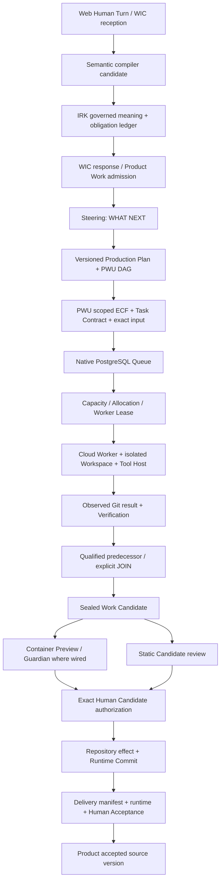

# Watt Systemic Reality / Technical Debt Census

## Current P0/P1 closure — 2026-10-06

**本轮 P0/P1 closure：PASS；SR-001…007 全部 CLOSED，剩余 P0=0、P1=0。**
这是当前单 ECS、默认静态软件路径的有界资格结论，不等于已经执行全部 Full-System Qualification，也不宣称 HA / 新主机灾备。

Census 的纯文档提交 `1231484bfd09f145d88e6d8e6b0f543967e91b14` 已从原 main `5fd6065f6633df2c5bb4dea1ff2bce62c8fcb44c` fast-forward 并推送。
Closure 实现仅在 `codex/p0-p1-system-closure`；main 保持 Census 提交。ECS 资格代码为 `52880f1eb0075a6ed3218abae672de08a2d0434e`，tree `24d2e506fbf9bca7573a5338be8d7dff5b864894`；唯一迁移 head 为 `20261005_68`，直接继承 `20261005_67`。
最终文档/资格收据提交不改变该已验证运行代码。以下 2026-10-05 Census 的“current”属于当时观察；原始历史 JSON 与失败记录保持原样。

本轮精确 IDs、Task/ECF/Verification/Guardian 引用、Git/SQL 晋升、测试及恢复数据见 [closure evidence](../evidence/p0-p1-system-closure-20261006.json)。既有 [Census evidence](../evidence/systemic-reality-census-20261005.json) 未重写。

| Finding | Status | 实现与真实资格 |
| --- | --- | --- |
| SR-001 / P0 | CLOSED | 默认 static Preview 服务 exact immutable Git commit/tree，自动 Guardian；单 PWU 与 Multi-PWU 均经明确 Human 授权、Delivery Acceptance、精确 Product 源晋升。关闭 Guardian、伪造 coverage 和 auto-accept 均未使用。 |
| SR-002 / P1 | CLOSED | 全部 required PWU 的独立 Task/ECF、输入源、Execution、PASS Verification、qualified predecessor 与 JOIN reconciliation；最终同一 Candidate 有 3 个 canonical Guardian PASS，缺任一 owner 结果即阻塞。 |
| SR-003 / P1 | CLOSED | 实际 ECS API 已配置 Aliyun `watt`；正常研究 Turn 返回 13 条来源，Web/GitHub/显式 Fetch 可追溯；部分额外 URL 的 FETCH_FAILED 指标保留。外部参考与项目源 authority 不混用，重启后配置仍有效。 |
| SR-004 / P1 | CLOSED | A Guardian-qualified 且 Human-pending 时，在同一 Workspace 实际浏览器表单发起独立 B；B 获准并由 Worker RUNNING。A 的完整 Work 行哈希、Candidate、Plan、Guardian 与待决定状态保持；B 有独立精确 Work source/ref/Task。未来验收要求不再阻塞当前新 Work；Product 已接受源观察跨焦点切换保留。 |
| SR-005 / P1 | CLOSED | Human ACCEPT 与 durable exact promotion intent 同一 SQL commit；隔离真实 Gitea/PG 的 BEFORE_GIT、AFTER_GIT、BEFORE_SQL_COMMIT 三个 cut PASS。ECS 实际 Gitea 不可用时 503 / PROVIDER_UNAVAILABLE、ACCEPT 保留、intent BLOCKED、版本不动；恢复后浏览器重试完成同一 intent。再重放 3 次仍同一 Acceptance、仅一个新版本。 |
| SR-006 / P1 | CLOSED（本轮单 ECS 范围） | Worker/API/Coordinator/Tool Host/PostgreSQL/Gitea 全部停止与恢复；119 SQL tables / 6897 rows、3572 files、3 accepted Git repositories 的 quiesced cut 在隔离 PostgreSQL/路径重建且精确相等；无恢复 Worker、无新公网端口、未覆盖 live 数据。机器/数据盘损失恢复与 off-host backup 仍未资格。 |
| SR-007 / P1 | CLOSED | 10 个 stale unit mock/expectation 已窄修；legacy integration 改为 RuntimeCommit 不能代表 Product Human Acceptance。Unit 1190 PASS / 3 intentional SKIP；当前唯一受影响 integration cases 108 PASS；UI 96 PASS；四象限与 exact authority 断言保留。无 unexplained failure。 |

### 接受、恢复与资格边界

- 专用单 PWU Work `b11e4aac-001b-5c1f-9744-f27fcc93d1d1`：Guardian PASS、HTTP 200、明确 Acceptance `ec23a52d-a6a3-46fd-a63f-7dbe0feabc56`，Product version 0→1，exact revision `d4ad65db95fa1bb3ad7ec951ea844fd4939c2a3d`。
- 专用 Multi-PWU Work `3ee622b5-b816-5679-afdc-e5de51cd2702`：两个独立 root + JOIN 全部 VERIFIED；三个 own-ECF Guardian PASS；HTTP 三页面 exact revision/tree；明确 Acceptance `f1127996-a72c-45cf-9b94-ba8839ecf3a2`。Product version 1→2，exact revision `b4280990d55ac9da36eaa0dd9644006df7e8762e` / tree `330eb480e850ba9e0a57506db084d9a94ac59562`，远程 Gitea accepted ref 与 SQL 一致。
- Guardian PASS 时 Product 基线不变；候选授权 / RuntimeCommit 与 Delivery Acceptance 不互相冒充。新 Work 使用明确接受的基线：本轮 Multi-PWU 已实际消费单 PWU 接受后的 version 1；隔离恢复测试还验证恢复后下一 Work 的精确 source binding。
- 专用连续 Work B `c3819aa6-f464-59c3-a3dd-2949f038920a` 的资格目标是独立准入与真实进入 Worker；该目标已满足。后续模型在最初三个已提供 `file.write` 的回合未写源码，受 bounded no-progress/diagnostic 约束失败；Steering 保留 Human 决定。未把 B 冒充成功软件成果或改写失败证据；这不是初始工具能力缺失的证明。
- 原八个 Human-pending Candidate 的完整行/指纹与原 authority 相等；未新增它们的授权、接受或拒绝。原 `multi-pwu-v1` 六个资格文件哈希不变。新单/Multi 接受仅作用于专用资格数据。
- 恢复 queued identity 保留，已完成单 PWU 不重复，重复 PWU generation=0；最终 live lease=0、active allocation=0、未完成晋升 intent=0，Worker READY、max_concurrency=1。全恢复后的 Web 状态与 Search 配置可读。
- 恢复实测：backup 40.808 s，既有 Compose 恢复阶段 27.582 s，隔离重建检查 21.754 s；quiesced cut 后无已确认写入，即该 cut 的 observed RPO=0。这不是 SLA、new-ECS RTO 或 off-host DR。
- `/data` 本轮前 2,681,581,568 bytes、资格后 2,966,372,352 bytes 使用，105,088,192,512 bytes 总量，仍约 3%；没有清除历史资源以制造 clean。

### 保留 P2 / Deferred

SR-008 hard quota、SR-009 周期 cleanup/monitoring、SR-010 HTTP/域名/HTTPS、SR-011 无关 runbook/profile 漂移、SR-012 ancillary root-only summary、SR-013 外部 Git clone 可达性继续 OPEN（详见原 C2）。不扩入 Worker Pool、concurrency>1、广泛 replanning/Multi-PWU v2、Admin/组织/租户/计费/Quality 平台。Off-host 备份保管/加密/定时运行及完整机器损失恢复仍为未资格的操作能力。

Protected context 的新增检查只用于有界 exact static targets，按真实源码 witness 和确切 ECF/package 做语义验证，失败/未知保持 fail closed；不是形式化证明或 Guardian 替代品。其他 profile 保留原 typed verification 与既有 protected-context gate。本轮只关闭具备上述实际证据的 findings。

## Census baseline — 2026-10-05 (historical)

本节是当前 canonical 事实基线，取代下方历史快照里的“current”结论；旧审计及原始历史证据原样保留。此任务只做盘点，没有实现修复。**Census 完成不等于 Full-System Qualification PASS。**

| 基线 | 本次观察 |
| --- | --- |
| canonical main / ECS source | `5fd6065f6633df2c5bb4dea1ff2bce62c8fcb44c` |
| tree | `48d10b5e0ef3e758ad9ca4cf8427fd1b44edde0a` |
| migration | `20261005_67`；唯一 head，ECS 数据库一致 |
| ECS | `cn-wulanchabu / i-0jl386xnbauudq5j9jk0` |
| API | non-root UID `10001`；authenticated HTTP `8.130.172.58:8080` |
| 服务 | API、Worker、Coordinator、Tool Host、PostgreSQL、Gitea 均运行；4 个有 healthcheck 的服务均 healthy |
| 当前数据 | 13 Work、29 PWU、31 Attempt、29 queue entries（27 COMPLETED、2 CANCELLED）、52 PASS / 5 FAIL Verification、8 sealed Candidates |
| 接受情况 | 8 个 Candidate 全部等待 Human；0 Candidate authorization、0 Runtime Commit、0 Delivery Acceptance；本节点尚无完整 accepted Product 晋升案例 |
| Managed Source | 1 个 Product source，version 0；13 Work source bases。Gitea accepted ref 与数据库 revision/tree 精确一致 |
| 容量 | production Worker READY，`max_concurrency=1`；旧 qualification-only Worker OFFLINE，不算生产容量 |
| `/data` | 105,088,192,512 bytes 总量；约 2.65 GB 使用，97.05 GB 可用，3%；未构成即时磁盘阻塞 |

机器可读证据和完整检索清单：[本次 evidence](../evidence/systemic-reality-census-20261005.json)。其中保留查询结果、真实浏览器投影、Candidate 指纹、资格文件 hash、每条失败测试分类及 source/test 选择器清单；不含 credential 值。既有 A/B/C/D 证据仍位于 ECS `/var/lib/spg/owner-runtime/qualifications/multi-pwu-v1/`，宿主机对应 `/data/watt/app/owner-runtime/qualifications/multi-pwu-v1/`，本次没有重写这些文件。

**系统结论：**当前默认路径已真实打通 Human Intent → governed Work → ECF/Task Contract → Multi-PWU → PostgreSQL queue/capacity/lease → Cloud Worker → Git 修改/验证 → sealed Candidate。不能将此扩写成当前 ECS 已完成 Guardian → Human Acceptance → Product accepted baseline 全闭环；静态软件的接受路径、Guardian 多 PWU 上下文、Web Search 容器配置是具体缺口。未观察到当前 Candidate 源码/血缘腐坏，也未发现默认执行依赖 Human 笔记本。

## A. System Reality Map

### A1. 实际调用顺序与所有权

“WIC → IRK”不是一次自然语言模型输出直接驱动执行。Web/WIC 接收之后，compiler candidate 先经 `IntentRealizationKernel.govern()` 成为 canonical IR，再由 WIC 构造 progressive semantics / ResponseContract 和 grounded response。生产触发消费 IRK 的 typed ProductionIntent，不从回复文本取得执行权限。



G/D/M 是当前本节点尚未完整资格验证的 seam；图不表示它们已全部成功。Candidate、Candidate authorization、Runtime Commit、Delivery Acceptance、Product accepted source 是不同事实。

### A2. 默认生产链逐段追踪

表内“旁路”是实存接口/测试入口，不代表未授权默认路径。独立服务调用也必须通过其 owner invariant。

| Transition / canonical owner | Persistent SOT | Runtime / Human projection | Fallback / bypass boundary | Tests | ECS evidence |
| --- | --- | --- | --- | --- | --- |
| Web → Turn：HTTP / Interaction | interaction records/messages/turns/response events | authenticated Home / Workspace / SSE | bearer 或 session 同一 actor；`test-only-disabled` 是显式 fixture seam，本 ECS `required` | `test_authenticated_authority.py`、`test_wic_pre_work_interaction.py` | 14 completed Turns；A/B/C/D 从正常 `/api/experience/intent` 提交 |
| Compiler → IRK：IntentRealizationKernel | interaction assessments、semantic envelopes/realizations、obligations | realization API | legacy typed projection 仍兼容；provider candidate 不自带 authority | `test_intent_realization_ledger.py`、`test_wic_governed_work_admission.py` | 持久化 14 realization / 15 obligation；资格 state 含 exact IR identity |
| IRK → WIC：Interaction / ResponseContract | assessment fingerprint + response contract / events | grounded final response、readiness / question | controlled profile 消费 governed IR；legacy WIC 配置不是 ECS default | `test_wic_response_contract.py`、`test_wic_response_contract_status.py` | `WIC_VNEXT_CONTROLLED`；未用 client prose 取代 IRK authority |
| IRK Work obligation → Product/Work：ProductionAdmission / Work | Product、Work、WorkReality、scope、transition | Product / Work projection | direct Work API 可单独测试 admission；greenfield 不需要虚构 existing repo | `test_wic_governed_work_admission.py` | 13 Work；资格 WORK obligations SATISFIED |
| Work → Managed Source：ProductManagedSource / Gitea | product_managed_sources、source_versions、work_source_bases；provider Git objects/refs | accepted version 与 Work source 分开 | 外部 repository intake 需独立权限；不能 fallback 到开发者当前 checkout | `test_product_managed_source_gitea.py` | 13 bases；accepted ref 与 DB 精确一致；来源位于 persistent storage |
| Work → Steering：PostAdmission / SteeringDriver | steering plan/revision/step/decision/history | Agenda / next step / material attention | immediate-production orchestrator 是另一个已声明 Work mode，不是第二 Scheduler | `test_mvp_plan_steering_truth.py`、`test_mvp_app_work_flow.py` | 52 Steering steps；A/B/C/D 正常 admission 后自动推进 |
| Steering → Plan/PWU：ProductionPlanning / Runtime | plan_revisions（version/graph/supersession）+ production_work_units | plan version、每 PWU state | deterministic/refine correction；无意义节点在 Runtime admission 前拒绝 | `test_multi_pwu_planning.py`、`test_multi_pwu_admission.py` | A/C 3 units、B 2、D 1；D-invalid 新 Run/PWU/Attempt=0 |
| Ready PWU → ECF/Task Contract：Work / DecisionContext | scoped CompletionContract、Task Contract、context lineage/fingerprint | 当前输入、blocked reason、verification obligations | no context → fail closed；不降低 freshness 以让 queue 通过 | `test_decision_context_work_admission.py`、`test_decision_context_integration.py` | 多 PWU 各自不同 context fingerprint；30 个 ECF repository Reality 文件 |
| Task Contract → Execution：Preparation / NativeCompatibilityExecutor | contract version、source vector、native binding、execution session/workspace、dispatch | Execution request API | 非 product-bound native compatibility tests 可显式放宽 product context；ECS default enforce | `test_production_execution_runtime.py`、`test_native_executor_runtime.py` | 29 isolated workspaces；实际改动 diff / result evidence |
| Execution → Queue：NativeExecutionRuntime | executor_queue + attempt state/events | QUEUED / CREATED 与 RUNNING 区分 | re-submit 已有 attempt 时复用 durable identity；不产生第二 queue | native lifecycle / nonblocking handoff tests | 当前 29 entries；completed/cancelled 不是 Work accepted |
| Queue → Capacity：scheduler policy / allocation | scheduling metadata、worker registrations、allocations | WAITING_CAPACITY / NO_COMPATIBLE_WORKER / assignment | PostgreSQL 是真实 queue；没有外加 DAG scheduler 或 broker | `test_capacity_scheduling.py`、`test_capacity_scheduling_policy.py` | parallel-ready roots 被有限容量串行执行；不是 concurrency>1 资格 |
| Allocation → Lease：NativeExecutionRuntime | allocations、executor_leases、epoch/token fencing | assigned/active allocation | expired worker/effect UNKNOWN 必须 reconcile，不能无脑重跑 | allocation race / worker loss tests in `test_native_executor_runtime.py` | 29 released allocations；restart proof 无重复 Execution |
| Lease → Worker/Workspace/Tool：Worker + Tool Host | exact source member、workspace manifest、tool receipt/checkpoint/evidence | Worker READY/BUSY；Execution running | local Docker-backed Tool Host 是当前 ECS 支持路径；Landlock/跨主机不是该 profile proof | `test_native_executor_runtime.py`、tool provider tests | Cloud Worker 真正 model/tool/Git execution；API 不执行未治理 Human prose |
| Source changes → qualified result：Worker evidence + Watt Verification | changed-file diff、proposed snapshot、CompletionEvaluation、Verification、admissibility | technical PASS / FAIL | result-ready 是 claim；独立 Verification 仍检查 exact subject、scope、obligations | `test_s3b_verification_satisfaction.py`、production worker tests | 52 PASS / 5 FAIL 都保留；D 有真实 Node test 结果 |
| Predecessor → dependent/Join：Runtime / GitJoinReconciler | exact qualified output baseline、parent IDs、reconciliation evidence | dependency-blocked / join integration / conflict | 不从日志猜 source；机械 Git reconcile 后仍需独立 verification | `test_multi_pwu_runtime.py`、`test_qualified_clone_baseline.py` | B child input=qualified A result；A/C 明确 JOIN；所有 sealed Candidate 满足全 graph |
| Full graph → Candidate：Governance | immutable Candidate fingerprint / satisfied IDs / verification refs | exact preview / Human attention | 一个 Execution 完成不足以 seal；required failed/cancelled node 不被忽略 | `test_multi_pwu_runtime.py`、`test_s3c_candidate_governance.py` | 8 sealed Candidates 所有 required unit 都在 satisfied lineage 中 |
| Candidate → Guardian：Preview / GuardianAssuranceClient / Guardian | file-backed preview versions、governed requirements、Guardian-owned request/result/findings、Watt gate projection | quality gate / repair state | only FRONTEND/FULL_APPLICATION READY preview 自动 assess；STATIC 不进入该分支；REQUIRED gate 不伪造 PASS | `test_guardian_assurance_adapter.py`（mock owner）、`test_owner_default_wiring.py`（真实 ECF）、既有 Guardian qualification | owner installed；本节点 0 preview / requirement / finding / result 文件；SR-001/002 |
| Candidate → Human authorization → repository effect：Work/Governance/Integration | exact authorization、repository effect ledger、Runtime Commit | Actions / authoritative source effect | lower-level APIs 有 exact fingerprint/currentness/CAS；adapter OFF 测试不证明 REQUIRED flow | `test_s4a_repository_integration.py`、`test_s4b_runtime_commit.py`、software-delivery tests | 本节点 0 authorization / Runtime Commit；保持 Human-pending，未模拟授权 |
| Delivery → Human Acceptance → Product baseline：Delivery / ProductManagedSource | manifest/acceptance、source version / accepted pointer；Gitea ref CAS | Deliverable / accepted Product version | document acceptance 不需要软件 runtime；软件接受需要 exact runtime/Guardian；不是 Worker auto-accept | `test_software_delivery.py`、`test_work_delivery.py`、`test_product_managed_source_gitea.py` | current node 0 manifest/acceptance；隔离测试成功不消除 REQUIRED ECS 静态 seam 缺口 |

上述源码入口分别见 [HTTP](../../src/spg/api/http.py)、[Interaction](../../src/spg/application/interaction.py)、[admission](../../src/spg/application/production_admission.py)、[Work](../../src/spg/application/work.py)、[Runtime](../../src/spg/application/runtime.py)、[Native Runtime](../../src/spg/application/executor_runtime.py)。测试名除另列者均在 `tests/integration/`；它们证明的是声明的场景，不自动升级为本 ECS live proof。

## B. Capability Matrix

“默认”表示正常 API/Work wiring，不表示每个 Work 都应该触发每个可选能力。ECS 资格限定本次目标；已在旧目标/本地 qualified 的能力单独列明。

| Capability | Implemented | Default-path integrated | Persisted | ECS-qualified | Human-visible | Known gap |
| --- | --- | --- | --- | --- | --- | --- |
| WIC / IRK | YES | YES，controlled | YES | YES 到 Work/Candidate | YES | Workspace 复用 active interaction 的新 Work 路径受待决定事项限制 |
| Product / Work / Steering | YES | YES | YES | YES | YES | 最终 acceptance 闭环未在当前节点完成 |
| Production Plan / PWU DAG | YES | YES | relational units + versioned graph | A/B/C/D REAL_PASS | YES，真实浏览器 | conservative/all-required；不宣称 broad replanning |
| ECF Decision Context | YES，独立 owner adapter | ready PWU/Task 必需 | Task lineage + file Reality | YES，scoped exact predecessor | fingerprint / blocked facts | 最终 Guardian adapter 尚未覆盖多 PWU context aggregate |
| Task Contract / execution context | YES | YES | YES | YES | projected / advanced evidence | 缺 context fail closed；mock 测试需跟随 typed contract |
| Managed Source / Gitea | YES | greenfield 默认 | PostgreSQL identity/version + provider Git | accepted/current bases YES；新 acceptance seam 未 live | accepted source / code download | Git/DB promotion crash-cut proof、browser clone endpoint |
| Search / Retrieval | YES | Interaction read-only research，非每 PWU 强制调用 | Turn evidence/provenance | ECS GitHub/Fetch PASS；Web FAIL 配置 | cited results / truthful failure | Aliyun 本地 live PASS，但 ECS default Brave/no key |
| SemanticReferenceRole | YES | research source routing | semantic facts / provenance | 随既有 Search L1–L7 qualified；未在 ECS 重跑全 campaign | answer grounding | PROJECT_REPOSITORY 不由语言/URL 外形猜；EXTERNAL_REFERENCE 不成为生产 source |
| Execution queue / Capacity | YES | YES | PostgreSQL | YES | truthful waiting/running | concurrency=1 intentional |
| Worker registry / leases | YES | YES | identity/capacity/heartbeat/fencing | YES，restart proof | API / Workspace | cross-host pool 不 qualified |
| Cloud Worker / Tool Host | YES | YES | receipts/checkpoints/evidence | real modifications PASS | aggregate + advanced detail | single-host local Docker/mount topology |
| Workspace isolation / resource limits | YES | YES | workspace/source/budget identity | YES | blocked/runtime evidence | bounded checks 不是硬文件系统 quota |
| Verification | YES | completion/sealing gate | exact verification records | YES | technical PASS/FAIL | 不把 source PASS 等同浏览器 business PASS |
| Guardian | YES，owner runtime installed | conditional preview assessment；software Acceptance required | file-backed owner result + gate projection | current node NOT_EXERCISED | quality summary | SR-001/002；不应再说 Guardian 只有 admit/get，但也不能说所有 Candidate 已 assurance |
| Candidate sealing | YES | YES，全图 | immutable fingerprint | YES | exact static preview / diff / actions | technical Candidate 不等于 accepted Product |
| Human Acceptance / Product promotion | YES | endpoints/owner guards wired | YES | 当前节点 NOT_EXERCISED；隔离 PostgreSQL/Git tests PASS | forms/actions | REQUIRED 静态软件闭环 SR-001 |
| Cloud Delivery / Host Bootstrap / Network Exposure | YES | accepted Deliverable 后 conditional governed flow | schema / receipt payloads | 旧 Hong Kong live target PASS；当前节点无 Cloud Connection/Deployment | delivery surface | ECS API 无 Aliyun service keys；当前环境未激活，不自动等同实现缺失或 old live FAIL |
| Watt Web | YES | actual `index.html` → `experience.js` | owner-derived state | A/B/C live read-only PASS | YES | limited acceptance/provider activation；legacy app.js 不是主入口 |
| Native retention / Preview retention | YES | API/owner controls；非周期自动 GC | pins/actions/archive/tombstone | covered bounded tests | advanced operations | 未安装统一自动清理和磁盘告警 |
| Backup / machine-loss recovery | operational design | 未证明 repository 安装了生产 backup job | local persistence YES | container restart YES；新 host restore 未证明 | operations docs | off-host consistent DB+Gitea+file restore 未 qualified |

### B1. Guardian 精确结论

- [bootstrap](../../src/spg/application/bootstrap.py#L340) 和 [HTTP wiring](../../src/spg/api/http.py#L273) 在 `owner_runtime_mode=REQUIRED` 安装 intake、`JsonSoftwareAssuranceStore`、preview assurance、acceptance guard；不是测试里才存在接口。
- [assess_ready_preview](../../src/spg/application/guardian_assurance.py#L101) 读取 exact Candidate 的 Verification refs、Task lineage、governed business effects，提交 Guardian-owned request，持久化 findings/result；Watt 只保存 gate projection。
- 默认 trigger 在 [Candidate preview advance](../../src/spg/application/candidate_preview.py#L509)。[prepare_review/review_ready](../../src/spg/application/candidate_preview.py#L91) 只要求容器型 frontend/full-app candidate 的该流程。7 个 ECS static Candidates 未被送入 Guardian；另 1 个无 runtime preview mode。
- Completion/Verification/Candidate sealing 是技术资格，Guardian 主要 gate exact Candidate authorization（容器型）和软件 Delivery Acceptance；两者不是同一个概念。[Delivery.decide](../../src/spg/application/delivery.py#L550) 的软件 ACCEPT 无 Guardian PASS 会拒绝。
- requirements 仅从 `POST /api/works/{work_id}/guardian-assurance/requirements` 入库；未找到 default Turn/Work 自动绑定者或主 Web form。所测 ECS requirements/results/findings 都是 0，不代表 Guardian provider 本身坏了。
- Multi-PWU adapter 仍取 binding 的根 Task；本 ECS 四个多 PWU Candidate 的根 fingerprint 都不在 final Candidate verification fingerprint 集合中。它会将相关保护义务标成 `GUARDIAN_REQUIRED`，不会错误宣称已 COVERED。缺少默认全图 handoff proof 是 SR-002。
- Guardian 没有与 Watt Verification 争夺同一事实：Watt owns exact engineering verification/admissibility，Guardian owns independent observed business/protected-context assurance。真正风险是 handoff coverage/activation，不是应该合并两个 owner。

### B2. Search 精确结论

[默认 wiring](../../src/spg/application/bootstrap.py#L418) 支持 Aliyun / Brave、GitHub、bounded direct Fetch；[research owner](../../src/spg/application/external_research.py) 在受治理 read-only Turn 内执行、保存 provider/query/URL/rank/time/stable evidence identity，并区分 snippet 与 inspected content。typed `SemanticReferenceRole` 和 governed research actions 参与 project context routing；reference 不授予 repository write。

本次分别观察：

1. 本地现存配置 `aliyun-opensearch / watt / ops-web-search-001`：一次最小真实调用 PASS，返回 1 个含 provider/URL provenance 的结果。
2. ECS API `web_search_provider=brave`、workspace=`default`、Aliyun endpoint/key 和 Brave key 均缺：一次 configured-provider 调用返回 `CREDENTIAL_REQUIRED`，未发送 Web Search HTTP。
3. 同一 ECS：GitHub public repository Search 返回 1 个结果；`https://www.python.org/` direct Fetch 成功。私有/受保护 GitHub code search 无 token，不能据此 claim qualified。
4. Compose 没有传入 Search 配置字段；只在 Human 本地 `.env` 有 key 不会启用 ECS app。**这是 SR-003 的部署 wiring 缺口，不是阿里云服务仍处于旧 BLOCKED_EXTERNAL。**
5. 既有 [Search live qualification](../operations/web-search-live-qualification.md) 的 L1–L7 / GC-EX-12 11/11 保持有效，但目标环境不同。本次 provider probe 不冒充新的完整 ECS Search→Fetch→synthesis Turn 资格。

## C. Findings

所有条目是 census finding，closure 尚未实施。`risk/proof gap` 明确区分于已经发生的数据损坏；P0/P1 不包含新功能愿望。

### C1. P0 / P1

| ID / severity | Owner/module | Observed Reality | Expected Reality | Evidence | Consequence | Bounded closure scope |
| --- | --- | --- | --- | --- | --- | --- |
| **SR-001 / P0** | software Delivery / Preview / runtime composition | ECS 7 static Candidates；static 不进入 container Guardian review；software ACCEPT 仍 required Guardian；static Delivery runtime disabled，旧 adapter URL 为 API-local loopback | 支持的默认静态软件 Work 有可达、exact served、assured、Human-authorized 的最终接受/晋升路径 | `candidate_preview.py:91,183,240`；`delivery.py:564`；`software_runtime.py:87,105`；evidence candidate_modes/config，0 current-node acceptances | 默认软件生产能 seal，但无法完成正式接受；并非 wrong code 已被接受 | 把既有 static runtime/assurance/acceptance seam 接通并验证，保持 exact authority 和 Guardian 门禁；不能用关闭 Guardian / auto-accept 绕过 |
| **SR-002 / P1** | Guardian adapter + Work context handoff | business effects 只有专门 REST binding；default Work 未生成；adapter 选 root Task，4 个 multi Candidate 的 final verification context 与它不一致 | 从已治理目标绑定 applicable assurance effects；final Candidate 的相关 PWU context/evidence 精确归属可证明 | `guardian_assurance.py:70,130,143`；`http.py:2486`；ECS 0 requirements/results；owner_seams fingerprints | full-app 默认 review 可阻塞；multi-PWU qualified context 不能被当前 adapter 当已 COVERED | 使用既有 Task/Verification/Guardian contracts 做 bounded admission/aggregation；保留缺 coverage fail closed；覆盖 serial+JOIN final Candidate，不重设计 Guardian/ECF |
| **SR-003 / P1** | Cloud runtime deployment config / Search | 本地 Aliyun live PASS；ECS 默认 Brave/no key；compose 没有 Search env wiring | 已 qualified 的 provider 配置进入实际 ECS API，受治理 Search Turn 可工作 | `deploy/cloud-worker/docker-compose.yml`；`bootstrap.py:426`；本次 local/ECS probes | 用户在当前产品请求 Web research 会失败，不能把 Fetch 当 Search PASS | 窄配置传递、secret references 与当前 ECS 一次 governed Web+Fetch+provenance probe；不扩 Search domain |
| **SR-004 / P1** | Product Workspace / Interaction / Work formation | 现有 interaction 固定 current Work；有 pending decision 时普通输入沿 current context 分支，不形成独立 Work；Home 新 interaction 路径可避开 | 同 Product 新 bounded Work 的意图能被治理，不被旧 Work pending choice 误吞；旧 choice 不丢失 | `production_admission.py:607`、`interaction.py:2999`；既有 accepted known finding；census 未提交新 Turn 重演 | 真实连续使用 Workspace 的用户可能不能开始下一件事项 | 修正 new-work vs answer-current-decision 的 canonical routing seam；保留现有指纹/attention 和布局，增加双 Work 场景，不做 Workspace redesign |
| **SR-005 / P1 (recovery proof gap)** | Managed Source acceptance promotion | Gitea push 发生在 PG acceptance/version commit 前；provider 同 exact revision 重放是 idempotent，当前 refs/DB 完全一致；未找到 commit-cut 的持久化恢复资格 | crash 在 external ref success 与 PG commit 之间可安全重放/对账，后续 Work 不使用未解释的 source 状态 | `product_managed_source.py:227`、`managed_source_provider.py:247`、`delivery.py:589`；current accepted_source_checks PASS | 中断窗口可出现暂时双 Reality；本次没有观察到现存 corruption，不能忽略该未资格 seam | 先隔离注入该 cut、证明 exact replay/拒绝冲突；仅在证明缺恢复后补既有 owner reconciliation；不创建第二 accepted SOT |
| **SR-006 / P1 (durability gap)** | operations / Data / Gitea / file-backed owners | 单 ECS persistent volume 与重启已 qualified；仓库只有 off-host backup/restore 设计，没有新 host 一致性恢复 proof；Gitea/owner JSON/receipts 都是必要恢复数据 | 明确一致性切面、备份范围、失败域、restore/fencing proof；不以 PostgreSQL alone 或 Git code remote 代替运行数据备份 | `docs/architecture/operations.md`、`data-lifecycle.md`；当前 file stores/Compose volumes | ECS/数据盘损坏可能丢 Product/Work/source/evidence；本次未审计账号外部 snapshot，不能断言云端绝无备份 | bounded DB+Gitea+referenced-file 备份/新 host restore 资格与 owner recovery；不引入 speculative infra/HA |
| **SR-007 / P1 (test gate gap)** | regression / contract fixtures | 10 个 unit 持续失败；另 1 legacy integration 失败；worker recovery 等 mock 因缺新字段，在原断言前报错；缺 REQUIRED ECS 静态 acceptance / multi Guardian 集成测试 | regression gate 真正覆盖当前 production contracts；历史路径/环境问题有 explicit selector/classification | C3 exact test list；unit XML summary / native full 66 PASS / integration seams | 旧 core tests 给不出 recovery/authority assurance；isolated owner-OFF delivery PASS 不能证明 REQUIRED 产品闭环 | 窄 fixture/expectation 对账 + SR-001/002 seam tests；不大批重写 assertions、关闭 gate 或修无关实现 |

### C2. P2 register

| ID / severity | Owner | Observed / expected | Evidence / consequence | Closure scope (not immediate) |
| --- | --- | --- | --- | --- |
| **SR-008 / P2** | execution resource governance | runtime/log/artifact/observed-workspace limits 已有；无 filesystem hard quota。期待写入前的可靠空间边界，而非仅执行后检查 | `production_evidence.py`、`worker.py`、cloud-worker-runtime doc；当前盘 3%、concurrency 1，无即时容量失败 | 以真实 disk pressure 选最小 quota/guard 资格，不把目前检查虚称 hard quota |
| **SR-009 / P2** | retention / disk operations | pin-aware archive/cleanup API 和 Docker cleanup script 已有；未证明周期 GC / alert 在节点安装。期待有受保护引用的自动治理 | `native_retention.py`、`http.py:2374`、`cleanup-docker.sh`、data-lifecycle；持续使用会累积文件/镜像 | 受引用约束的定时执行和 disk metrics；不能 age-only 删除 pending Candidate |
| **SR-010 / P2** | ingress | temporary HTTP 8080；没有 domain/TLS/production ingress。当前是明确接受的 test-node boundary | Compose/public health；不能称生产 HTTPS，公网 credential 通道仍 HTTP | 既定 later domain/HTTPS/production ingress task；不在 census 改 SG/nginx |
| **SR-011 / P2** | architecture / runbook | canonical docs 多处把历史 profile 当 current；health.sh 仍测 host 8000（实测 000），而 8080=200；省略 Gitea | C7 drift table；操作员可能误判当前 healthy runtime；本文给出 current source 取代旧说法 | 窄 current-state/runbook reconciliation，保持历史 evidence；不重写全部 architecture |
| **SR-012 / P2** | compatibility summaries / observability | `ProductStore.runtime_summary` 的 attempt/artifact/verification 是 binding root 的旧摘要；当前 Work graph/PWU projection 与 Candidate 全图读取已另聚合 | `product_store.py:447`、`product_experience.py:136`、`measurement.py:675`；旧 advanced consumers 可能只展示根事实，未发现据此错 seal/accept | 将 root-only summary 明确命名/覆盖边界，逐 consumer 资格；不另建 Work/PWU status SOT |
| **SR-013 / P2** | Managed Source Human export access | ECS `managed_source_public_endpoint=http://gitea:3000` 为容器 DNS；当前 source ZIP/API 路径独立可用，clone URL 不能当 Human 外网可达 | `managed_source_provider.py:271`、Compose；源码 API export 不等于远程 Git clone 资格 | 明确内部 provider endpoint 与 Human clone 可达性/授权；暂不开放 Gitea 端口、改 DNS 或发放凭证 |

每个 P2 的现状/期望、证据、后果、closure 均在本表明确；无即时 P0 的磁盘耗尽或 quota breach 被观察到。

### C3. Test Reality — exact failure reconciliation

本次执行全 **unit collection**（排除 integration）和 96 个所列 integration seam；不是所有 integration files，也不是重跑 live deployment。JUnit summary 已压缩写入 evidence，不提交完整可能含运行参数的日志。

| Run | Observed result | Interpretation |
| --- | --- | --- |
| 全 unit，初始 shell env | 1,158 PASS / 14 FAIL / 3 SKIP（1,175 tests） | 4 FAIL 属环境；10 FAIL 持续 fixture/expectation debt |
| 四个 exact 环境失败复核 | 4/4 PASS | 仅配置 runner `PYTHONPATH=src:../guardian/src:../engineering-context-fabric/src`、venv PATH，无源码/mock 变更；没有把第二次 4 PASS 算四个新 tests |
| Full Native Executor integration | 66/66 PASS | 本次完整文件通过；不能笼统声称“Native integration 仍有五个失败” |
| Owner/default wiring + software delivery + work delivery | 13/13 PASS | 真实 PostgreSQL/Git；软件测试的非 REQUIRED 配置/可启用 loopback runtime 与 ECS profile 有差异 |
| Measurement + Search + Product attention integration | 16 PASS / 1 FAIL（17 tests） | 下表 legacy Product source assertion；其余 graph economics / external research / attention PASS |
| 同 exact main 前次 bounded Multi-PWU integration | unit 74、integration 34、JS 88（含 quadrants 5）PASS | 本次 doc-only census 未失效；A/B/C read-only real browser 又 PASS，无 page JS errors |

10 个持续 unit failures：

| Exact test | Classification | Evidence / reason |
| --- | --- | --- |
| `test_container_production_environment_provider::test_native_tool_command_binds_workspace_python_imports` | stale fixture/mock | `SimpleNamespace` 无 `max_log_bytes`；real ToolOperationRequest 有 typed budget |
| `test_container_production_environment_provider::test_native_test_command_rejects_unexpanded_targets_before_execution` | stale fixture/mock | 同上；失败在 output encoding budget 读取，不能推导生产环境 command expansion 坏了 |
| `test_native_executor_contracts::test_native_queue_and_controls_are_human_visible_without_claiming_trust` | stale test | 断言主 index.html 的旧 queue/control DOM ID；实际入口已为 experience.js，旧 app.js 不载入 |
| `test_native_executor_contracts::test_worker_releases_lease_when_provider_decision_is_not_admissible` | stale fixture/mock | mock Runtime 缺 `enforce_product_context`，未到 lease release assertion |
| `test_native_executor_contracts::test_worker_retries_response_unknown_without_discarding_checkpoint` | stale fixture/mock | 同一 mock 缺字段，未到 checkpoint retry assertion |
| `test_native_executor_contracts::test_worker_rejects_incompatible_checkpoint_before_provider_or_tool_recovery` | stale fixture/mock | 同一 mock 缺字段，未到 checkpoint compatibility assertion |
| `test_native_executor_contracts::test_worker_parks_quota_failure_with_checkpoint_residual_work` | stale fixture/mock | 同一 mock 缺字段，未到 quota/residual assertion |
| `test_persistence_foundation::test_alembic_environment_has_native_executor_head` | stale test | 固定 `20260928_62`；actual head=`20261005_67` |
| `test_wic_side_question_routing::test_typed_scope_constraints_answer_exact_pending_work_question` | stale fixture/mock | active context SimpleNamespace 无 `pending_human_question_decision_id`；real ActiveWorkContext 字段存在 |
| `test_wic_side_question_routing::test_constraint_answer_linked_to_current_production_does_not_require_duplicate_scope_fact` | stale fixture/mock | 同上，不是 production typed context AttributeError |

另一个持续 integration failure：`test_dcp2_production_measurement::test_p1_q1_product_current_source_advances_from_authorized_runtime_commit`。分类为 **unsupported legacy path / stale fixture expectation**：通过 SQL 种下非 Managed Source Runtime Commit 后，期待旧 asset attachment metadata 的 `a…` 自动成为 `b…`。当前 default Product accepted source 从 `product_managed_sources/source_versions` 与 Delivery Acceptance 晋升；fixture 没有这些 SOT/Acceptance。不能修成“RuntimeCommit 自动接受 Product”以满足它。旧 non-managed `current_sources` 命名与导入快照语义仍有 SR-011/012 风险；若未来声称支持该 legacy continuity journey，必须明确资格，而非跳过 assertion 冒充成功。

环境问题的 exact 四例：`test_decision_context_integration::test_guardian_receives_only_exact_covered_context_evidence`、`test_guardian_assurance_adapter::{test_watt_binds_governed_effect_and_consumes_exact_guardian_pass,test_missing_scope_and_candidate_change_fail_closed}` 缺 owner import path；`test_git_operation_recipes::test_connector_resolved_native_git_operation_changes_isolated_workspace` 缺 `python` PATH。4/4 环境复核 PASS。

三 skip 分别为 `test_brownfield_delivery_vertical_slice::test_real_repository_container_preview_delivery_and_reality_refresh`、`test_native_production_environment::test_native_executor_runs_tools_through_real_production_environment`（旧 qualified image `watt-engineering-semantic-human-retest-app:latest` 在本机不可用）及 `test_release_evaluation_gate::test_p1_q7_versioned_release_evaluation_compares_qualified_baseline`（unit runner 没有 test DB env）。均为 **environment-only issue**，不是 PASS；不为 census rebuild 旧镜像。Root autouse `SPG_AUTH_MODE=test-only-disabled` 表示不少历史 tests 并非 authenticated production-profile proof；独立 auth tests 和 actual ECS `required` 事实需要同时保留。

关键缺测 seam：REQUIRED static software acceptance、normal admitted Guardian effects、Multi-PWU final assurance scope、Gitea-push/PG-commit crash cut、off-host DB/Gitea/file consistent restore。它们是 closure qualification 要求，不能用 mock Guardian PASS 或技术 Candidate sealing 顶替。

### C4. Multi-PWU legacy assumption inventory

AST census 收集 **216 个源码选择器/单数约束位置、814 个测试位置**（合计 1,030，包括专门补列的 Guardian root Task selector）；逐条 file/line/function/expression/classification/reason 在 evidence。统计是语法 occurrence，不是 1,030 项债。一般 string/tuple parsing、排序首项、单 fixture index 归类为合法单项/结构位置；没有以“出现 `[0]`”自动判断为缺陷。主要涉及生产所有权的位置人工核对如下：

| Occurrence | Classification | Reason |
| --- | --- | --- |
| `RuntimeStore.work_unit_for_run` / root Work binding / `runtime_summary` | harmless legacy code / SR-012 projection gap | 当前 DAG execution/sealing 遍历 `work_units_for_plan`，root compatibility pointer 不代表唯一 PWU |
| Guardian `binding.work_unit_id` Task selection | **production defect SR-002** | 当前 final Candidate verification 与根 context 实测不匹配；不宜以第一个/root Task 代表全图 assurance |
| `NativeProductionRecordService` root Task reference | harmless legacy code, owner handoff gap | 全 Work Git diff 和所有 Candidate Verification refs 已 aggregate；顶层 Task ref 仍 root identity，不能视作每个 PWU 的上下文 proof；current node 无 post-authorization owner record |
| `measurement._candidate_lineage` 的 `bindings[0]` | legitimate single-item invariant | 先验证所有 bindings 属同一个 Work/run；graph economics 遍历全部 PWU；多 PWU measurement 的 pwu_id 可以为 None |
| `measurement` 单 Authorization/Effect/币种 | legitimate single-item invariant | one exact Candidate authority / effect identity，或 currency ambiguity fail closed；不是一个 Work 只准一次 Execution |
| `production_evidence` source vector len=1 | legitimate v1 invariant | 每 PWU 一个 exact writable repository；多 PWU 同 Work 受支持，跨 repository/cloud-host routing 未 qualified |
| `steering_production` admitted artifact len=1 / domain SemanticProductionProposal | legitimate bounded documentation invariant | one documentation artifact/one approved design entry；CODE_WORK 使用 exact targets/DAG |
| `GitJoinReconciler` first parent | legitimate ordered topology | 以第一个 parent 起点，然后固定顺序 reconcile 剩余 parents，并非丢弃它们 |
| rule-based change provider primary source/test / old brownfield first repo helper | harmless legacy code / conservative capability | 有 admission scope/coverage fail-closed；不能据此 claim arbitrary free-form multi-repo planning |
| `OnePwuFitClassification` / `MULTI_PWU_REQUIRED` legacy no-graph path | legitimate compatibility status | 不支持的旧 draft fail refinement；当前 valid graph 使用 MULTI_PWU_FIT；不是默认 exactly-one invariant |
| 旧 queue-control DOM 与固定 migration test | obsolete test assumptions | 见 C3；不是应该恢复旧 UI / migration 的依据 |
| `src/spg/web/app.js` 主 HTML controls expectation | dead code for primary Web entry | source 文件仍供 legacy/advanced consumers，主 index 不加载它；不主张删整个文件 |

没有在当前 DAG admission、capacity dispatch、completed_graph 或 Candidate sealing 找到强制全 Work `PWU count == 1` 的默认 production rule。现存 root-based ancillary selectors 是真实遗留，不应因为主链 PASS 而消失在 census。

### C5. Engineering Truth / double-SOT / persistence

| Pair / seam | Current owner boundary | Verdict |
| --- | --- | --- |
| Product accepted source vs qualified predecessor | accepted version 在 Product managed source；qualified result 只使 successor eligible，Task scoped exact input 不移动 accepted ref | 当前 ECS DB/Gitea accepted revision/tree 一致；A/B/C/D qualified revisions 均非自动 Product acceptance，正确 |
| Work condition vs Work projected status | admission `READY` 是 Work record condition；RUNNING/BLOCKED/NEEDS_ATTENTION derived from Runtime/Steering/current revision | 13 persisted READY 不代表都可以执行；不是两个 owner 随意写同一状态 |
| PWU vs Queue/Execution | PWU qualification/dependency 属 Planning/Verification；queue COMPLETED 是 executor outcome，Worker READY 是 capacity | Runtime graph 和 capacity 不重复 decomposition；completed queue 不直接 seal Work |
| Repository HEAD vs exact source basis | HEAD 必须匹配绑定基线；dependent 从 exact qualified commit checkout，原 accepted ref 不动 | 当前 ECS 与既有 clone/ECF regressions PASS；“latest main”不提供执行权 |
| Candidate vs Workspace files | Candidate commit/tree immutable，preview reads exact Git object；工作区可变不能替代 sealed identity | browser review / delivery hashes 与 source tree guards；未发现当前 Candidate 被工作区文件偷偷替换 |
| Verification vs Guardian | 独立 technical verification 与 independent assurance 是不同 subjects | 无证据表明重复 truth owner；SR-002 是 root context handoff 缺口 |
| Gitea promotion vs PostgreSQL source version | remote Git CAS 与 SQL commit 不是一个事务；exact repeat idempotent | **双 Reality 恢复窗口 SR-005**；现存 provider/DB match；不能宣称已证明 every crash cut |
| JSON owner stores vs PostgreSQL | ECF/Guardian/preview file-backed truths 有各自 identity、Watt SQL 存 references/projections | 合法跨 owner persistence；backups 必须覆盖两者；不是 PostgreSQL alone 足够恢复 |
| Web projection vs source authority | primary Web 从 owner API读取；DAG execution aggregate 与每个 unit detail 独立呈现 | 当前 A/B/C 浏览器一致；root-only advanced summaries 和 blocked-preview通用文案不等于完整 Human blocker diagnosis |

本次没有找到“两个模块可以各自授权同一 Candidate”或现存错误 baseline 已被接受的证据。不能把这个结论扩大为任意 fault cut 的系统完整性保证。

Restart/recovery 覆盖分层：

- **API / Worker / Coordinator**：既有 A safe-point restart 使用 `t-wl06z4e6h834xz4`；同 Plan/unit/attempt identity，completed roots 未重复，waiting JOIN 继续；当前 PG queue/fencing/checkpoint owner 仍 authoritative。
- **Tool Host**：receipt spool 和 fenced tool-effect/checkpoint contracts 已有本次 full Native integration proof；没有为 census 实际杀死主机上的 tool process。已 issued external effect 无法判定时保持 UNKNOWN/reconcile，不能宣传 unrestricted exactly-once。
- **PostgreSQL / Gitea**：当前 Compose persistent volumes；已有 container recreation/state survival；本次只读 ref/DB/lineage。不存在证明全 ECS/data-disk loss 后所有 file-backed Truth可恢复的证据。
- **Candidate lineage**：8 个 Candidate 的 satisfied IDs 包含其全部 required units；fingerprints 与原资格快照一致。当前节点 0 authorization/commit/acceptance 意味着 Human authority 仍未被代行。
- **API 内存任务**：Interaction/Steering 异步 handles 在 API 内存，但 Turn/Plan/Step/queue 是 durable，startup `resume_pending_turns` / `resume_*eligible_works` 恢复；当前单 API 支持，不扩写为多个 API replicas 的生产资格。

### C6. Local-machine dependency audit

| Dependency | Development workflow | Default ECS production runtime | Verdict |
| --- | --- | --- | --- |
| Human laptop / browser / Codex | Codex 调查、修改、提交代码；浏览器提交 Human Turn / 决策 | 已提交 Turn、Plan、queue、Worker execution 和 Evidence 由 ECS 上的 owners 持续推进；已有 safe-point restart proof | 没有发现客户端休眠会撤销已受治理执行的依赖；等待 Human 决策是 authority boundary，不是必须保持客户端进程运行 |
| Local `.env` / cloud authorization | 本地诊断 runner 使用已有 Cloud Connection 的 role / ExternalId；本地 Search 已配置 Aliyun | ECS API 使用自己的 runtime 配置；当前 Search keys 缺失（SR-003），Cloud Delivery credentials/connection 未激活 | 本地探测成功不能代替 ECS wiring；不能把诊断用 credential 视作当前 ECS 已拥有 |
| Developer Git checkout / local branch | 开发迭代和 qualification 使用 exact source commit；直接 Codex→ECS 是已批准开发方式 | 执行从 Managed Source / exact PWU input checkout；ECF 的 canonical 架构文档来自部署 source/owner bundle | 未发现生产执行读取 Human 笔记本 checkout；部署 source 是固定服务依赖，不是开发者当前 HEAD |
| Filesystem / Docker / Tool Host | 本地 fixture 可用本机 Docker；与 ECS proof 分开 | Workspace、JSON owner evidence、receipts 和 Gitea 存在 ECS persistent volumes；Tool Host 使用当前 ECS Docker/mount topology | 是当前 single-host Execution/Data runtime 依赖；不可误称“无本地文件系统依赖”，也不可误称 Human laptop 依赖。跨 host 与机器丢失恢复仍未 qualified |
| API in-memory task handles / software preview | 本地测试可显式启用 loopback adapter | durable Turn/Steering/queue 在 startup 恢复；静态 software runtime 默认 disabled，旧 URL 是 API-host loopback（SR-001） | durable execution 与 served review 分开；loopback 地址不可充当 Human 外网可访问结果 |

未观察到需要 local Codex 常驻、睡眠客户端、Human 本地 Git 授权或本地 filesystem 才能继续默认 Cloud Worker 执行的条件。该结论限定已 qualified 单 ECS 路径；不声明跨机器恢复或任意外部 provider 自动可用。

### C7. Architecture / documentation drift

| Canonical text | Exact drift | Treatment |
| --- | --- | --- |
| 本文件历史 2026-09-26 sections | dirty tree、Brave key absent、Guardian admit/get-only、desktop-only Worker、single-PWU measurement、Managed Source absent、remote deployment absent | 保留为 historical，不再引用作 2026-10-05 current blockers |
| [integration-boundary.md](integration-boundary.md) Guardian段 | “currently inspected ... not findings ... assurance decision/gate”已过时；当前 JsonSoftwareAssuranceStore 和 gate/finding contracts 已安装 | SR-011；不能因此宣称 current ECS 已实际跑 assurance |
| [runtime-baseline.md](runtime-baseline.md) / [production-target.md](production-target.md) | 老 migrate head=65、未证明 model completion/public ingress、service topology 无 Gitea；当前=67、真实 model/tool生产+公网 Web已有 | SR-011；设计/历史 qualification边界需标日期，不改历史 receipts |
| [operations.md](operations.md) / `deploy/cloud-worker/health.sh` | loopback-only 描述、host health 8000 和当前 port 8080 冲突；host8000 HTTP000，8080 HTTP200 | SR-011；不是当前服务 unhealthy，不执行 update/restart“修复” |
| [web-search-live-qualification.md](../operations/web-search-live-qualification.md) | 头部 Aliyun current 正确；后部 “A live Web PASS requires actual Brave”仍为旧 provider-specific wording | SR-011；current provider contract should remain neutral；历史 trial不变 |
| primary Web vs `test_native_executor_contracts` old DOM | test读取 main index 的 legacy app.js IDs，index只加载 experience/cloud_delivery | C3 stale test；不是缺UI要恢复旧控件 |
| 当前任务文本四象限简图 | 请求写下 `Agenda/Reality; Production/Actions`，但此前 accepted/main canonical 和 actual CSS 是 `Agenda/Reality; Actions/Production` | 本次不改布局；以已批准结构及 current structural tests保留事实。未来任何变更要显式治理，不能通过 census 偷换位置 |
| [architecture-context.md](../ecf/architecture-context.md) | canonical ECF source已列 Multi-PWU / runtime等；不能拿“context preparation”历史标题声称 Decision Context integration未实现 | 保留 source ownership；本次不重设计接口 |

## D. Ordered P0/P1 Closure Queue

这是后续 bounded task 队列，不是本 census 执行授权：

1. **SR-001 + SR-002**：先明确既有静态/container result 的 exact assurance/served review scope，绑定 governed effects和各 PWU context，再接通 REQUIRED software authorization/Acceptance/Product promotion；增加 current ECS-profile integrated seam证明。不能关 gate 取代修复。
2. **SR-003**：把既有 Aliyun Search server config传入当前 app，验证 normal governed Web Search + Fetch provenance，保持 reference role。
3. **SR-007**：对账所列 exact fixture/old assertions，增加 1/2 的真实默认 seam；legacy current_sources path明确边界，不把 skipped/environment case写作PASS。可与前两项各自同任务完成，不做全仓修理。
4. **SR-004**：只修 Workspace 中独立新 Work vs current decision answer 的 admission routing，保留旧 pending fingerprint/attention；资格验证一个 Product 连续两个 Works。
5. **SR-005**：在隔离 provider/DB上注入 promotion/commit crash cut，证明 exact idempotent replay/CAS/conflict及后续Work基线；若不足再补原 owner recovery。
6. **SR-006**：针对当前 single ECS 落实 consistent off-host DB/Gitea/file-backed evidence restore proof与fencing。未完成时只可声称 container restart continuity，不可宣称 machine-loss continuity。

P2、Worker concurrency增加、cross-host pool和adaptive replanning不进入这个 immediate closure队列。

## E. P2 / Deferred / intentional register

P2 是 SR-008…013，见 C2；HTTP、hard quota、cleanup/monitoring、runbook漂移、ancillary summaries、Human clone 可达性有各自明示限制。

**不是当前债的 intentional / Deferred Capability：**

- production `max_concurrency=1` 是当前批准的 finite capacity，不是不完整 Scheduler；parallel-ready不等于 concurrently running。
- conservative decomposition、全部当前 nodes required 是 v1明确界限；optional node及broad interactive/adaptive replanning属于以后能力，不要求为本次 Full-System Qualification开始 Multi-PWU v2。
- 跨 ECS Worker pool / workspace & Tool routing 尚未 qualified；Single ECS既有逻辑分离不保证跨host可直接复制。保持deferred，不增Kubernetes。
- Watt Admin、组织生产、广泛自主进化、commercial billing、完整 Quality/Evaluation 产品均非本次closure能力。
- Alibaba Marketplace/ROS initial authorization及later domain/HTTPS production ingress仍独立commercial/experience任务。
- Workspace pending-decision问题是**SR-004 P1**，不是因为上次 deferred就永远无债；filesystem quota/HTTP未成为当前即时P0。

## F. Full-System Qualification Preconditions

开始最终 integrated dogfood前必须有：

1. exact reproducible code/tree/image/owner revisions与single migration67；明确本次 supported static/container软件profile，而非“任意应用”承诺。
2. SR-001/002默认接受seam关闭：governed effect admission、per-PWU context/verified input、exact served subject、真实Guardian owner result/gate；当前profile不能依赖专门测试脚本补 scope；fail/blocked保持真。
3. ECS normal Web Search/Fetch/provenance成功；GitHub private/code search须按真实权限范围记录；Cloud Delivery若纳入该campaign须在当前API建立受治理Cloud Connection/grant，不能把旧target proof当当前环境已激活。
4. exact current Candidate → Human explicit authorization → repository effect/RuntimeCommit → Delivery Acceptance → Product accepted version能成功；拒绝 stale fingerprints/unaccepted Deliverables；不得代Human接受现有8个Candidate。使用独立qualifiedWork并保留原证据。
5. 同 Product连续完成/启动Work的normal Workspace path可用（SR-004）；历史pending决策不会被删除或吞新Work。
6. 11个持续failure有针对性对账/修复或明确不支持的legacy gate boundary；required tests到达真正断言；环境skip有独立真实proof或显式qualificationscope排除，不伪装绿灯。
7. 保留本次相同基线的DAG/empty rejection/qualified lineage/capacity/lease/verification/Candidate/restartproof；若closure代码改变相关productionlogic才补受影响回归。不是重复无关历史campaign。
8. promotion crash cut（SR-005）replay/reconciliation经证明；durability声明含备份一致性切面/已验证restore（SR-006），否则明确singlehost/data-disk loss不在continuity PASS范围。
9. runtime健康、Worker READY/容量1、有限disk/log/artifact budgets；现有数据/8 pendingCandidate/qualificationfiles不被reset。P2 hardquota等保持明示，不假称已实现。
10. 四象限保持 current accepted布局；API/public HTTP200与技术验证、Guardian、Human Acceptance分别记录。最终Human接受不是自动tests替代品。

### Audit scope and integrity

- 检查了canonical代码、durable SQL/JSON模型、实际Compose/profile/owner wiring、ECS只读数据库/refs/provider probes、A/B/C浏览器只读GET和现有资格记录。浏览器检查只证明所观察投影、四象限和无 JS error；没有点击授权/接受，不声明所有 Human action 已在当前节点验证成功。
- SR-001 来自 exact code/config guard 的静态接受路径审查，不是代 Human 对现存 Candidate 提交失败接受请求。1,030 个 selector 的清单是语法扫描加重点 owner 人工追踪；其一般结构项分类不是逐个测试所有边缘输入的 proof。
- 本次没有production-code/test/config/migration变更，没有deploy/bootstrap/SG修改、service rebuild/restart、Candidate authorization/acceptance或data清理。Cloud Assistant仅执行诊断读取，常规Worker heartbeat继续。
- actor token / provider keys只从已有private配置读取，输出仅credential-present布尔值；真实Search是bounded read-only外部请求。
- 已识别 **1 P0、6 P1、6 P2**；有意deferred能力不加到债计数。全部结论保持profile/evidence范围，代码发现的fault seam不伪称已发生事故。
- 最后只读复核：Cloud Assistant `t-wl06z4skqzx8sn4` / `c-wl06z4skqzpr3ls`，Success / exit 0；ECS main/source/tree clean、6 services running、public health 200、Worker READY / capacity 1 / active 0。8 个 Candidate、全 authorization rows 与 6 个 qualification 文件组成的快照，与 integration 前逐字节一致，SHA-256 为 `a8b66fa35cef0c4d8f19b1eab28ab41f3a2205bed18902fc0f8bf736628b88ce`。
- 审计文档/JSON 的 repository consistency checks：相对文件链接、证据 JSON、findings 数量、原历史正文完整保留、docs-only 变更范围及 `git diff --check`。未发现仓库配置的 Markdown lint gate；没有为此安装工具或改变配置。

---

## Historical census and reconciliation — preserved verbatim

以下是2026-09-26原始审计与随后P0/P1批次的历史记录；所有“current”指其历史时点，不是本节的2026-10-05 runtime。

# Watt Systemic Reality and Technical Debt Census

Original audit date: 2026-09-26. The body below this update records the
**historical pre-P0 inspection** of the working tree of
`feature/production-environment-foundation` at HEAD
`3953f0cb0240559bd2d6b92a216f9becfbb54253`. This is a read-only audit of
implementation, active wiring, tests and recorded Human observations. It is
not a new architecture decision or an authorization to implement the items.

**Baseline caveat.** At inspection, 79 tracked files were modified and 23
files were untracked. The recent Self-Refine, Search and Multi-PWU work is
therefore working-tree Reality, **not** reproducible from HEAD alone. The last
completed working-tree regression collected 1,403 backend tests (1,400 passed,
three environment skips, no failures) and passed 75/75 JavaScript tests. That
supports the tested tree, not a committed release or Human acceptance. See the
[Multi-PWU qualification](../evidence/watt-multi-pwu-production-qualification-20260926.md).
The working-tree Alembic head is `20260926_51`; migrations
[`48`](../../migrations/versions/20260925_48_refinement_semantics.py) through
[`51`](../../migrations/versions/20260926_51_baseline_tree_identity.py) are
among the untracked files. The prior qualification exercised migration/schema
consistency; this audit did not run a new database migration.

## P0 batch reconciliation (2026-09-26)

The historical finding rows and recommendation below remain as the original
audit, rather than being silently rewritten. The **current** status of each
affected P0 ID is maintained here with the qualification limits. See the
[P0 closure evidence](../evidence/watt-p0-full-system-closure-20260926.md)
for exact revision, migration and test results.

| ID | Current status | Current Reality and remaining condition |
| --- | --- | --- |
| TD-BASE-001 | CLOSED | Self-Refine, Search and Multi-PWU were frozen in committed, pushed baseline `364f40fde5a22dbb2738b436f887cd7ad1e76ea5` (tree `f61ae4ba330aaa96b117f886ddbf1be028f27e93`, migration `20260926_51`). The P0 result revision is recorded in closure evidence. |
| TD-IDENT-001 | CLOSED for single-owner profile | HTTP now authenticates the operator, derives `human:owner` server-side, checks persisted membership/resource access and ignores forged caller identity. This is not shared enterprise IAM. Migration `52`; authenticated API and CSRF tests. |
| TD-REPO-002 | BLOCKED_EXTERNAL for live remote proof | GitHub READ/WRITE grant, credential references, exact Human delivery authorization, observed non-force push and optional PR paths are implemented and test-isolated. No approved live read/write token was supplied; Guardian owner decision gate is also absent for the full profile. No remote effect is claimed. Migration `54`. |
| TD-REPO-003 | PARTIALLY_CLOSED | Git history is captured as a checked Git bundle in PostgreSQL, recovered into another worker checkout and exportable; migration `53` and real local Git/PostgreSQL recovery test. Off-host PostgreSQL durability, restore and machine-loss proof require infrastructure activation. |
| TD-CONT-001 | BLOCKED_EXTERNAL for independent-host proof | Durable queue/lease/checkpoint code remains in the original owner paths; independent-host Compose overlay and qualification runbook are supplied. Desktop sleep and host replacement have not been observed on an independent host. |
| TD-PREV-001 | CLOSED for supported Watt topology | Real Docker preview qualified an exact Watt Candidate with frontend, backend and PostgreSQL. A complete-application delivery target routes Human review to this exact preview. Declared Redis support is bounded; unsupported topologies fail explicitly. The final-revision proof and limits are in closure evidence. |
| TD-VERIFY-001 | CLOSED for supported Watt scenario | Preview READY now requires observed served revision/tree, reachable frontend and backend, database health, and a goal write/read round trip; evidence is persisted and required for complete-application acceptance. This does not certify arbitrary feature correctness. |
| TD-ECF-001 | PARTIALLY_CLOSED | Required owner mode wires ECF into the normal Watt Work service, checks owner Reality before each new governed attempt, and consumes revisioned, fresh/superseding repository Reality across sessions. Full Journey A/B convergence with all upstream owners is not yet proven. |
| TD-GUARD-001 | BLOCKED_EXTERNAL | Required owner mode wires attributable Guardian intake. Inspected Guardian owner runtime only exposes `admit`/`get`, not findings, challenge or assurance decision/gate; Watt cannot truthfully substitute its own PASS. |
| TD-SCOPE-001 | CLOSED | Human approved Journey A/B and the bounded frontend/backend/PostgreSQL plus declared-support-service topology in this batch request. Human Acceptance remains pending. |

These statuses distinguish code completion from runtime and Human acceptance.
The prior table's classifications describe the original audit snapshot, not
the status of this batch. P1/P2 findings remain open unless separately proven.
The P0 migration head is applied, but `alembic check` still detects pre-P0
index/check/unique-constraint naming drift on older tables. The sole new
authority-table discrepancy was removed in `9a74c19`; the older drift is a
separate non-blocking schema-maintenance finding, not evidence of a missing P0
table or a reason to rewrite unrelated migrations in this batch.

## P1 core readiness reconciliation (2026-09-26)

The rows farther below remain the original pre-P0 audit snapshot. Current
P1 status is recorded here and qualified in the [P1 batch evidence](../evidence/watt-p1-core-readiness-20260926.md).
"Closed" means the bounded implemented journey, not arbitrary enterprise
providers or Human acceptance.

| ID | Prior finding | P1 implementation and evidence | Classification | Remaining condition |
| --- | --- | --- | --- | --- |
| TD-ASSET-001 | Work-centric model had no durable Product owner. | [Product service](../../src/spg/application/product_assets.py), [Q1 and Q8](../../tests/integration/test_mvp_api.py): owner/name/lifecycle, Work binding without historical backfill, Engineering Assets, authorized Runtime Commit source and cross-session history. | CLOSED | Portfolio administration is outside this bounded Product slice. |
| TD-PLAN-002 | Candidate and measurement assumed one PWU. | [Graph economics](../../src/spg/application/measurement.py), [Q2](../../tests/integration/test_dcp2_production_measurement.py): all satisfied PWUs and Attempts, critical path, parallel wall versus accumulated execution. | CLOSED | Future billing/price policy is separate. |
| TD-COST-001 | Provider spend could be unreported; graph totals were incomplete. | [Work/Product economics](../../src/spg/application/measurement.py), [Q2](../../tests/integration/test_dcp2_production_measurement.py): observed tokens/resources/spend with `UNREPORTED` and `PARTIAL` distinguished from zero. | CLOSED | Broader provider telemetry and commercial price data are not inferred. |
| TD-CONN-003 | No Human management or credential lifecycle. | [Connector controls](../../src/spg/application/connectors.py), [GitHub grant lifecycle](../../src/spg/application/github_delivery.py), [Q3](../../tests/integration/test_github_governed_delivery.py): inventory, disable/health, audit, scoped READ/WRITE reference and rotation/revoke. | CLOSED | Other provider credential adapters and organization promotion remain future scope; capability never supplies authority. |
| TD-IMPORT-001 | Intake existed without a coherent Product-to-delivery journey. | [Product intake](../../src/spg/api/http.py), [Q4](../../tests/integration/test_p1_brownfield_product.py), [real native flow](../../tests/integration/test_brownfield_native_production_flow.py): exact Git source/ref/revision, Product Work, Candidate/Preview/Verification and delivery boundary. | PARTIALLY_CLOSED | Live external push is `BLOCKED_EXTERNAL` by absent approved WRITE credential and exact Human acceptance/authorization; arbitrary source types remain unsupported. |
| TD-PE-002 | No reference-aware retention or collector. | [Native retention](../../src/spg/application/native_retention.py), [Q5](../../tests/integration/test_native_executor_runtime.py), [Preview retention](../../tests/test_candidate_full_preview.py): evidence/pin/review protection, verified archive, cleanup and restart-safe audit. | PARTIALLY_CLOSED | The bounded Native workspace and Candidate Preview paths are qualified; a general cross-provider environment graph collector is still open. |
| TD-OPS-001 | Worker, connector, preview and cost facts required manual correlation. | [Control Room diagnosis](../../src/spg/application/control_room.py), [Q6](../../tests/integration/test_mvp_api.py): Work root cause, worker/lease/queue, capability gap, Preview probe, Evidence and economics. | CLOSED | Enterprise alerting and other providers' telemetry are future scope. |
| TD-EVAL-001 | Regression selectors lacked durable versioned release comparison. | [Versioned corpus and runs](../../src/spg/evaluation/release_gate.py), [Q7](../../tests/test_release_evaluation_gate.py): focused/milestone/release selection and shared-case qualified-baseline trends. | CLOSED | Automated results are not Human Acceptance; expand real-world cases from observed failure modes. |
| TD-WIC-002 | Returning Human lacked inspectable production continuity. | [Product history](../../src/spg/application/product_assets.py), [Q8](../../tests/integration/test_mvp_api.py): governed Work/PWU/Candidate/Verification/commit/acceptance facts across sessions. | PARTIALLY_CLOSED | Long-horizon multi-turn Human stability still needs dogfood. |
| TD-DOC-001 | Active wording and legacy schema metadata drifted from runtime. | [Architecture updates](watt-ai-native-software-production-architecture.md), [Q9](../../tests/integration/test_p1_schema_hygiene.py): bounded current Reality, legacy SQLAlchemy names aligned with deployed schema, `alembic check` PASS. | CLOSED | Dated historical evidence and applied migration history remain unchanged. |

P1 Human Acceptance remains **PENDING**. The WIC-only sampled Human acceptance
from the earlier milestone does not extend to Product, Multi-PWU production,
Connector operations, retention or the end-to-end Brownfield journey.

## Executive answer

**Genuinely proven within a bounded scope.** WIC's sampled entry interaction
has explicit Human acceptance. Governed semantic fact precedence/supersession,
local Git acquisition and branch creation, the native queue/lease/checkpoint
substrate, exact local Candidate/Commit, and bounded connector gap qualification
have implementation and automated/runtime evidence. Multi-PWU serial,
parallel, Join and re-plan paths have real Git/PostgreSQL qualification and full
regression, with Human acceptance pending. These are bounded claims; none
establishes an externally hosted, multi-tenant production service.

**P0 before a truthful full-system integration claim:**

1. Freeze a reproducible version of the currently uncommitted working tree
   (`TD-BASE-001`). This is a baseline/evidence task, not new product code.
2. Establish authenticated Human/worker identity at authority-bearing HTTP
   boundaries (`TD-IDENT-001`); a caller-supplied `authority_identity` is not
   authentication.
3. Qualify the actual full-application preview with a real backend/database
   Candidate and define the supported project topology (`TD-PREV-001`). Static
   or frontend preview is not proof of that path.
4. Close canonical source continuity for repository-optional Work and the
   remote Git delivery path for hosted-repository Work (`TD-REPO-003`,
   `TD-REPO-002`). Local execution Git is not a durable managed repository or
   remote push/PR.
5. Put execution capacity and its durable workspace beyond the Human's local
   desktop failure domain, then qualify sleep/disconnect/restart (`TD-CONT-001`).
6. If “full system” includes ECF and Guardian, connect their owner runtimes to
   the normal production path and prove the handoff, return evidence and gate
   (`TD-ECF-001`, `TD-GUARD-001`). Existing isolated integration tests do not
   make those calls the default runtime.

**P1 before a serious usable release:** production history and runtime
verification visibility, connector management/credential experience, generic
capability coverage, product/software-asset identity, brownfield handoff,
environment retention, multi-PWU measurement, operational diagnosis, and
Human evaluation of the newly qualified production paths. See the P1 rows.

**P2 that can wait:** a full adaptive Pattern/SOP/Context platform, complete
Platform Improvement Work/release governance, commercial billing and broad
scale connectors (CI/CD, SSH, object storage, mini-program upload, etc.) unless
a chosen first-release journey specifically requires one.

**Human decisions before construction:** select the first integration journeys
and supported preview topologies; choose the canonical repository home for
repository-optional Work and remote Git authority model; define actor/tenant
ownership and retention policy. `TD-SCOPE-001` records this dependency.

**External credentials/infrastructure:** `SPG_WEB_SEARCH_API_KEY` is absent,
so live Brave Web Search is unqualified; protected GitHub code search needs
`SPG_GITHUB_READ_TOKEN`. Remote Git write authorization and a durable
non-desktop worker/repository host need product/infrastructure setup as well
as implementation. These are separate from source-code defects.

## Reading the census

`COMPLETE_AND_PROVEN` means **the bounded capability named in that row**, not
the entire architectural layer. Every row has one primary Reality class. `—`
in Priority means no closure work for an already proven bounded capability;
all open findings use P0, P1 or P2. “Blocks” refers to the full integration
journey named in the row, not every possible local unit test. “A” is automated
test evidence, “R” is real provider/container/Git/PostgreSQL qualification,
and “H” is Human acceptance. An absent H is not a failure.

| ID | Capability | Owner | Promised Reality | Current Reality | Evidence | Gap | Classification | Priority | Blocks Integration | Recommended Closure |
| --- | --- | --- | --- | --- | --- | --- | --- | --- | --- | --- |
| TD-BASE-001 | Reproducible baseline | engineering | Exact source and evidence lineage | Current tree has 79 modified + 23 untracked files; HEAD predates recent work. [qualification](../evidence/watt-multi-pwu-production-qualification-20260926.md) (A/R) | A/R | A clean checkout of HEAD cannot reproduce the qualified tree | HIDDEN_RUNTIME_DEBT | P0 | Yes, release/integration baseline | Review and commit a coherent qualified tree, then rerun only checks invalidated by that act and record exact revision |
| CAP-WIC-001 | WIC/Response Contract | Interaction | Intent, mode, high-value clarification, question budget, capability alignment, corrections, response stages | [WIC closure](../evidence/wic-interaction-intelligence-phase-closure.md), [response realization](../../src/spg/application/wic_response.py), [Interaction runtime](../../src/spg/application/interaction.py) (A/R/H sampled) | A/R/H sampled | No gap for the accepted sampled entry scope | COMPLETE_AND_PROVEN | — | No | Preserve sampled acceptance boundary and scenario-driven evolution |
| TD-WIC-002 | Long-horizon Interaction | WIC | Durable coherent multi-turn behavior | Restart and exact-turn retry exist in [Interaction](../../src/spg/application/interaction.py); closure explicitly limits Human evaluation (A) | A | Long-horizon multi-turn stability and post-completion history need real use | EXPLICIT_TECHNICAL_DEBT | P1 | No, bounded integration | Dogfood long conversations and retain an inspectable execution timeline |
| CAP-SEM-001 | Engineering Semantic Truth | Semantic layer | Neutral extraction, contextual binding, canonical facts, Human precedence, correction/supersession | [fact binder](../../src/spg/application/engineering_semantics.py), [typed wire](../../src/spg/providers/semantic_wire.py), [semantic tests](../../tests/test_engineering_semantic_truth.py), [WIC closure](../evidence/wic-interaction-intelligence-phase-closure.md) (A/R) | A/R | No arbitrary provider-field guessing found in the inspected active semantic wire; broader Human production validation is not implied | COMPLETE_AND_PROVEN | — | No | Keep raw provider output outside authority and retain semantic regression |
| CAP-STEER-001 | Steering | WHAT NEXT | Reality-grounded re-entry, revision and ownership distinct from Scheduler/Executor | [Steering driver](../../src/spg/application/steering_driver.py), [semantic steps](../../src/spg/application/semantic_steps.py), [plan tests](../../tests/integration/test_mvp_plan_steering_truth.py) (A/R) | A/R | Human has not deeply evaluated real-production plan usefulness/replanning | IMPLEMENTED_BUT_HUMAN_ACCEPTANCE_PENDING | P1 | No, automation integration | Evaluate representative failure/refinement/re-plan journeys with Human |
| CAP-PLAN-001 | Multi-PWU | Planning and Runtime | Semantic hierarchy, DAG, exact baselines, parallel roots, Join, verified checkpoint, auto-continue/re-plan | [plan graph](../../src/spg/domain/planning.py), [runtime](../../src/spg/application/runtime.py), [qualification Q1–Q14](../evidence/watt-multi-pwu-production-qualification-20260926.md) (A/R) | A/R | Human has not accepted the new production experience | IMPLEMENTED_BUT_HUMAN_ACCEPTANCE_PENDING | P1 | No, bounded runtime integration | Human dogfood serial/parallel/Join visibility and recovery |
| TD-PLAN-002 | Production measurement | DCP-2 | Attributable measurements across production | [candidate creation](../../src/spg/application/governance.py) stores all graph PWUs, but [measurement](../../src/spg/application/measurement.py) rejects `len(satisfied_work_unit_ids) != 1` (code inspection; A covers older one-PWU cases) | Code/docs inspection | Multi-PWU Candidate economics/latency projection is still single-PWU shaped | HIDDEN_RUNTIME_DEBT | P1 | Yes, measurement journey | Make Candidate/Work measurement graph-aware and qualify multi-PWU values; do not alter trusted production lineage |
| CAP-NATIVE-001 | Native Executor and 8+1 | Executor | Self-Orient/Check/Execute/Observe/Refine/Converge/Resume/Evaluate and Human governance | [runtime](../../src/spg/application/executor_runtime.py), [technical closure](../evidence/watt-native-executor-technical-closure.md), [qualification](../evidence/watt-native-executor-qualification-closure-20260912.md) (A/R) | A/R | Final Human product acceptance remains deferred | IMPLEMENTED_BUT_HUMAN_ACCEPTANCE_PENDING | P1 | No, technical integration | Human-run exact Candidate, controls, preview and delivery journey |
| CAP-REFINE-001 | Self-Refine | Interaction, Steering, Executor | Candidate is not truth; routine/recurring/systemic classes, budgets, deterministic gate, low Human noise | [classification](../../src/spg/domain/refinement_contract.py), [Executor loop](../../src/spg/application/executor_runtime.py), [calibration evidence](../evidence/watt-self-refine-calibration-qualification-20260925.md) (A/R) | A/R | Combined Human evaluation pending; Platform Improvement is separate | IMPLEMENTED_BUT_HUMAN_ACCEPTANCE_PENDING | P1 | No, bounded integration | Human-evaluate recovery and escalation, preserve current bounded budgets |
| CAP-SEARCH-001 | Public GitHub retrieval | External Research | Explicit/model-initiated search, refinement, inspect, provenance, budget, truthful failure | [research runtime](../../src/spg/application/external_research.py), [provider](../../src/spg/providers/external_search.py), [live qualification](../evidence/watt-external-search-qualification-20260925.md) (A/R) | A/R | Human product acceptance pending | IMPLEMENTED_BUT_HUMAN_ACCEPTANCE_PENDING | P1 | No, GitHub search path | Human-evaluate result relevance and source presentation |
| TD-SEARCH-002 | Web/protected search | External Research | Real Web Search and protected GitHub code search | Providers and credential gates exist in [manifest](../../src/spg/application/connector_manifest.py); live Web qualification is blocked in [evidence](../evidence/watt-external-search-qualification-20260925.md) (A, R for public GitHub only) | Code/docs inspection | Missing `SPG_WEB_SEARCH_API_KEY`; optional code-search token absent | REQUIRES_EXTERNAL_CREDENTIAL_OR_INFRASTRUCTURE | P1 | Yes, Web/code search scenarios only | Configure read credentials, run live qualification, retain fail-closed behavior |
| CAP-CONN-001 | Core connectors | Capability Reality | Truthful executable inventory; filesystem, shell, Git, dependency/build/test, container, preview/artifact | [manifest](../../src/spg/application/connector_manifest.py), [native tools](../../src/spg/executor/tools.py), [connector tests](../../tests/test_connector_manifest.py) (A/R for bounded native paths) | Code/docs inspection | Catalog entries without a provider are explicitly non-executable | COMPLETE_AND_PROVEN | — | No | Keep catalog/provider/qualification distinct |
| TD-CONN-002 | Extended connectors | Connector owners | HTTP/API, browser, DB/migration, SSH, CI/CD, deployment, object storage, issue, mini-program | [manifest](../../src/spg/application/connector_manifest.py) has no provider for HTTP, browser, secret, SSH, CI, deployment, object storage, issue or upload; DB/migration/quality/mini build are generic-process adapter-ready, not family-specific qualified (code/A) | code/A | Broad catalog is not a broad executable platform | PARTIALLY_IMPLEMENTED | P2 | Conditional on chosen journey | Select journey-required families; promote a required family to P1 only after the Human selects that journey, then qualify provider and authority |
| CAP-GAP-001 | Capability Gap Recovery | ConnectorResolver | Detect gap, bounded generic candidate, native qualification, WORK and USER persistence/reuse | [resolver](../../src/spg/application/connectors.py), [qualification](../../src/spg/application/native_connector_qualification.py), [PostgreSQL tests](../../tests/integration/test_connector_capabilities.py) (A/R) | A/R | Generic process adapter scope, not arbitrary self-created providers or external authority | COMPLETE_AND_PROVEN | — | No | Preserve WORK/USER scope and independent qualification gate |
| TD-CONN-003 | Connector Management | Product | Human/Admin inspection, disable/rotate/credential/scope control | Future requirement in [architecture](watt-ai-native-software-production-architecture.md); only Work gap API and stored overlays exist in [resolver](../../src/spg/application/connectors.py) (code) | code | No management product or credential lifecycle | DOCUMENTED_ONLY | P1 | Yes, reusable connector/credential release | Define minimal authorized management and rotation flow after identity model |
| CAP-PE-001 | Work Production Environment | Watt | Work-bound isolated workspace/container, multi-repo revision, record, recovery | [native environment](../../src/spg/application/native_production_environment.py), [provider](../../src/spg/infrastructure/production_environment.py), [cross-repo qualification](../../tests/integration/test_brownfield_native_production_flow.py) (A/R with two local-image skips in latest full suite) | Code/docs inspection | Default product Human experience not accepted; external owner runtime differs from harness | IMPLEMENTED_BUT_HUMAN_ACCEPTANCE_PENDING | P1 | No, bounded local environment | Repeat real-container qualification with required image and Human dogfood |
| TD-PE-002 | Environment lifecycle/retention | Watt | Reference-aware cleanup and durable recovery | [architecture](watt-production-environment-architecture.md) explicitly defers graph/reachability/collector; [lifecycle](../../src/spg/application/production_environment.py) creates reference edges only (code) | code | Cleanup eligibility/retention policy not implemented | EXPLICIT_TECHNICAL_DEBT | P1 | No, short bounded integration | Choose retention policy and qualify cleanup/restart without deleting referenced evidence |
| TD-PREV-001 | Full Application Preview | Preview runtime | Exact Candidate frontend/backend/database/supporting services, health, isolation, failure evidence | [mode selection](../../src/spg/application/candidate_preview.py) and [Docker provider](../../src/spg/infrastructure/candidate_preview_runtime.py) implement a Watt-specific Python/Postgres topology. [tests](../../tests/test_candidate_full_preview.py) exercise a real frontend endpoint, but full-app cases use simulated provider; no real full-app Docker qualification found (A, limited R) | A, limited R | FULL_APPLICATION_RUNTIME is not yet real-qualified; arbitrary app/supporting-service graph unsupported | PARTIALLY_IMPLEMENTED | P0 | Yes, functional full-app review | Run a real exact-Candidate backend+DB preview through API/UI; state supported topology and fail explicitly outside it |
| CAP-REPO-001 | Repository Acquisition/local Git | Asset+Executor | Public HTTPS/local intake, exact branch/revision/tree, full reachable history, branch create/retry | [intake](../../src/spg/application/assets.py), [branch operation](../../src/spg/application/native_git_operations.py), [reliability tests](../../tests/test_repository_acquisition_reliability.py) (A/R) | A/R | Local qualification does not grant remote write authority | COMPLETE_AND_PROVEN | — | No, local Git path | Retain exact source gate and branch observability |
| TD-REPO-002 | Hosted Git delivery | Git provider | Authenticated read/write grant, push, PR/MR and delivery Reality | [manifest](../../src/spg/application/connector_manifest.py) lists GitHub/GitLab/Gitee push/PR without providers; [Control Room](../../src/spg/application/control_room.py) reports no GitHub App/OAuth (code) | code | No remote write credential integration or governed push/PR runtime | PARTIALLY_IMPLEMENTED | P0 | Yes, hosted-repository end-to-end journey | Decide provider/Access Grant, implement and qualify observed remote effects after identity boundary |
| TD-REPO-003 | Managed Repository | source SOT | Durable canonical Git for users without external host | [managed execution workspace](../../src/spg/application/assets.py) creates local Git substrate; [architecture](repository-asset-and-managed-execution-workspace.md) explicitly excludes managed hosting (code/docs) | Code/docs inspection | Canonical code can remain only in host-local Workspace/volume | DOCUMENTED_ONLY | P0 | Yes, repository-optional durable journey | Choose durable managed Git or authorized export target; prove restart/machine-loss recovery and exact history |
| TD-ASSET-001 | Product/Software Asset | Product owner | Product portfolio and long-lived Software Asset changed by Works | [product schema](../../src/spg/infrastructure/persistence/product_schema.py) has Goal/Work/Asset scope but no Product/Portfolio lifecycle; [Work model](../../src/spg/domain/product.py) is Work-centric (code) | code | Long-lived asset ownership, evolution and portfolio continuity are not first-class | DOCUMENTED_ONLY | P1 | No, single-Work integration | Decide minimal Product identity and Work→Product relation before repeated-Work dogfood |
| TD-IDENT-001 | Identity/tenant/authorization | Governance | Authenticated actor, organization, membership, resource visibility and role authority | [HTTP routes](../../src/spg/api/http.py) accept client-supplied `authority_identity`; [product schema](../../src/spg/infrastructure/persistence/product_schema.py) has no tenant/membership tables; local Compose binds to loopback (code) | code | Human authority is attributed but not authenticated or tenant-scoped | HIDDEN_RUNTIME_DEBT | P0 | Yes, trustworthy Human authorization / shared runtime | Add actor/session authentication and server-derived authority before exposing shared production controls |
| TD-IMPORT-001 | Brownfield onboarding | Asset+Context | Repo, docs/context, credentials and developer handoff | [repository intake](../../src/spg/application/assets.py), [brownfield bridge](../../src/spg/application/brownfield_delivery.py), [local delivery](../../src/spg/application/delivery.py) (A/R bounded) | Code/docs inspection | External credential setup and imported non-repo asset/context lifecycle remain incomplete | PARTIALLY_IMPLEMENTED | P1 | Conditional, richer brownfield journey | Test one supported import→production→export path; narrow unsupported sources explicitly |
| TD-ECF-001 | ECF integration | Engineering Reality | Fresh, revisioned, attributable ECF intake/projection across sessions | [boundary payloads](../../src/spg/application/production_environment_contracts.py) and [cross-repo harness](../../tests/integration/test_brownfield_native_production_flow.py) exist; [default context](../../src/spg/application/conversation.py) is native and [bootstrap](../../src/spg/application/bootstrap.py) does not wire ECF runtime (A/R isolated) | A/R isolated | Normal production does not consume ECF-owned freshness/supersession runtime | PARTIALLY_IMPLEMENTED | P0 | Yes, full ECF integration claim | Add explicit Watt-side runtime gateway/configuration and test repeated-session stale/superseded Reality; do not reimplement ECF |
| TD-GUARD-001 | Guardian integration | Assurance | Evidence handoff, findings/challenge/gate, release assurance | [intake payload](../../src/spg/application/native_production_record.py), [cross-repo harness](../../tests/integration/test_brownfield_native_production_flow.py) exist; [default Verification](../../src/spg/application/bootstrap.py) intentionally runs without Guardian (A/R isolated) | A/R isolated | Intake is not a default Guardian decision/gate or repeated-failure challenge | PARTIALLY_IMPLEMENTED | P0 | Yes, full Guardian integration claim | Wire attributable intake/result/failure gate in selected journey and qualify real owner runtime |
| TD-PLATFORM-001 | Platform Improvement | internal production | Cluster failures → mitigation → improvement Work → governed release | [Self-Refine store](../../src/spg/infrastructure/executor_runtime/postgres_store.py) clusters signatures and projects candidates; no Internal Improvement Work/release path found (code/A) | code/A | Telemetry exists, closed improvement loop does not | PARTIALLY_IMPLEMENTED | P2 | No | Admit separately after core dogfood, using observed clusters |
| TD-CONT-001 | Scheduler/worker continuity | Execution ops | Durable fair queue, independent worker leases/recovery, unattended long-running production | [scheduler/lease recovery](../../src/spg/application/executor_runtime.py), [worker](../../src/spg/executor_worker.py), [local Compose](../../compose.native-executor.yaml) (A/R for lease recovery) | Code/docs inspection | Local worker/volumes still share the desktop host failure domain; a folder permission prompt plus machine sleep/remote-control loss can stop all capacity until that host returns | HIDDEN_RUNTIME_DEBT | P0 | Yes, unattended dogfood | Run worker+durable state on independent host; prove prompt-denial, sleep/disconnect, lease reclaim and exact workspace recovery |
| CAP-GOV-001 | Human governance | Work+Candidate | Attention, explicit final Candidate/Delivery authorization; Human is not next-PWU button | [Work](../../src/spg/application/work.py), [governance](../../src/spg/application/governance.py), [Multi-PWU Q11](../evidence/watt-multi-pwu-production-qualification-20260926.md) (A/R) | A/R | Human experience beyond sampled WIC remains pending; authenticated actor is separate `TD-IDENT-001` | IMPLEMENTED_BUT_HUMAN_ACCEPTANCE_PENDING | P1 | No, local technical path | Human-test attention, exact review and release decisions after identity foundation |
| TD-OPS-001 | Admin/observability | Operations | System/Work/worker/connector health, costs, diagnostic failures | [health and queue APIs](../../src/spg/api/http.py), [Self-Refine metrics](../../src/spg/infrastructure/executor_runtime/postgres_store.py), [Control Room](../../src/spg/web/control-room.js) (A) | A | No unified operator view/alerting across worker, connector, preview and source retention | PARTIALLY_IMPLEMENTED | P1 | No, bounded integration | Add minimal operational diagnosis after independent worker runtime is chosen |
| TD-COST-001 | Production economics | Measurement | Exact token/compute/resource cost with unknown spend preserved | [usage models](../../src/spg/domain/native_execution.py), [resource settlement](../../src/spg/infrastructure/executor_runtime/postgres_store.py), [measurement](../../src/spg/application/measurement.py) (A) | A | Provider cost may be `UNREPORTED`; multi-PWU aggregation is incomplete (`TD-PLAN-002`) | PARTIALLY_IMPLEMENTED | P1 | No, functional path | Make observed/unknown spend explicit per Work graph before economic claims |
| TD-BILL-001 | Commercial billing | Product | Prices, invoices, organization billing | [future capabilities](future-capabilities.md) separates strategy/economics from product billing; no billing runtime found | Code/docs inspection | Legitimate later commercial scope | FUTURE_COMMERCIAL_OR_SCALE_CAPABILITY | P2 | No | Revisit after reliable production economics and tenant identity |
| TD-INTEL-001 | Domain Grounding/SOP/Context | Intelligence owners | Adaptive patterns, activity SOP and context selection | [foundation contracts and defaults](../../src/spg/application/production_intelligence.py), [architecture](watt-ai-native-software-production-architecture.md) explicitly says foundation (A) | A | Full adaptive catalog, retrieval/index/cache and enterprise SOP precedence are not built | PARTIALLY_IMPLEMENTED | P2 | No, current bounded path | Extend only from scenario evidence; keep guidance outside authority |
| TD-EVAL-001 | Production Evaluation Framework | Evaluation | Balanced, versioned intent/production/assurance evaluation | [release gate](../../src/spg/evaluation/release_gate.py) has scenario selectors and [WIC closure](../evidence/wic-interaction-intelligence-phase-closure.md) retains the full framework as unimplemented (A for current corpus) | Code/docs inspection | Existing regression corpus is not a complete evaluation framework or Human acceptance substitute | PARTIALLY_IMPLEMENTED | P1 | No, bounded integration | Establish minimum representative release scenarios and trend evidence after integration scope is fixed |
| CAP-UI-001 | Formal UI visual language | Product experience | Accepted industrial-cyan workspace composition | [Formal UI evidence](../evidence/formal-ui-phase-1/README.md), [web implementation](../../src/spg/web/app.js) (A/H visual) | Code/docs inspection | Visual fidelity acceptance does not certify production usability or every action | COMPLETE_AND_PROVEN | — | No | Preserve the bounded visual acceptance claim |
| TD-DEC-001 | Independent Decision Intelligence | external owner | Replaceable Decision Artifact provider, not an embedded YiJue engine | [program decisions](program-architecture-decisions.md) explicitly place concrete provider integration in the future; current WIC/Steering does not instantiate YiJue (docs/code) | Code/docs inspection | No independent Decision Intelligence runtime integration | DOCUMENTED_ONLY | P2 | No, current core | Revisit only when a selected journey needs this provider |
| TD-DEPLOY-001 | Autonomous governed deployment | Delivery | Governed promotion to externally hosted runtime | [phase-2 product direction](../product/watt-autonomous-governed-deployment-phase-2.md); [connector manifest](../../src/spg/application/connector_manifest.py) has no deployment provider (docs/code) | Code/docs inspection | Remote deployment is not a current production action | FUTURE_COMMERCIAL_OR_SCALE_CAPABILITY | P2 | No, local delivery integration | Admit a deployment scenario separately with external-effect authority and observed rollback/compensation |
| TD-VERIFY-001 | Runtime Verification | Assurance | Functional behavior of served result independently checked | [Dogfood #10](../evidence/dogfood/long-lived-motive-dogfood-10-human-acceptance.md) retains `VERIFICATION_RUNTIME_COVERAGE_GAP`; [Verification](../../src/spg/application/verification.py) validates source obligations (A/R) | A/R | Source-level PASS does not by itself prove browser-served runtime behavior | EXPLICIT_TECHNICAL_DEBT | P1 | Yes, functional preview/release claim | Add scenario-specific served-runtime obligations after real full-app preview qualification |
| TD-DOC-001 | Current-state wording | Architecture docs | Current docs distinguish bounded implementation from future layer | [integration boundary](integration-boundary.md) still says MVP does not implement ECF/Guardian while Watt-side boundary payloads/harness exist; [Work status](../../src/spg/application/work.py) still says multi-PWU deferred on a refinement branch. Older dated evidence is historical and must remain untouched (docs/code) | Code/docs inspection | Readers can mistake transitional wording for current capability or vice versa | STALE_DOCUMENTATION | P1 | No | Correct current wording in a separate scoped task; leave historical evidence immutable |
| TD-SCOPE-001 | Integration scope | Human architecture | One explicit first integration profile and acceptance bar | [first-release journey](../product/watt-first-release-human-journey.md) and [roadmap](../roadmap/watt-development-roadmap-and-progress.md) contain broader directions than the qualified local runtime | Code/docs inspection | Which journeys/topologies/owners are in the next “full system” gate is not fixed | REQUIRES_HUMAN_PRODUCT_OR_ARCHITECTURE_DECISION | P0 | Yes, gate definition | Human select scenarios and authority/infrastructure boundary before P0 build sequencing |

## Connector family reality, without catalog inflation

| Family | Current executable reality | Qualification / limit |
| --- | --- | --- |
| Filesystem, process, Git local | Native tool providers; exact workspace/authority boundaries | Native Executor runtime and connector tests; external Git push is separate |
| Dependency, build, test, lint/format/type-check | Named dependency/build/test providers; quality via generic process adapter | Native tool tests; each command still requires Work scope and observed result |
| Container, preview, artifact, observability logs | Production Environment and Preview providers; artifact references, runtime logs | Docker/local bounded scope; full-app preview caveat `TD-PREV-001` |
| GitHub public search/fetch | Real public REST retrieval | Live GitHub qualification; code search needs read token |
| GitHub/GitLab/Gitee write, HTTP general, browser automation, secret injection, SSH, CI/CD, deployment, object storage, issue update, mini-program upload | Catalog/authority description only; no production provider in manifest | Not executable by catalog membership |
| Database query/mutate, migration, quality, mini-program build | Generic `process.run` or build adapter eligible | Adapter readiness is not dedicated connector qualification or broad authorization |

## Human acceptance and evidence boundary

| Area | Implementation | Automated test | Runtime qualification | Human acceptance |
| --- | --- | --- | --- | --- |
| WIC entry/Interaction Intelligence | Bounded complete | PASS | Sampled provider/UI evidence | **PASS for sampled WIC scope only** |
| Semantic Truth and Steering | Implemented bounded foundation | PASS | Provider and Work path evidence | Production plan/Steering **NOT_EVALUATED** in WIC closure |
| Multi-PWU | Implemented | 1,400/1,403 backend total, three skips; Q1–Q14 PASS | Real Git/PostgreSQL serial/parallel/Join | PENDING |
| Native Executor/8+1 and Self-Refine | Technically qualified | PASS | Real provider/container evidence | PENDING for combined current journey |
| GitHub Search | Implemented | PASS | Real public search/fetch | PENDING |
| Web Search | Implemented behind key | PASS for contract/failure | BLOCKED by missing key | PENDING |
| Production Environment/Preview | Bounded implementations | PASS for covered cases | Native PE and frontend preview; real full-app preview **not proven** | PENDING |
| ECF/Guardian | Watt boundary/harness | Cross-repo tests for available contracts | Isolated harness, not default runtime | PENDING |
| Remote Git/Managed Repository/identity | Partial or absent | Local Git only | No end-to-end hosted/managed evidence | PENDING |

The latest full suite's three skips are two unavailable qualified local-image
cases and one sibling ECF preview-contract mismatch, not passes. No full
regression was rerun for this read-only audit.

## Architecture Promise / Runtime Reality Drift

The strongest current examples are: (1) `TD-PREV-001`, where a real frontend
preview and full-app implementation can be mistaken for full-app runtime
qualification; (2) `TD-ECF-001`/`TD-GUARD-001`, where contract payloads and an
isolated harness can be mistaken for default owner-runtime integration;
(3) `TD-PLAN-002`, where a new multi-PWU Candidate feeds an older one-PWU
measurement assumption; (4) `TD-REPO-003`, where a local execution workspace can
be mistaken for managed canonical Git; and (5) `TD-IDENT-001`, where persisted
authority attribution can be mistaken for actor authentication. These findings
come from comparing active call paths and evidence, not from TODO markers.

## Recommended construction order (proposal only)

1. Human fixes the integration profile (`TD-SCOPE-001`): one local self-dogfood
   and one external/brownfield repository journey, with supported preview
   topologies, ECF/Guardian inclusion and source home stated explicitly.
2. Establish a reproducible baseline (`TD-BASE-001`) and authenticated actor /
   resource authority (`TD-IDENT-001`). This prevents later gates and evidence
   from binding to ambiguous source or identity.
3. Decide and build source continuity (`TD-REPO-003`) and remote Git Access
   Grant/delivery (`TD-REPO-002`) on that authority model; qualify exact
   branch/revision, push/PR and machine-loss recovery without changing Work
   ownership.
4. Move worker/storage outside the desktop failure domain (`TD-CONT-001`),
   then integrate ECF and Guardian owner runtimes (`TD-ECF-001`,
   `TD-GUARD-001`) in the chosen Work path. Keep their ownership separate.
5. Prove actual full-app Candidate preview and served-runtime Verification
   (`TD-PREV-001`, `TD-VERIFY-001`); only then run the selected full-system
   integration and Human dogfood.
6. Close P1 usability/operations in dependency order: multi-PWU measurement,
   product asset continuity, connector/credential management, brownfield
   import/export, retention, diagnostics and Human acceptance. Defer P2 until
   observed scenarios justify them.

No debt item was implemented or historical evidence rewritten during this
census. The document itself is the only intended audit change.

```text
ALL_MAJOR_ARCHITECTURE_PROMISES_ARE_ACCOUNTED_FOR = PASS
DOCS_AND_RUNTIME_REALITY_ARE_RECONCILED = PASS
PARTIAL_IMPLEMENTATIONS_ARE_EXPLICIT = PASS
ARCHITECTURE_PROMISE_RUNTIME_DRIFT_IS_IDENTIFIED = PASS
CURRENT_P0_DEBT_IS_EXPLICIT = PASS
CURRENT_P1_DEBT_IS_EXPLICIT = PASS
LEGITIMATE_P2_FUTURE_SCOPE_IS_SEPARATED = PASS
HUMAN_DECISION_ITEMS_ARE_SEPARATED = PASS
EXTERNAL_CREDENTIAL_BLOCKERS_ARE_SEPARATED = PASS
HUMAN_ACCEPTANCE_STATUS_IS_TRUTHFUL = PASS
NO_DEBT_ITEM_WAS_SILENTLY_IMPLEMENTED_DURING_AUDIT = PASS
NEXT_IMPLEMENTATION_SEQUENCE_IS_PROPOSED = PASS
```
