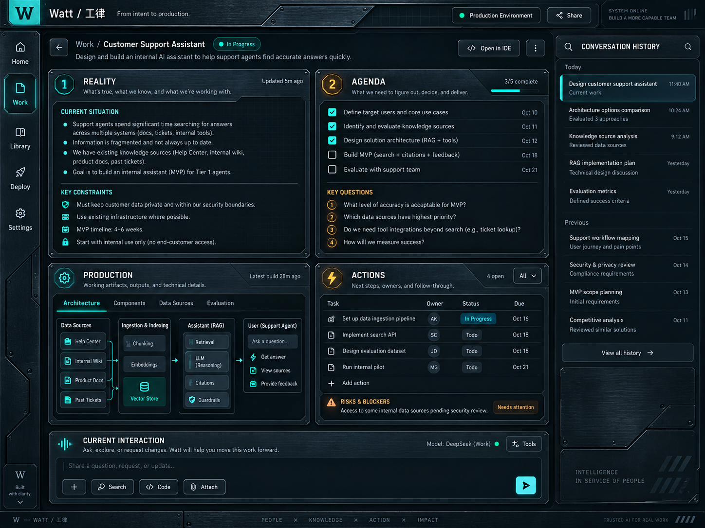
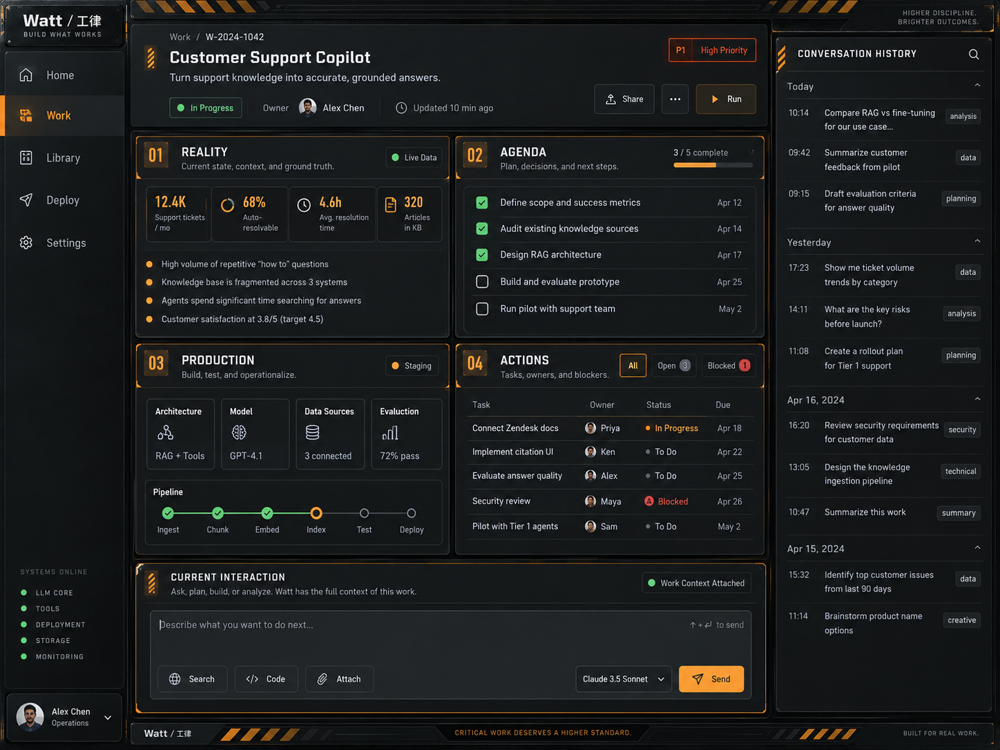
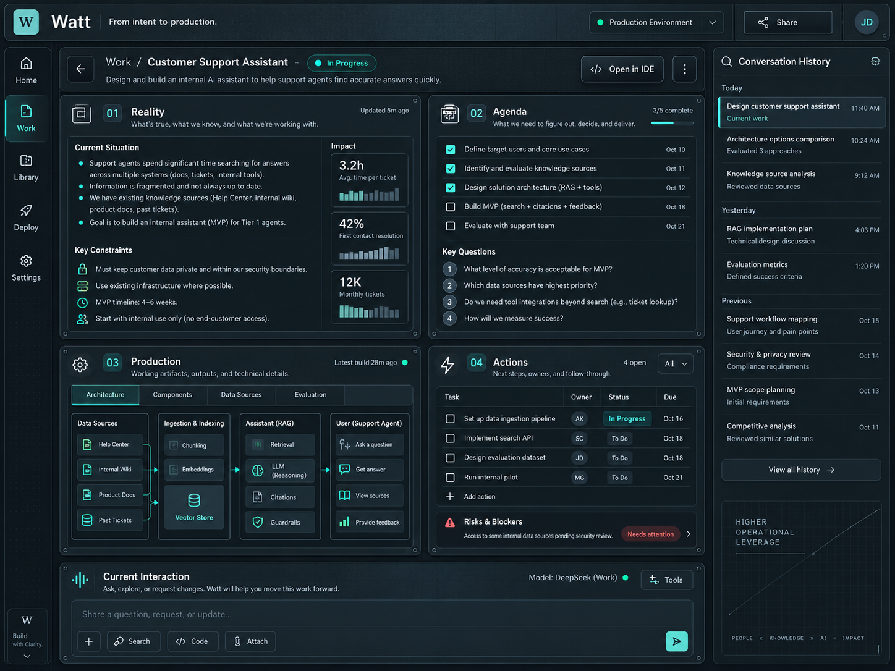
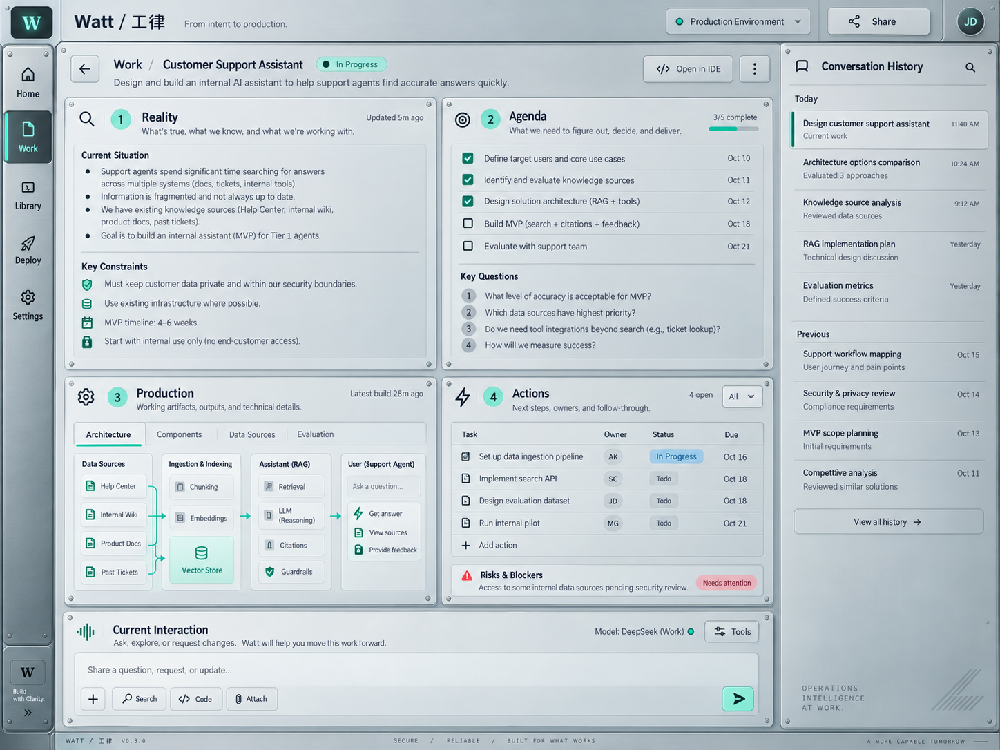
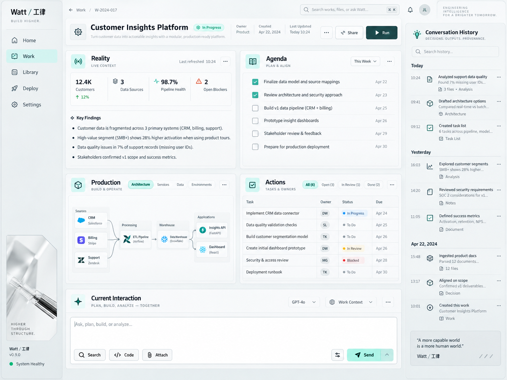
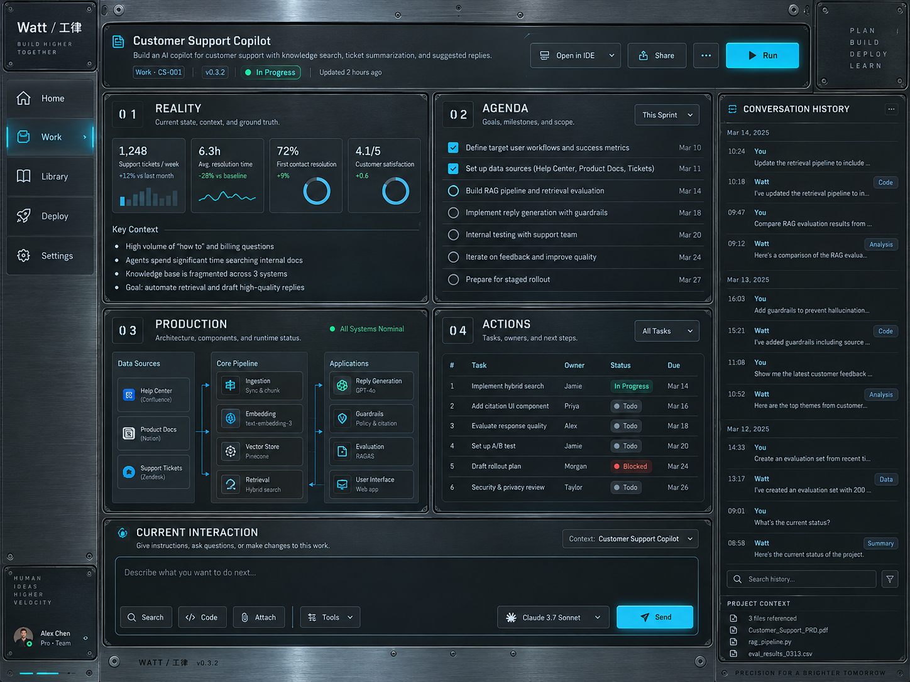

# Watt Formal UX/UI — Appearance Architecture & Workspace Skin Library

## Status and authority

```text
DOCUMENT_TYPE
    ARCHITECTURE / DESIGN REFERENCE

APPEARANCE_ARCHITECTURE
    DOCUMENTED

WORKSPACE_SKINS_REGISTERED
    6

FORMAL_UX_UI_IMPLEMENTATION
    NOT STARTED / NOT AUTHORIZED BY THIS DOCUMENT

REFERENCE_IMAGES
    6 IMPORTED / 0 PENDING_REFERENCE_IMPORT
```

This document is the canonical appearance architecture and first-generation
Workspace Skin registry for Watt Formal UX/UI. It refines the visual-expression
boundary recorded in [Core Workspace Experience Calibration](../product/watt-core-workspace-experience-calibration-notes.md)
without changing its accepted interaction semantics.

It does not implement Formal UX/UI, modify WIC, or change Work, Steering, PWU,
Executor, Scheduler, Guardian, ECF, lifecycle, navigation, or Runtime behavior.

## 1. Repository Reality and design basis

Current Repository Reality establishes the following basis:

- WIC Interaction Intelligence is closed with Formal UX/UI identified as the
  next separately authorized major phase.
- Work identity and production interaction semantics are intentionally
  decoupled from visual style.
- The clickable prototype establishes stable Workspace interaction semantics,
  but its styling is not a frozen product identity.
- The production web client and the isolated Human Journey prototype already
  use local CSS custom properties. Those implementation details are useful
  evidence, but they are not yet a canonical Global Theme or Workspace Skin
  system.
- The approved central Work Workspace has four persistently present surfaces,
  Human-controlled focus, a workspace-native Current Interaction and Composer,
  and a subordinate Conversation History rail.

This document turns those facts into one bounded appearance architecture. The
six exact visual references selected by the Human are preserved in the
[Workspace Skin asset manifest](../assets/ui-skins/README.md). No substitute
imagery has been created.

## 2. Governing invariant: visual evolution must be cheap

> **Visual Evolution must be cheap and behavior-preserving.**

Frequent visual comparison and refinement are expected product-development
activities. A Human may ask to see several substantially different expressions
of the same Work experience. This must not multiply product logic, page
structure, state machines, or behavioral test obligations.

The required conceptual layering is:

```text
Product / Interaction Logic
        ↓
Semantic UI Components
        ↓
Presentation Layer
        ├── Global Product Theme
        └── Work Workspace Skin
```

The architecture explicitly rejects this shape:

```text
Industrial Cyan page implementation
Executive Amber page implementation
Precision Silver page implementation
...
```

The same semantic components and accepted product behavior must survive a
Global Theme or Workspace Skin change. Appearance code may express semantic
roles; it must not become another owner of product meaning.

The intended binding remains:

```text
governed/domain state
    → presentation semantic role
    → Global Theme or Workspace Skin token
    → rendered expression
```

For example, `PRODUCTION_RUNNING` may map to a semantic `status-active` role.
The role may look different in Industrial Cyan and Warm Professional, but the
skin must not reinterpret the production state.

## 3. Two visual scopes — hard invariant

> **Global Theme controls the product shell. Workspace Skin controls only the
> Work experience.**

These are separate presentation scopes. The six Workspace Skins are not six
whole-product themes.

### 3.1 Global Product Theme

Watt has exactly two global appearance families for ordinary product surfaces:

- `GLOBAL_LIGHT`
- `GLOBAL_DARK`

The Global Product Theme applies to the application shell and ordinary Watt
surfaces, including:

- authentication and login;
- Home;
- History and historical Works;
- Deliveries;
- Settings;
- generic navigation and application shell;
- future ordinary product pages;
- any other non-Workspace product surface.

When a future ordinary page is added, its default visual implementation burden
is `GLOBAL_LIGHT + GLOBAL_DARK`. It must not automatically become six
Workspace-Skin variants.

The following are forbidden product concepts:

- Industrial Cyan Login;
- Executive Amber History;
- Precision Silver Deliveries;
- Futuristic Studio Settings.

This is a deliberate maintenance-cost boundary, not an incidental first-release
shortcut.

### 3.2 Work Workspace Skin

Workspace Skins apply only to the central Work Workspace experience. Within
that bounded scope, a skin may style:

- Work Header;
- Reality;
- Agenda;
- Production;
- Actions;
- Current Interaction;
- Composer;
- workspace-local Conversation History and provenance presentation;
- workspace-local status visualization;
- workspace-local panels, cards, framing, and instrumentation aesthetics.

A Workspace Skin must not propagate into the application shell or ordinary
pages. Its `base_appearance` describes its own presentation basis and does not
turn that skin into a global theme.

The different scopes reflect different product economics. The Work Workspace
is Watt's primary production environment and is the right place for frequent,
high-value visual experimentation. Peripheral pages must remain coherent and
inexpensive to maintain.

## 4. Approved Formal Workspace semantics

Workspace Skins must preserve the approved Workspace layout architecture.

The default central Work Workspace is:

```text
┌─────────────────────┬─────────────────────┐
│ Reality             │ Agenda              │
├─────────────────────┼─────────────────────┤
│ Production          │ Actions             │
└─────────────────────┴─────────────────────┘
```

The four surfaces:

- are simultaneously present by default;
- retain stable spatial memory;
- may be temporarily focused or expanded by the Human;
- are not automatically rearranged merely to appear intelligent.

Current Interaction is below or associated with the central Work surface. The
permanent Composer is anchored at the bottom of the central Work Workspace.
Conversation History and provenance occupy the right rail.

The attention hierarchy remains:

```text
Work Reality
    > Current Interaction
    > Conversation History
```

No skin may convert Watt into a chat-first product, move the primary Composer
into Conversation History, change surface ownership, or alter Human-controlled
focus behavior.

## 5. Workspace Skin Registry

The Workspace Skin Registry is a central presentation registry. It belongs to
Workspace presentation and is not the Global Theme system.

Its conceptual fields are:

```text
skin_id
display_name
status
base_appearance = LIGHT | DARK
workspace_token_profile
workspace_presentation_profile
version
enabled
reference_asset
```

The bounded lifecycle vocabulary is:

- `REFERENCE`
- `PLANNED`
- `IMPLEMENTED`
- `POLISHING`
- `DEPRECATED`

The registry and lifecycle are an architecture direction only. This document
does not add runtime persistence, a user preference, a selector, or production
configuration.

### 5.1 Registered identities

| ID | Stable `skin_id` | Display name | Base | Current registration | First batch | Reference asset |
|---|---|---|---|---|---|---|
| 01 | `INDUSTRIAL_CYAN` | Industrial Cyan / 青蓝工业控制台 | DARK | `PLANNED` | yes | [01-industrial-cyan.png](../assets/ui-skins/01-industrial-cyan.png) |
| 02 | `EXECUTIVE_AMBER` | Executive Amber / 橙标执行控制室 | DARK | `PLANNED` | yes | [02-executive-amber.png](../assets/ui-skins/02-executive-amber.png) |
| 03 | `TECHNICAL_GRAPHITE` | Technical Graphite / 技术石墨 | DARK | `PLANNED`, initially disabled | no | [03-technical-graphite.png](../assets/ui-skins/03-technical-graphite.png) |
| 04 | `PRECISION_SILVER` | Precision Silver / 银灰工业精密 | LIGHT | `PLANNED` | yes | [04-precision-silver.png](../assets/ui-skins/04-precision-silver.png) |
| 05 | `WARM_PROFESSIONAL` | Warm Professional / 温和专业 | LIGHT | `PLANNED` | yes | [05-warm-professional.png](../assets/ui-skins/05-warm-professional.png) |
| 06 | `FUTURISTIC_STUDIO` | Futuristic Studio / 未来技术工作室 | DARK | `PLANNED`, initially disabled | no | [06-futuristic-studio.png](../assets/ui-skins/06-futuristic-studio.png) |

All six identities are durable even though implementation has not started.
Later implementation or activation of Technical Graphite and Futuristic Studio
must be additive, not an appearance-architecture redesign.

### 5.2 `INDUSTRIAL_CYAN`

**Character:** industrial, precise, engineering-led, trustworthy; dark
graphite with cyan or teal instrumentation accents; controlled luminous
details; professional rather than cyberpunk.

**Intended feeling:** a high-end industrial production and control system.



### 5.3 `EXECUTIVE_AMBER`

**Character:** an operational command center with amber or orange hierarchy,
strong execution/task/risk visibility, dark industrial surfaces, and an
assertive but restrained production-control presence.

**Intended feeling:** a serious operational command room in which Work feels
actively driven forward.



### 5.4 `TECHNICAL_GRAPHITE`

**Character:** developer tooling and engineering console; graphite-neutral
palette; dense but disciplined information; subtle status accents; IDE and
control-plane influence; minimal decoration.

**Intended feeling:** an engineering-first professional workspace.



### 5.5 `PRECISION_SILVER`

**Character:** precision instrumentation; metallic and industrial light-neutral
surfaces; technical typography; restrained cyan or green status accents; high
clarity; office-friendly professional brightness.

**Intended feeling:** a precision-machinery or engineering-instrument
interpretation of Watt.

It must not collapse into a generic Bootstrap administration interface.



### 5.6 `WARM_PROFESSIONAL`

**Character:** modern professional software; approachable and calm; cleaner
spacing, softer visual weight, and broad commercial usability while remaining
recognizably Watt.

**Intended feeling:** professional and trustworthy with lower cognitive
intimidation for a broader set of users.



### 5.7 `FUTURISTIC_STUDIO`

**Character:** AI-native, future-facing, advanced, and premium; subtle luminous
details; controlled neon, glass, or instrumentation where useful.

**Intended feeling:** a credible future engineering environment rather than
decorative science fiction.

It must not become excessive cyberpunk, a gaming UI, or entertainment-first
presentation.



## 6. First implementation batch

The first authorized implementation mission, when separately issued, should
begin with:

1. `INDUSTRIAL_CYAN`
2. `EXECUTIVE_AMBER`
3. `PRECISION_SILVER`
4. `WARM_PROFESSIONAL`

Registered but initially planned/disabled:

- `TECHNICAL_GRAPHITE`
- `FUTURISTIC_STUDIO`

The architecture must assume that all six will probably be implemented. The
first batch is an implementation sequence, not a reduction of the registered
library.

## 7. Bounded skin capability levels

### 7.1 Level 1 — Design Token Skin

A Level 1 skin may alter:

- colors;
- typography;
- spacing density;
- radius;
- borders;
- shadows;
- icon treatment;
- background material;
- state colors;
- focus treatment;
- selection treatment;
- motion character.

### 7.2 Level 2 — Presentation Variant

A Level 2 skin may alter bounded Workspace presentation details, including:

- panel-header treatment;
- section framing;
- status lights;
- card-title treatment;
- separators;
- progress-visualization appearance;
- badges;
- bounded decorative instrumentation.

Neither level may alter:

- semantic structure or surface ownership;
- product meaning or action semantics;
- Work state or lifecycle;
- state machines or domain models;
- event contracts;
- navigation semantics;
- WIC, Steering, SPG, Verification, Runtime, or Authority behavior.

Presentation variants must remain bounded. A different visual hierarchy
expression cannot become a different information architecture.

## 8. Human visual-iteration workflow

The supported product-development workflow is:

```text
Human requests a UI variation
        ↓
Presentation / Workspace Skin changes
        ↓
Human compares variants
        ↓
Human refines or chooses
        ↓
Product and domain behavior remain unchanged
```

Visual comparison is expected, not exceptional. The presentation architecture
must make creating, reviewing, refining, disabling, and later adding skins
cheap enough that Human visual exploration does not pressure the team to fork
the product implementation.

## 9. Implementation guardrails for the next phase

This document does not authorize implementation. A later implementation must
preserve at least these guardrails:

1. Put product and interaction semantics behind semantic components before
   introducing multiple skins.
2. Keep global shell tokens distinct from Workspace-local tokens.
3. Keep the registry declarative and presentation-owned.
4. Do not branch domain behavior, navigation, state machines, or API handling
   by `skin_id`.
5. Do not copy the Work page for each skin.
6. Treat exact Human-approved images as reference evidence, not executable
   specifications or new Truth owners.
7. Preserve accessibility, focus visibility, state distinguishability, and
   reduced-motion requirements across every implementation.
8. Prove behavior preservation with shared semantic tests rather than six
   duplicated suites of product behavior.
9. Limit ordinary pages to `GLOBAL_LIGHT` and `GLOBAL_DARK`.
10. Require separate Human review before representing a skin as
    `IMPLEMENTED` or `POLISHING`.

## 10. Explicit non-decisions

This architecture does not freeze:

- final token names or token values;
- final typography or icon system;
- exact motion timings;
- skin selector UX;
- user preference persistence;
- per-Work or per-user selection semantics;
- automatic selection or operating-system preference behavior;
- exact Global Theme and Workspace Skin compatibility treatment;
- implementation technology or component-library choice;
- runtime storage or API contracts;
- final accessibility certification criteria;
- the exact contents of the pending Human-approved reference images.

Those decisions belong to separately authorized Formal UX/UI implementation
and Human visual review. None may weaken the two-scope invariant or accepted
Workspace semantics.

## 11. Architecture smell checks

The following indicate appearance-architecture drift:

- a new ordinary page requires six Workspace-specific implementations;
- a Workspace Skin changes Work meaning, lifecycle, or action availability;
- a skin-specific component owns API or domain behavior;
- the application shell inherits a Workspace Skin;
- a reference image is replaced by a generated approximation and represented
  as Human-approved;
- a visual variant moves or removes Reality, Agenda, Production, or Actions;
- Conversation History becomes the primary stage;
- a skin causes automatic surface rearrangement or focus theft;
- adding a registered skin requires redesigning the appearance architecture.

These are not implementation preferences. They violate the cost-control and
product-semantics boundaries established here.
