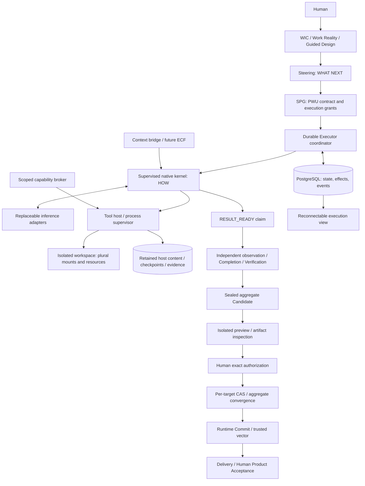

# Watt-native Executor Runtime — Architecture Blueprint

Date: 2026-09-11 (Asia/Shanghai). Final technical closure status updated
2026-09-13. Original architecture basis: `a0394daaa59351f7e92a3f4f2482e675e751a64e`.

**Architecture assessment: APPROVED; IMPLEMENTATION COMPLETE; TECHNICAL PHASE CLOSED.**

**Current status: IMPLEMENTATION COMPLETE / TECHNICALLY QUALIFIED / CONTINUITY QUALIFIED / HUMAN ACCEPTANCE DEFERRED BY HUMAN GOVERNANCE.** The approved architecture has been implemented and Q01–Q50 technical release requirements have closed. Continuity Benchmark v8 passed all 18 A/B pairs and real model replacement. Human Product Acceptance is intentionally deferred to the later system-wide Human Journey and UX/UI reconstruction phase; it is not inferred from technical evidence. See the [final technical closure](../evidence/watt-native-executor-technical-closure.md). D1–D7 remain the governing architecture.

This is one specification in four documents:

- This document owns boundaries, data contracts, topology, persistence, integration and migration.
- [Lifecycle and recovery specification](watt-native-executor-lifecycle.md) owns exhaustive transition rules, command contracts, recovery frontiers and crash outcomes.
- [Qualification and Human acceptance plan](watt-native-executor-qualification.md) owns test cases, measurable gates, implementation sequence and acceptance procedure.
- [Capacity Scheduling and Execution Queue amendment](watt-native-executor-capacity-scheduling.md) owns the Capacity Scheduling Plane boundary, Queue and Execution Allocation semantics, MVP fairness policy, and Human-visible capacity-waiting model.

Formal evidence inputs, read in full: [external architecture study](../research/external-executor-architecture-study.md), [38-pattern matrix](../research/external-executor-pattern-matrix.md), [source evidence register](../research/external-executor-source-evidence.md), and [research contract](../research/executor-architecture-study-research-contract.md). External mechanisms are evidence, never Watt authority. The source register pins the ten reference revisions; its limitations remain applicable. No new claim of running those systems or their tests is made here.

## A. Executive summary

Watt owns a durable, autonomous code-production runtime. A trusted coordinator admits work under SPG; supervised native workers run the inference/tool loop; a separate trusted tool host enforces scoped execution in isolated containers. PostgreSQL records authority, frontiers and effects. Retained host storage holds immutable content and mutable workspaces. Inference adapters supply reasoning and proposed actions without owning execution truth.

## A.1 Current Autonomous Production Intelligence loop

The 8+1 names describe behaviors of the existing responsibility owners, not
eight independent engines. Current production follows this bounded loop:

| Behavior | Owner and durable boundary |
|---|---|
| Self-Orient | WIC, Context Orchestrator, Work Reality, ECF and capability Reality assemble decision-scoped facts; admitted Human-explicit semantic facts outrank provider phrasing. |
| Self-Check | Steering, Task Contract, Connector Resolver and Tool Host enforce prerequisites, executable capability, resource and authority scope before a side effect. |
| Self-Execute | Steering admits a PWU/Attempt; the Queue allocates a Watt Native Executor Worker, which invokes API-key inference and scoped Tool Host operations in a Production Environment. |
| Self-Observe | Durable steps, effect receipts, independent repository observations, Completion and Verification compare the admitted obligation with the observed result. A model statement is not a side-effect receipt. |
| Self-Refine | A failed provider attempt or rejected canonical decision creates an append-only, Work-linked incident and bounded repair actions. Recovery resumes the same admitted contract without granting additional authority. |
| Self-Converge | Configurable attempt, repeated-signature, elapsed-time and inference budgets stop nonconverging same-layer retries; evidence remains historical. |
| Self-Resume | PostgreSQL Queue, lease epochs, checkpoints and effect receipts distinguish safe replay from uncertain effects after Worker interruption. |
| Self-Evaluate | The executable domain-separated evaluation corpus checks accepted interaction, production, resilience and assurance behaviors and fails on a critical regression. |
| Human Governance | Work intent, material revision, sensitive authority, exact Candidate authorization, Delivery and final acceptance remain Human-owned. |

The active execution provider contract is Watt Native Executor plus API-key
model providers (currently DeepSeek). There is no external coding-agent SDK
runtime, alternate executor or hidden fallback. Provider/model identity and a
secret reference travel through infrastructure configuration; raw API keys do
not enter prompts, Work Reality, Production Records or Self-Refine evidence.

Self-Refine incidents are durable in `self_refine_events` with append-only
`self_refine_actions`. An incident records its operation/Work identity, failure
signature, expected and observed Reality, safe diagnosis, repair hypothesis,
evidence references, overhead and known-failure match. `OPEN` denotes ongoing
repair; `MITIGATED` records a stopped or escalated execution-level episode;
`VERIFIED` denotes a successfully re-observed repair outcome. An Executor
`RESULT_READY` is still only a claim for downstream Completion and independent
Verification, never Human Acceptance. Work and cross-Work list/detail/metrics
are projected through `/api/works/{work_id}/self-refine` and `/api/self-refine`.

The event structure supports later frequency analysis, clustering and proposed
Platform Improvement Work. It does not authorize automatic platform-code
mutation or widen Work authority. The evaluation command is
`python -m spg.evaluation.release_gate`; it requires a real PostgreSQL test
database and reports domain-level results, not one aggregate coding score.

Freeze the following for the implementation specification after Human closure:

| Direction | Concrete closure decision |
|---|---|
| D1 — production continuity | One PWU has 0..N reconstructible Sessions and 0..N accountable Attempts. One active writable Attempt per PWU initially; Steps are internal execution boundaries. Session and Attempt identities cannot replace PWU or Work. |
| D2 — recovery promise | Single-host supervised services; existing PostgreSQL plus retained local content/workspace volumes. UI disconnect and worker restart are covered. Thirty-day hot paused workspace, then recoverable cold hibernation while Work remains open. No disk/machine-loss claim. |
| D3 — UNKNOWN | Fence, retain frontier, inspect, reconcile, classify, salvage and continue residual work. Historical UNKNOWN is immutable. Unresolved mutating scopes stay quarantined. |
| D4 — model independence | Material provider/model/effort or execution-backend replacement requires successor Attempt, same PWU and normally same Session, portable checkpoint and fresh provider session. In-Attempt model replacement is deferred. |
| D5 — resources | Exact admitted profile and finite envelope, pre-call reservation, bounded retries, unknown usage retained. No automatic premium, credits, provider or privacy expansion. |
| D6 — multiple repositories | Immutable source/output vectors, independent aggregate verification, exact aggregate authorization, per-target CAS and truthful partial convergence. Only complete convergence permits the aggregate Runtime Commit. |
| D7 — qualification | Outcome/intent/acceptance equivalence, not identical traces. Fault matrix, deterministic safety gates, paired real-provider trials and separately recorded Human acceptance. |

No fundamental architecture question is left for the implementation agent. Deployment secrets, an admitted exact model profile and later Human Product Acceptance are operational inputs, not architecture gaps. The architecture and technical implementation phase is closed; the Human acceptance decision is deferred by Human governance.

## B. Current Watt Reality

These are observed current facts, not promises that native behavior already exists.

| Area | Rechecked current source | Change required by this Blueprint |
|---|---|---|
| Work / Assets | [WorkRecord and binding](../../src/spg/domain/product.py), [asset allocation](../../src/spg/application/assets.py); Work Reality revision and optional scope/resources, managed Git at production readiness. | Preserve Work identity; bind plural exact execution assets without introducing Project. |
| Guided Design / Steering | [GuidedDesignApplicationService](../../src/spg/application/guided_design.py), [Steering admission](../../src/spg/application/steering.py); distinct design revisions and exact Reality admission. | Preserve WHAT NEXT and admission ownership; runtime local plan cannot advance Steering. |
| PWU / Attempt | [runtime contracts](../../src/spg/domain/runtime.py): PWU conditions PROPOSED/PRODUCED/SATISFIED/SUPERSEDED; Attempt condition only CREATED, generation plus retry_of. | Add native lifecycle records; do not infer a full Attempt machine from the present enum. |
| Executor boundary | [ExecutorCapabilityContract](../../src/spg/domain/executor.py), [execution records](../../src/spg/domain/execution.py), [dedicated subprocess transport](../../src/spg/infrastructure/executor_boundary.py). | Preserve governed dispatch and untrusted output; introduce an asynchronous, idempotent backend contract alongside v1. |
| External coding-agent adapter | Removed from the active runtime. Historical evidence remains in earlier records. | Watt Native Executor and API-key model providers are the only active execution path. |
| Workspace / recovery | [GitAttemptWorkspace](../../src/spg/infrastructure/git_workspace.py), [AttemptRecoveryService](../../src/spg/application/attempt_recovery.py): one detached worktree, exact source, salvage before clean retry; provider resume deferred. | Plural isolated mounts, native journal and portable partial-work continuation. |
| Observation / completion | [ExecutionService](../../src/spg/application/execution.py), [CompletionService](../../src/spg/application/completion.py): independent immutable observation and obligation evaluation. | Independent exact-vector observations with multiple immutable generations, rather than overwriting one dispatch observation. |
| Assurance / trust | [Verification](../../src/spg/application/verification.py), [Candidate governance](../../src/spg/application/governance.py), [Git CAS](../../src/spg/infrastructure/git_integration.py), [Runtime Commit](../../src/spg/application/runtime_commit.py). | Retain owners; extend exact-subject and convergence contracts to vectors. |
| Delivery / acceptance | [DeliveryService](../../src/spg/application/delivery.py) requires PASS plus trusted Runtime Commit; current software runtime is a static-Web slice. | Add a separate pre-authorization preview contract; preserve post-commit Delivery and exact acceptance. |
| WIC / intervention | [Interaction admission](../../src/spg/application/interaction.py) rejects stale interpretation basis. | Typed admitted update queue with application receipts; direct authenticated Stop control. |
| Persistence / deployment | [database](../../src/spg/infrastructure/persistence/database.py), [UnitOfWork](../../src/spg/infrastructure/persistence/unit_of_work.py), [runtime schema](../../src/spg/infrastructure/persistence/runtime_schema.py), [Compose](../../compose.yaml), [delivery profile](../../compose.delivery.yaml). Python 3.12+, Pydantic, SQLAlchemy, PostgreSQL and local Docker already exist. | Reuse this stack; no Redis, graph framework, message broker or distributed scheduler is required. |
| Measurement | [DCP-2 contracts](../../src/spg/domain/measurement.py), [process-local orchestration](../../src/spg/application/orchestration.py). | Add native spans/events while preserving available/derived/unavailable distinctions. |

Intent authorities: [North Star](watt-product-north-star.md), [Work-centric model](work-centric-production-model.md), [responsibility principles](work-centric-production-and-responsibility-principles.md), [ECF boundary](../context/ecf-integration.md), [Guardian boundary](../assurance/guardian-integration.md), [Passport direction](production-execution-package-direction.md).

Explicit evolution of dated limits: the [MVP autonomy contract](executor-autonomy-envelope-attempt-granularity-mvp-contract.md) and [current multi-repository slice](work-to-delivery-multi-repository-spg-proposal.md) constrain the current backend to one repository and defer exact restart. D1/D4/D6 deliberately extend those limits for native v2. They remain true descriptions and rules for legacy v1. Native internal Steps become durable runtime facts but do not become Steering Steps or independent production-governance units. No technical impossibility was found; the change requires versioned contracts and migrations during implementation, not reinterpretation of historical rows.

## C. Architecture goals and non-goals

The implementation must deliver real multi-file production, autonomous inspect/edit/test/repair, recovery after retained-host worker restart, effective pause/cancel, useful progress, optional repository intake, plural writable repositories, exact independent assurance and inspectable artifacts. Continuity must preserve admitted constraints, useful artifacts, findings and residual obligations across segmentation.

No first-class Project; no final UX redesign; no full ECF, Guardian Core, Passport product, OAuth, enterprise Git hosting, global scheduler, mobile deployment platform, billing platform or multi-region recovery. Initial execution supports Linux containers on the existing local Docker substrate, including Docker Desktop as a development host. An unavailable sandbox is an explicit readiness failure, never a fallback to unrestricted host shell. Artifact contracts are form-independent even when initial preview adapters support fewer forms.

## D. Ownership model

| Owner | Sole responsibility / permitted output | Prohibited responsibility |
|---|---|---|
| Human / WIC / Work admission | Interpret Motive, admit Work/constraints/material decisions, record authorization and acceptance through existing services. | A chat message by itself cannot become a runtime grant. |
| Guided Design / Steering | Design decisions and meaningful WHAT NEXT; decide revision, replacement or decomposition of a PWU. | Selecting every file/tool or using repository count as PWU granularity. |
| SPG production services | PWU contract, Attempt grant/generation, readiness, Completion/admissibility, Candidate authorization and trusted convergence. | Calling model output or runtime status independent assurance. |
| Executor coordinator | Implement admitted runtime control, leases, scheduling, bounded recovery policy and durable command/event ordering. | Granting scope, increasing budget or changing Work truth independently. |
| Native kernel | HOW: working plan, inference, proposed tools, observations, repair, checkpoint and result-ready claim. | SATISFIED, TRUSTED, authorization or acceptance writes. |
| Tool host / process supervisor | Actual capability enforcement, process ownership, effect admission/receipts, isolated files and output capture. | Accepting the model's claim that a command is read-only or approved. |
| Context bridge / future ECF | Exact context assembly/provenance/freshness; runtime persists working knowledge separately. | Capability grants or rewriting governed intent. |
| Verification / future Guardian | Independent assessment of exact artifacts and obligations, Findings. | Executor self-review, Steering replacement or Candidate authorization. |
| Integration / Runtime Commit / Delivery | Authorized target effects, aggregate convergence, trusted pointers, delivery and exact acceptance linkage. | Treating a preview, partial integration or arbitrary Git commit as whole-PWU trust. |

The coordinator is a runtime implementation of SPG-issued authority, not a second governor. Existing application services remain authoritative, including when a recovery decision is automatic under a previously admitted policy. The native kernel has no API to write governance/verification tables. Worker and verifier service identities are distinct; all caller identity checks are server-derived.

## E. PWU / Session / Attempt / Step model

All identities are UUIDs generated by Watt; content digests supplement identity. Versions are monotonically increasing optimistic concurrency values, not timestamps. Schema versions are separate. Relationships below are logical contracts; AC specifies physical reuse and extensions.

| Object | Owner, identity and cardinality | Versioning / authority | Lifecycle and termination | Recovery relationship |
|---|---|---|---|---|
| Work | Work admission; existing work_id; 0..N Steering decisions/PWUs. | Versioned governed Reality; Asset associations preserve provenance. | Existing lifecycle; PWU or Session end does not end Work. | Recovery remains attached to the same Motive/Work. |
| Steering Decision | Steering; decision_id; belongs to one Work and exact plan/Reality basis; 0..N admitted PWUs with explicit membership. | Immutable admitted decision; replacement is a new decision. | Applied/superseded according to existing Steering, not tools. | Recovery is HOW unless meaningful direction changes. |
| PWU | SPG; existing work_unit_id; exactly one Work linkage and originating decision/admission; 1..N contract versions. | Immutable contract versions plus current pointer and production disposition; preserves a meaningful objective. | Admission → open production → satisfaction, exhaustion, replacement or withdrawal by rules below. A resource wait is not exhaustion. | Same PWU across retries, pause and material model replacement. |
| Session | Executor continuity service; session_id; exactly one PWU; PWU has 0..N. | Immutable parent_checkpoint_id and append-only working context; CAS current frontier. No production authority. | OPEN → CLOSED; archive is retention, not completion. No close while attached live grant. | Default successor uses same Session; fork or explicit restart of approach creates new Session with parent bundle. |
| Attempt | SPG grant service; attempt_id; one PWU contract version, one Session, one workspace, one SourceVector and binding/envelope; PWU has 0..N. | Binding immutable; grant admission generation distinct from worker epoch; append-only outcomes and runtime projection. | GRANTED until RELEASED/FENCED with terminal outcome. Pause and bounded resource wait retain grant if valid. | Same Attempt only with proven valid grant/continuity; terminal UNKNOWN never reopened. |
| Step | Kernel via coordinator; step_id; one Attempt, Session sequence; 0..N effects. | Immutable request and result records; status projection CAS; links model/tool/plan/context/checkpoint observations. | PREPARED → RUNNING → completed/failed/interrupted; uncertain effects explicitly linked. | Completed results reused only under matching subject; interrupted inference cannot execute partial proposals. |
| Effect | Tool host/journal; effect_id; one originating Step; 0..N delivery tries and receipts. | Watt-issued semantic identity, request digest, conflict domains and preconditions fixed before submission. | INTENDED → STARTING/ACTIVE → settled or UNKNOWN; resolution appended. | Delivery retry keeps identity; changed semantic action needs new effect with predecessor. Provider tool-call ID is only correlation. |
| Workspace | Resource manager; workspace_id; one PWU lineage; each writable incarnation belongs to one Attempt; 0..N repository/non-repo mounts. | Immutable admitted manifest plus materialization versions and observed inventories. Path is a locator, not identity. | ALLOCATING → READY → SEALED/HIBERNATED/QUARANTINED → RETIRED/DELETED. | Same-Attempt restart reuses retained materialization; successor gets isolated copy from checkpoint with salvage provenance. |
| Checkpoint Bundle | Checkpoint service; bundle_id; one Attempt frontier and Session sequence; three component manifests. | Immutable content references, frontier, epoch and exception set; CAS current bundle pointer. | PREPARING → COMMITTED or ABORTED; only COMMITTED is reconstructible. | Names repository, execution and semantic state; does not store a live process image. |
| Execution Evidence | Runtime recorder; evidence_id/content hash; 0..N per Step/effect/observation. | Immutable, classified by producer and exact subject, append-only corrections/supersession. | Retained/pinned then policy-governed deletion with tombstone. | Explains successful, partial, failed and unknown work. Cannot certify quality by itself. |
| Result Ready Claim | Kernel or reconciler as attributed claimant; claim_id; one exact bundle/output vector and contract. | Immutable claim, proposer identity and residual-obligation declaration. SPG controls selection/applicability. | Submitted → evaluated/obsolete; publication releases the producing Attempt. | Late claims cannot advance current state; independently salvaged artifacts may support a new claim. |

**PWU lifecycle is two orthogonal production axes.** `disposition = OPEN | SATISFIED | EXHAUSTED | SUPERSEDED | WITHDRAWN`; while OPEN, `phase = ADMISSION | READY | EXECUTING | AWAITING_RECOVERY | AWAITING_GOVERNANCE | VERIFYING | UNSATISFIED`. `UNSATISFIED` means an evaluated subject failed or did not produce required output; it is not final Work failure. Readiness needs exact contract, Assets/source, tool/environment/context, authority and resource binding. Paused execution is projected as OPEN/EXECUTING with runtime PAUSED; it does not invent another PWU identity. The complete transition table is [L1](watt-native-executor-lifecycle.md#l1).

`PRODUCED` remains an immutable Completion outcome, and existing v1 projections remain intact. Native `SATISFIED` requires independent Completion + all required exact-subject Verification PASS + admissibility, on the current contract/basis. It precedes Candidate authorization/integration and is not Work acceptance. A satisfied contract version is immutable historical fact. A material later requirement creates another contract version under the same still-meaningful PWU, or Steering explicitly replaces/decomposes it; no historical satisfaction is overwritten. A current applicability projection can become stale without changing the historical verdict.

Initial Session policy: create on first admitted native Attempt; use one default Session through successors. Additional Sessions require a recorded fork/approach-reset decision within admitted policy, with an explicit parent bundle. Forks cannot share writable materializations; switching branch of work fences/releases the prior active grant first. Parallel experimental writers within one PWU are deferred, not ruled out by the object model. Different PWUs may run concurrently on isolated workspaces.

New Attempt is mandatory after terminal release/Attempt fencing, material contract/source/binding/resource-envelope change, lost workspace, or governed re-execution. Request retries, tools and worker epoch rotation do not create Attempts. Renewing expiring credential handles without changing capability scope does not change the grant. A source vector contains the admitted baseline plus an optional **untrusted input overlay**; salvage never becomes a Trusted Baseline. Changed source or replayed/rebased salvage requires fresh evidence and an explicit successor binding.

## F. Native Executor kernel

Use an explicit Python loop/state reducer and typed Pydantic contracts, not an imported orchestration framework as production authority. Kernel code runs in a trusted worker service; repository code runs only through Tool Kernel containers. The worker consumes an `ExecutionBindingV2` and calls ports for inference, tools, context, persistence, control and evidence. It cannot directly mutate authoritative repositories, access provider credentials from repository code, or bypass the Tool Kernel with `subprocess`.

`ExecutionBindingV2` contains: schema_version, Work/Steering/PWU/contract IDs and digests, Attempt/generation, Session, SourceVector, workspace manifest, ContextPackageRef, materialized input digest, backend implementation/version, exact inference profile, capability grant set, resource envelope/policy version, stop conditions and inherited obligation references. It is immutable; each worker claim adds a separate `(worker_id, epoch, lease_deadline, control_version)` token.

The kernel's public surface is `run(binding, frontier, ports) -> runtime events / ResultReadyClaim / bounded return-control`. The coordinator controls persistence and authority; asynchronous suspension is a persisted boundary, not an in-memory coroutine that must survive restart. One worker slot owns one running Attempt at a time; event subscribers never own it.

## G. Agent loop

1. Claim and reconcile through the coordinator; hydrate exact contract, portable context, residual obligations and current workspace inventory.
2. Observe admitted Assets. Create/update a versioned `WorkingPlan` containing objective reference, hypotheses, chosen approach rationale, completed actions, open questions, obligation IDs and evidence pointers. It has no authority to alter the contract.
3. At the next boundary, first apply control requests/admitted updates, verify current generation/basis and reserve resources. Compact only through K/L.
4. Persist inference Step and request reference; call the inference adapter. Store complete normalized response before executing any proposed tool. Interrupted or malformed streamed actions do not run.
5. Validate proposed action schema, tool availability, scope, expected artifact preconditions and conflict footprint. Model-supplied effect class is ignored. Assign Watt effect identity and follow the durable protocol in L.
6. Execute independent reads concurrently; serialize overlapping mutations and arbitrary shell at whole-workspace scope initially. Ingest durable results; update working plan and locally evaluate residual engineering work. Test failure drives ordinary repair.
7. After settled mutations, persist an inventory delta and working-state frontier. Make a bundle at explicit barriers. Continue while bounds and contract permit.
8. When the model proposes completion, require no pending admitted update, no unresolved relevant effect, exact output inventory, retained evidence, environment identity and declared residual checks. Freeze output and submit RESULT_READY. SPG independently decides production/admissibility. If the same final prose appears without new evidence, it is not completion.

Initial `native-policy-v1` operational defaults, subordinate to smaller admitted limits: 120 inference submissions, 400 tool effects, 60 minutes active execution and 3 automatic successor recoveries per PWU contract; transport retries consume those totals and their own cap. Paused/Human waits do not spend active-time allowance; tools still settling and backoff do. These are finite initial settings, not PWU granularity and not a promise every task fits them. PWU-level accumulated counters survive successor Attempts; no budget reset by cycling Sessions.

No-progress rule: normalized action signature = tool/version + semantic input digest + relevant before-state + context revision. Three identical ineffective actions force local replanning; ten consecutive completed actions without artifact delta, a new attributable finding or resolved obligation park as `NO_PROGRESS`. Cosmetic prose and plan rewrites do not reset it. At most two autonomous replan episodes per no-progress window; then return a boundary finding with retained work. Invalid tool/model JSON gets at most two repair requests, counted as inference. Limits trigger checkpoint/resource blocking or bounded return-control, never self-issued satisfaction. Meaningful findings permit read-heavy analysis without requiring arbitrary file churn.

## H. Workspace and multi-repository model

`WorkspaceManifestV1 = {workspace_id, work_id, pwu_id, attempt_id, source_vector_digest, host_storage_id, environment_profile_digest, mounts[], generated_roots[], service_resources[], evidence_namespace, retention_policy}`. Locator changes are stored as materialization records. No user path becomes identity.

Each repository mount names `mount_id, asset_id, asset_binding_revision, repository_identity, source_baseline_ref, source_commit_oid, source_tree_oid, git_object_format, input_overlay_ref?, container_path, read_scope, write_scope, forbidden_paths, integration_target?`. A SourceVector sorts unique mount IDs, rejects duplicate/overlapping destinations, and hashes canonical serialized entries plus the non-repository input manifest. Baseline ref captures Watt snapshot ID and pointer version where present. An empty Human asset set causes existing managed repository provisioning at readiness, with a real initial baseline; a remote URL with UNKNOWN access cannot be treated as fetched input.

Initial native materialization uses **per-Attempt local Git clones with private Git metadata and no remote write credentials**, populated from trusted host object caches. Do not mount the authoritative `.git` or writable shared worktree metadata inside arbitrary code containers. Immutable Git object caches may accelerate transfer, but a retained checkpoint must have a complete recoverable object closure, not dangling alternates to an evictable cache. This adapts detached-workspace lessons while avoiding the legacy linked-worktree metadata exposure. Local Git commits inside these clones are engineering checkpoints only; verification uses content/tree and admitted source, never local HEAD as authority. Cleanup/export uses a host-owned inventory rather than trusting repository hooks/configuration; host Git plumbing disables untrusted hooks/filters and never runs repository-provided executables outside the sandbox.

Submodules/LFS are explicit child inputs or hydrated file content with exact object references; implicit recursive network checkout is disabled. Unsupported repository features fail preparation with an actionable capability finding. A private, host-produced source archive can support toolchains without Git. Initial native code production includes Git-backed output; document and other asset mounts are immutable inputs unless admitted for output.

Dirty Human input is never committed/reset/stashed by intake. Default: capture its tracked/untracked inventory and ask Work admission to name the immutable overlay if useful; otherwise report preparation blocked while preserving the original. An already admitted explicit dirty-input snapshot needs no additional per-file permission. Dirty state generated by the same valid Attempt is expected output, not a failed clean-worktree precondition.

A source/archive manifest includes paths, type, digest, size, mode and symlink target; binaries and useful generated/ignored outputs are first-class. Explicit reproducible cache directories may be excluded with recorded reason and recreation recipe. Unknown untracked/ignored output is retained by default subject to admitted storage limits. Secrets are not eligible recovery artifacts; required secret resources are re-provisioned via handles.

Workspaces contain per-mount RO/RW paths, temporary build output, isolated test data/services, toolchain/image/dependency identifiers, context and evidence references. Exact path scopes are enforced by filesystem mount/permission layout, not a post-hoc diff check alone. If arbitrary shell cannot be confined to the admitted subpaths on the selected profile, that tool is unavailable; patch tools can still provide narrower host-validated edits. Concurrent reads use an observed inventory frontier; writes invalidate relevant caches and checks. Arbitrary shell locks the entire writable workspace. Different workspaces may independently modify the same repository baseline; target integration is serialized later.

## I. Tool and process runtime

Every tool has a registered `ToolContractV1`: identity/version, schema digest, validated input/output schemas, cwd/mount rules, required capabilities, enforced write/network footprint, effect classification, execution timeout and first-output policy, cancellation contract, streaming/output bounds, evidence requirements, reconciliation handler and supported environment profiles. The model sees exactly the admitted executable subset. Tool addition during a run requires a registry/capability revision delivered through the same boundary checks.

| Family | Scope and input requirements | Effects, timeout/cancel and recovery |
|---|---|---|
| Read/search | mount + canonical relative path, optional expected digest; bounded search patterns and output. | Read-only where host implementation proves it; 30 s default; safe rerun against named/newly observed subject, not silently reusable across source changes. |
| Edit/patch | Expected before-digest, explicit paths and patch/content; reject traversal, aliases and forbidden paths. | Reconcilable mutation; 30 s; write temp file then rename per file. Multi-file edits report per-file receipts, never fake batch atomicity. Compare before/after digests before resubmission. |
| Shell/process | argv or explicit shell script, allowed cwd/env and whole-workspace mutation scope; no ambient credentials. | Conservative reconcilable local mutation, potentially UNKNOWN; default 120 s, admitted max 900 s per foreground process. Separate first-output yield, process-group interrupt/kill and inventory reconciliation. |
| Git | Private clone read/diff/log, local branch/checkpoint actions with explicit capabilities; host owns authoritative refs. | Local metadata mutations serialized per clone; remote operations unavailable without separate adapter/grant. Integration is outside this registry. |
| Test/build | Named recipe/command and exact source/environment; test data confined to scratch resources. | May mutate build/cache/test data; default 600 s, bounded by envelope. Rerun missing/stale checks after cleanup; local PASS remains Executor evidence. |
| Dependency/package | Lockfile/config digest, approved registries, cache scope, install scripts policy. | Installation is execution/mutation; 600 s default. Network through scoped proxy; partial installs reconciled/rebuilt from recipe in scratch, never assumed transactional. |
| Browser/preview | Exact artifact/runtime reference, isolated profile and admitted URLs; no personal browser session. | Stateful pages and network can cause effects; navigation/read versus submission classified by adapter. 120 s action timeout; remote effect UNKNOWN requires query. Browser memory is not a checkpoint. |
| Network/API | Registered destination/action/schema and credential handle; bounded payload. | Read or idempotent/reconcilable/unknown according to endpoint contract. 60 s default; stable idempotency key only if provider supports it; timeout after send is not no-effect. |
| Async operation | Start/query/cancel/versioned operation contract, provider operation ID and query semantics. | Submission journal plus continuing scope reservation. Reconnect/query existing operation; never start again because caller disconnected. |

Tool timeout is capped by remaining resource/grant allowance. Ordinary permitted tool operations do not ask Human each time. Unregistered external mutation is denied and reported as a capability boundary, not automatically escalated to unrestricted shell.

`ProcessRecord`: Watt process_id, effect_id, Attempt/generation/epoch, host_boot_id, supervisor_instance_id, container_id, start nonce/time, PID/PGID within its namespace, parent_process_id, command/env digests, cwd, declared write domains, spool locator, deadline and observed termination. PID alone is never an identity or kill target.

A trusted host supervisor outside the repository container owns child/container lifecycle. Within a container, a trusted launcher starts a process group and writes status/output to a host-owned spool inaccessible to repository code. PTYs and interactive stdin are supported under the same effect scope; each stdin submission is a new accountable operation. Yield after 1 s by default returns process_id and available output; this does not cancel execution. Track start, first output, last output and actual exit independently. Interactive sessions have a 10-minute idle limit and grant-bound absolute deadline; service resources use explicit recipes and retention leases.

Graceful Stop sends INT, waits 5 s, then TERM for 5 s, then KILL; deadline/cancel policy may go directly to KILL. Verify container/process-group disappearance including descendants. If the process escaped or host cannot confirm termination, retain UNKNOWN and quarantine. Initial recovery may reattach to a **proven supervised operation** with matching durable identity and spool, but a changed worker epoch defaults to stopping old mutating processes before write transfer. No shell stack, browser heap, Python coroutine or PTY handle is promised to resume after death. Restart only explicit service recipes after reconciliation.

A foreground shell exit does not settle its effect while writable descendants remain. The supervisor either terminates and accounts for descendants, or registers them as explicit continuing operations that retain their conflict reservations and prevent a quiescent barrier. A persistent interactive session similarly retains its scope until closed; later stdin operations are serialized under that parent reservation, not admitted as conflicting independent writers.

Output: default model-visible head/tail 32 KiB per tool result; full retained log capped at 64 MiB per effect unless its admitted evidence policy requires more. Spool chunks 1 MiB or 1 s, with sequence/checksum; final receipt flushes remaining bytes. At limit, emit truncation with byte counts; if complete logs are required, stop/park before losing required evidence. Model deltas/progress are bounded separately. No lost receipt is converted into success because console output looked complete.

## J. Capability and credential seam

Keep Asset Reference → Discovery → Capability Check → Authorization → Production Binding. `AssetAccessObservation` records UNKNOWN/GRANTED/DENIED separately for READ, WRITE, CREATE_BRANCH, CREATE_PR, PUSH and relevant external operations. Read access never implies remote writes. The initial provider supports managed/local Assets and explicitly configured handles; OAuth/provider-hosting products remain deferred.

`CapabilityGrantRef` names issuer, admission decision, subject Attempt/PWU, resource identity/version, paths/actions/destinations, expiry, revocation epoch and secret-free policy digest. `CredentialHandle` is opaque, issuer-scoped and short-lived; default 15-minute issuance with automatic refresh only within unchanged authority. Broker requests derive from the admitted contract. Tool host resolves at use, checks current control/capability epochs, injects through a trusted sidecar/request broker and records a capability receipt. Provider inference credentials stay outside code containers.

Never place a broad host `.env`, home directory, SSH agent, Docker socket, Codex auth directory or cloud credentials in a workspace. Where a tool must directly receive a narrow credential, its executable is trusted, isolated from arbitrary repository code, and its exposure is part of the capability contract. Redaction covers input/outputs before evidence persistence; handle expiry does not erase audit identity. Secret rotation preserves authority only when scope/policy is unchanged. Revocation prevents new calls, requests cancellation of active ones and reconciles already accepted effects; it cannot retroactively undo a remote action.

## K. Context / ECF seam and compaction

`ContextPackageRefV2 = {package_id, schema_version, revision, manifest_digest, contract_version_id, source_vector_digest}`. Its immutable manifest names exact Work Intent/Reality and Steering decisions; contract/constraints/acceptance obligations; admitted Assets with provenance and freshness basis; architecture/invariant references; required/deferred capabilities; known Findings/evidence; information sensitivity; assembly policy/version and source frontier. All required material must be retrievable under retained storage before execution. Names such as the legacy `PROJECT_CONTEXT` role are compatibility vocabulary only; native manifests use WORK_CONTEXT and do not create a Project entity.

Separate governed external context from versioned `WorkingState` (plan, observations, decisions/rationale, unresolved hypotheses, residual obligations, evidence references) and optional provider request state (opaque response handles/cache/format metadata). The initial deterministic assembler consumes existing Context Assembly Lite/MEI facts plus native vector/working-state references. ECF later implements `assemble`, `request_additional_context` and `assess_freshness` behind the same port. Repository instructions are attributable suggestions; conflicts with governed facts create findings, never override the authority block.

The prompt/request projection includes the full current authority/obligation capsule and selected working context. Persist selected source identities and resulting normalized request, not a dependency on private chain-of-thought. Store concise conclusions and rationale. Provider hidden reasoning/opaque compaction may be auxiliary only. An adapter that requires private state without a portable reconstruction path is not eligible for native continuity qualification.

`CompactionOperation` freezes `(Session sequence, context revision, contract version, source/output frontier, control_version)`. At a safe boundary: persist input → reserve budget → build candidate projection → validate all mandatory exact references and unresolved effects/receipts → store projection/source blobs → CAS the current projection and append completion event in PostgreSQL. Only after commit may memory swap to the new projection. A concurrent correction makes CAS fail; retain candidate as unused and reassemble from the new basis. Previous projection remains retrievable; a crash after commit loads the new pointer, a crash before commit keeps the old one.

Default trigger: estimated request plus reserved output exceeds 80% of negotiated context capacity; adapter/token estimator uncertainty adds a 10% margin. At most two compaction submissions per unchanged input frontier and at most 10% of the admitted inference-request allowance, rounded up. If input still fits without compaction, continue with a recorded fallback. If exact required capsule alone cannot fit, park as CONTEXT_BLOCKED; do not summarize away authority. Cross-model compaction uses a successor Attempt/profile under D4, not hidden fallback. Provider-specific compaction is disabled initially and may later optimize a portable projection.

Never lossily replace contract, acceptance criteria, authority/grants, source/candidate vectors, unresolved effects, admitted intervention receipts or Verification/evidence identity. Large log bodies may be summarized for inference only after the retained evidence reference exists. Summary quality is assessed separately from exact-reference completeness in the continuity benchmark.

## L. Checkpoints and persistence ordering

Three immutable manifests form `CheckpointBundleV1`:

| Layer | Required content | What it cannot restore |
|---|---|---|
| Repository checkpoint | SourceVector, per-mount exact output tree/content, admitted input-overlay provenance, generated/untracked inventory, excluded-cache recipes, object/blob closure and resource snapshots where supported. | Live processes, external effects or reasoning state. |
| Execution checkpoint | Attempt/generation/worker epoch, last committed Session Step sequence, effect/journal frontier, settled receipt set, unresolved exceptions, active control version, operation refs, resource accounting frontier, next eligible boundary. | A suspended coroutine, unsaved child process or an unqueryable remote operation. |
| Semantic checkpoint | Contract/ContextPackage refs, WorkingState version, exact remaining obligations/findings, admitted update receipts, selected portable projection and provider binding provenance. | Identical future model reasoning or private provider cognition. |

Bundle fields also include parent_bundle_id, schema/version, host_storage_id, content_root digest, creation reason, consistency class and owner. `QUIESCENT` requires no active mutating effect; `RECOVERY_REQUIRED` explicitly names exceptions and cannot justify PAUSED or immediate RUNNING. Read-only background results may be abandoned, but no process retaining write capability is compatible with a quiescent barrier. Snapshotting a live unquiesced tree is a diagnostic capture only, never a coherent Candidate or PAUSED checkpoint.

Required bundles: before first effect, graceful pause, worker handoff, compaction boundary when projection changes, result-ready, material update, resource park and recovery decision. After each settled mutating batch, persist incremental artifact/working-state frontier; consolidate a bundle at most every 5 settled mutation batches or 60 active seconds at the next safe boundary. A long effect remains represented by its durable intent, prior bundle, actual retained workspace and supervisor spool until it settles. Durability does not require full filesystem copy after every token/tool read.

**Pre-effect protocol:**

1. In a short PostgreSQL transaction, lock current Attempt/control/lease and conflict-domain rows in canonical order; validate generation, epochs, scopes, input preconditions and resource reservation. Insert Step/effect intent, executable request digest and `EffectAdmission` with control version; commit with event. No effect starts before this commit.
2. Trusted tool host accepts that admission using `(effect_id, delivery_id, request_digest)` and current authority validation. Persist STARTING in its host-owned spool before launching. Duplicate delivery returns the existing operation, not a new process. A crash between STARTING and a provable process identity is UNKNOWN, not NOT_STARTED.
3. Execute in the sandbox; capture bounded output and exact process observations. Store/fsync immutable result/artifact blobs first. The host's final durable receipt identifies actual termination and effects separately from exit code.
4. PostgreSQL transaction inserts immutable receipt/evidence refs, advances Step/resource projections and event sequence using generation/epoch/CAS checks. Commit before a dependent next effect. Stale receipts are accepted only into a late-evidence quarantine, never as current progress.

The DB and filesystem are not one transaction. Content first → atomic DB references second is the rule. Write blobs to host-owned temporary files, fsync, atomic rename to digest location, fsync parent directory; then insert verified blob references. Orphan content is safe and later collectible. A referenced missing/corrupt blob is a recovery fault and blocks trusting its frontier. Provider response persistence follows the same ordering before tool proposal admission. DB commit outcome uncertainty is resolved using the same command/effect ID; do not resubmit an external effect to discover whether the transaction committed.

Action admission also has a unique `(inference_step_id, proposal_index)` mapping to its tool Step/effect ID. Rehydrating a stored response looks up that mapping before preparing actions, preventing a crash from assigning a second effect to the same proposal. Tool-defined business operation keys/preconditions govern deduplication across newly generated proposals; identical command text alone is neither sufficient semantic identity nor permission to repeat an unresolved operation. This is controlled admission/reconciliation, not an exactly-once guarantee for arbitrary external effects.

Control-vs-launch race: `EffectAdmission` is the linearization point for starting authority. An effect admitted before Stop may already be in flight; Stop atomically closes subsequent admissions and triggers the host to reject not-yet-launched admissions it observes as revoked. Stop acknowledgment distinguishes REQUEST_RECORDED from EFFECTS_SETTLED. No design claim says an API call already accepted by an external service can be stopped instantaneously.

## M. Pause, resume, stop and recovery

The normative machines and transition write sets are [L1–L10](watt-native-executor-lifecycle.md#l1). Runtime control is separate from PWU production and Attempt grant outcome.

- **Pause:** persist PAUSE_REQUESTED and scheduling barrier; enter PAUSING; settle/interrupt processes and classify effects; commit QUIESCENT bundle; release worker lease and acknowledge PAUSED. Attempt grant remains live, credentials are revoked while parked and reacquired at resume. An unresolved relevant mutation remains PAUSING plus a recovery block; it cannot be labelled PAUSED.
- **Resume:** persist RESUME_REQUESTED; claim a new worker epoch; RECONCILING validates current contract/context, source pointers, retained workspace, capabilities and remaining envelope; RUNNING only after clean authority/effect frontier. Expired retention of a hot directory uses cold rehydration. Invalid retained grant creates a successor Attempt after reconciliation.
- **Stop:** authenticated control revokes future effect admission immediately, then requests graceful termination and preserves output. **Cancel:** also fences actor access and requests hard termination. Both terminally release the Attempt, with unresolved effects retaining UNKNOWN. Neither rolls back work. Later continuation requires a new grant.
- **Retry:** an individual classified request/delivery may repeat within the same grant. Re-execution after terminal release is a successor Attempt and consumes PWU-level cumulative recovery/resource limits.
- **Fork:** an isolated workspace and new Session from a named committed bundle, with new grant and explicit parent links. There is no shared writable directory or implicit copying of authorization.

If a worker disappears, the coordinator first disables its admissions and requests host quiescence. The recovery service can keep the same Attempt only when the grant was not terminal/fenced, the workspace is provably continuous, current policy/basis still match, and all relevant effects are resolved. Rotating the **worker epoch** is not **fencing the Attempt generation**. Otherwise the old Attempt ends UNKNOWN or another truthful outcome and a successor is issued; the same PWU survives.

## N. UNKNOWN reconciliation

`RecoveryCase` is an immutable sequence of assessments/actions over exact subjects, with a versioned current projection. The coordinator opens it automatically for uncertain native effects or lost ownership; no new Work is created. Existing recovery service semantics remain for legacy records.

| Stage | Concrete component and durable product |
|---|---|
| R1 Fence/quarantine | Coordinator increments worker epoch and closes effect admissions; host termination receipt or quarantine set captures remaining possible actors. A whole Attempt fence occurs only when grant continuity ends. |
| R2 Load frontier | Checkpoint service resolves the last committed bundle, later committed Steps/receipts, binding, control version and resource usage. Preserve old UNKNOWN records. |
| R3 Inspect local Reality | Independent observer inventories every mount, private Git history, before/after blobs and authoritative target refs; records exact inventory vector and mismatches. |
| R4 Query outstanding operations | Tool-specific reconciler queries operation IDs and host spool. Record query evidence, absence proof if available, and mutation uncertainty. Timeout alone is not absence. |
| R5 Classify | Persist one assessment plus per-effect/per-mount classifications from the table below; retain multiple classifications where different scopes differ. |
| R6 Preserve/salvage | Freeze attributable output and residual obligations with provenance, without declaring trust. Missing/stale checks route to independent Verification as required. |
| R7 Continue/return | Within admitted policy, resume valid grant or issue successor binding + workspace from salvage bundle; otherwise produce material decision/unsafe ambiguity finding. Persist decision and effects before scheduling. |

| Reality class | Mandatory disposition |
|---|---|
| NO_EFFECT | Only when durable host/provider evidence establishes not submitted/not started, or observed effect-specific pre/postconditions establish safe absence. Retry eligible action, same grant if still valid. An empty diff alone does not prove an external API had no effect. |
| COMPLETE_USEFUL | Independent observed result can go straight to Completion/Verification through an attributed reconciliation claim; no redundant inference or implementation Attempt is required. Old Attempt outcome remains unchanged. |
| PARTIAL_USEFUL | Preserve exact useful overlay and evidence; list unmet/stale obligations; resume or successor performs residual work. No clean reset and no automatic inclusion of unattributable files. |
| STALE_OR_INVALID | Retain output for audit; withdraw current applicability. New source/contract requires successor binding and revalidated/reworked output; never reuse aggregate PASS by changing only IDs. |
| WORKSPACE_LOST | Restore from verified retained bundle where available into a new workspace/successor Attempt; mark missing frontier/output explicitly. Without recoverable material, block and report the recovery-promise breach. |
| EFFECT_UNRESOLVED | Keep affected conflict domains quarantined, query with bounded policy; allow only independent reads elsewhere. No overlapping successor writer or trusted result until resolved. |

Human escalation is for material risk/authority changes or irreducible ambiguity requiring a decision (for example abandoning an unqueryable external operation), not routine inspection or missing test execution. Declaring an unresolved operation “abandoned” records risk and ends further waiting only under explicit policy; it does not certify no effect or enable overlapping writes without a safe isolation boundary.

## O. Worker topology, leases and fencing

Initial deployment is a single retained host/storage domain with independently supervised processes/services:

1. Existing FastAPI/SPG service plus a durable executor coordinator loop. API restarts do not own/kill workers. Queue is a PostgreSQL table; notification wakes workers, bounded polling recovers missed notifications.
2. A native worker pool, default two slots, each trusted Python process with scoped RuntimeGateway identity and isolated provider-session memory. Workers invoke adapters; they cannot execute repository code directly.
3. A trusted local tool-host daemon owns container creation, process groups, spool and capability injection. Only this service can access the Docker management interface. Repository containers have neither that interface nor SPG/DB/provider credentials.
4. Existing PostgreSQL volume plus a distinct retained executor data volume for workspaces, source objects, blobs and spool. The coordinator/API has no dependency on a particular browser connection. Development uses supervised local processes/Compose profiles; production claims are bounded to this topology.

Queue claim uses transactional row lock/CAS; leases use database time with default 30 s expiry and 5 s heartbeat. Each successful claim increments monotonically increasing worker epoch. Heartbeat does not extend grant scope or cumulative budget. Renewal failure stops new effect admission immediately. The tool host watches leases/control and stops old mutating containers on expiry; DB failure prevents fresh admissions and causes active work to quiesce by its bounded watchdog. An old process might still mutate until termination, so a new writer waits for host proof or quarantine clearance.

Conflict domains: workspace/mount/path trees; private Git index/ref; external resource key; authoritative `(repository_identity, target_ref)`. Normalized ancestor/descendant paths conflict. Unknown shell footprint reserves the whole workspace. Acquire domain locks in sorted order. No path-lock concurrency for arbitrary shell initially. Authoritative integration uses separate persistent reservations across Git effects, plus short row locks for state commits; it does not hold database transactions over model/tool execution.

Current-state publications require matching Attempt generation, worker epoch, control version and expected projection version. A stale owner can deliver forensic receipts into the quarantine inbox, tagged with its old epoch; it cannot attach them to the current result, release another worker's locks or advance event projections. A lease is not a side-effect rollback. External non-fenceable resources remain blocked until query/termination/isolated replacement demonstrates safety.

Warm reuse: reuse trusted worker processes, immutable images, read-only dependency/index caches and connection pools keyed by principal/provider profile. Create fresh repository containers and capability/session state for each Attempt. Reuse live processes only within the same valid grant/epoch. After any cross-grant handoff, clear provider clients, secrets, memory/session refs and writable caches; unable-to-prove-clean workers are replaced. Resource limits default to 2 vCPU, 4 GiB and 256 PIDs per code container, configurable only through the admitted environment profile.

## P. Human intervention

`AdmittedExecutionUpdate` names update_id, source interaction/assessment, Work Reality revision, PWU and expected contract/context/control versions, typed meaning, payload digest, admission authority, urgency and supersedes IDs. WIC interpretation and Work/SPG admission precede delivery. Immediate authenticated Stop is a separate control signal that does not wait for inference; its explanatory text is later interpreted normally.

| Input | Governed behavior |
|---|---|
| Fact / clarification | Admit attributable context revision, apply at next safe boundary; no new Attempt if contract/scope remain unchanged. |
| Constraint / correction | Determine materiality outside Executor. Immediately barrier affected actions if prior assumptions may be unsafe. Material contract revision ends old grant and creates successor after reconciliation. |
| Request / approach rejection | A local HOW preference may update working context under existing scope; a changed required outcome or acceptance criterion requires contract admission. |
| Scope change / decision | Work/Steering/Human authority decides scope and PWU identity; Executor cannot widen its own grant. |
| Unrelated Motive | Keep out of active contract; WIC offers/adopts separate Work only through normal Work admission. |
| Immediate Stop | Authenticated subject control records barrier first; ordinary semantic interpretation can follow. |

Receipts are append-only events with a current disposition: RECEIVED/DEFERRED/APPLIED/REJECTED/SUPERSEDED, reason, admitted basis and effective Step frontier. DEFERRED is pending, never a false acknowledgment of application; rejection specifies stale basis, wrong subject or unavailable authority. Supersession names the replacing admitted update. APPLIED means durable context/control change committed before later inference/effects, not merely queued to the model.

Update admission and result-ready acceptance serialize on the same PWU/control row. If update wins, a result omitting it cannot become current. If result wins, the update receives an explicit applicability decision against the result/current contract; it cannot disappear into a closed Session. A material update invalidates affected evidence selection, while old evidence and decisions remain immutable. Human sees those dispositions through the event/query contract rather than retransmitting instructions.

## Q. Provider and model abstraction

`InferenceAdapter` exposes `capabilities(profile)`, `infer(request, cancellation) -> normalized events/response`, and optional `query_request(reference)`; it does not expose file/tool execution. Capability profile includes tool-schema support, structured output, context/output limits, reasoning controls, modalities, streaming, continuation features and opaque-state compatibility. Native v1 requires a negotiated text + tool-call/structured-action path and a portable fresh-request path; unsupported capabilities are rejected before grant dispatch.

Request names Step, model binding, exact normalized context/tool schema digests, output ceiling, reasoning profile, reservation and provider request idempotency token where supported. Response normalizes complete proposed actions, final text, finish reason, usage, resolved provider request ID, effective model identity and known error. Native tool calls are never automatically executed by the adapter.

Initial live implementation uses an **OpenAI Responses HTTPS adapter**, plus a deterministic/fault-injecting adapter. The native request uses custom function schemas and Watt executes their proposals; no provider-hosted shell, agent runtime or MCP execution is enabled. Default request profile: streaming, explicit `store=false`, no background execution or required server conversation/previous-response chain. Keep wire modules separate and model identity in the admitted profile, not kernel code. The implementation mission must configure an eligible exact provider/endpoint/model/account profile and data policy before a real call. No inherited Codex subscription credential is presumed usable for direct model API access.

Protocol evidence checked on 2026-09-11: official [function-calling documentation](https://developers.openai.com/api/docs/guides/function-calling) shows application-executed calls and correlated outputs; the [response creation reference](https://developers.openai.com/api/reference/cli/resources/responses/methods/create) defines storage, streaming and output limits. Same-profile request replay retains any required returned reasoning items as opaque adapter data paired with tool outputs. At a portable handoff, reconstruct a fresh request from governed context and tool observations instead of sending dangling call outputs or assuming opaque state is portable. `store=false` is a response-storage choice, not a blanket data-retention guarantee; account data policy remains an admitted profile input.

The binding captures provider service and endpoint/configuration revision, requested model ID and resolved model ID/revision where the API exposes it, reasoning/output settings, region/data policy, adapter version and pricing/accounting policy. A moving alias must record the provider's declared resolution semantics; unreported internal weight revision remains explicitly unavailable. `sdk-default` is rejected for native admission. No invented model identity fills missing data.

Default model/provider/effort replacement: checkpoint → release/fence old Attempt → same PWU/Session, successor Attempt with new immutable binding → fresh provider session → portable context and Reality hydrate. Actual profile must be inside pre-admitted resource/privacy policy or receive material authorization. In-Attempt compatible switching is deferred to avoid mixed immutable binding semantics.

## R. Resource and cost governance

`ResourceEnvelope` records policy/version, permitted provider/model/effort profiles, monetary ceiling if measurable, token/request/active-time/tool/storage limits, maximum output per inference, recovery limits, rate/backoff policy and external data boundary. A null monetary value means unavailable/not applicable with reason, never unlimited money. Native admission requires either a conservative price-based reservation model or an explicit bounded non-monetary allowance approved for that account/profile. An unknown-price paid provider is not enabled by default.

`ResourceLedger` distinguishes configured ceiling, admitted Attempt allocation from a PWU pool, per-request reservation, measured/estimated/unknown consumption and forecast remaining work. Reservations are transactional and count against the shared PWU envelope across successors. For priced requests reserve the conservative maximum from known input estimate + allowed output + declared provider reasoning accounting. Release unused reservation only from trustworthy usage evidence; ambiguous timeout keeps the reservation as uncertain spend. New attempts and retries never zero it. Unknown usage can later receive an appended reconciliation adjustment without rewriting the original measurement.

Initial bounded request retry: initial submission plus at most three retries; full jitter starting at 1 s with 30 s cap, total retry wait 120 s. Honor a larger provider Retry-After by parking until eligible, not exceeding the admitted wait budget in a busy loop. Retries remain on the same exact profile; all submissions count/reserve usage. Capacity can park nonterminally; quota requires provider reset/eligibility evidence or admitted replacement. No automatic purchase of credits or higher reasoning tier. A deterministic implementation/test failure is repair input, not a provider retry.

Record input/output/cached/reasoning tokens only when supplied, request/retry/compaction counts, provider and tool durations, workspace preparation time, CPU/memory/storage observations, rate/version/currency basis, measured cost and estimate labels. Do not add overlapping token categories or overlapping duration spans twice. An absent measurement is UNKNOWN with provenance. Future scheduling allocates capacity; this runtime enforces existing allocation. Exhaustion of one request/Attempt is not production satisfaction or a reason to create a new Work.

## S. Execution evidence and Guardian seam

`EvidenceManifestV1` is immutable and content-addressed. Required lineage: Work/Steering/PWU/contract/Session/Attempt/Step/effect; source and output vectors; context/working-state frontier; backend and effective model profile; tool/schema/input digest; cwd/mount/capability receipt; wall timestamps and monotonic durations; process/result/timeout/cancel/unknown; before/after files and generated inventory; environment/toolchain/dependency identities; tests/builds; findings/residual obligations; checkpoints; interventions; recovery decisions; usage availability and truncation/redaction markers.

Separate evidence producer classes: EXECUTOR_CLAIM, TOOL_HOST_OBSERVATION, INDEPENDENT_OBSERVATION, VERIFICATION and GOVERNANCE. Kernel can create only its claim class. Trusted host receipts bind execution observations but do not establish product correctness. IDs/digests attest identity, not quality. Native worker credentials cannot insert Verification, authorization or trusted pointer rows; verifier runs under its own service identity, independent read-only artifact mounts and scratch resources. Repository code has neither identity.

`ResultReadyClaim` binds one QUIESCENT bundle and complete output/evidence vector plus claimed fulfilled/residual obligations. Coordinator checks structural completeness and current basis, then SPG performs independent observation and Completion. Verification owns checks against that exact vector and contract. Missing required proof is not PASS. Independent observation of artifacts can recover a result even when the original Executor never emitted RESULT_READY; record reconciler provenance and retain historical Attempt failure.

Future `AssuranceSubject` read port returns contract/context/source/output/evidence digests and resource recipes; `AssuranceAssessment` returns exact subject, method/version, PASS/FAIL/INCONCLUSIVE, findings and independent evidence. Guardian receives its own provisioned environment; it is not a child agent of Executor. The existing Verification implementation remains required now. Reserve `qualify_task(contract, WorkReality, context) -> findings` for future independent pre-execution qualification; mandatory known contradiction checks already live in admission. This seam never transfers Steering's WHAT NEXT.

## T. Candidate preview, authorization and acceptance

Preserve current order: independently observe/freeze output → Completion/Verification/admissibility → seal Candidate → meaningful inspection/preview → exact Human authorization → integration/Runtime Commit → Delivery → Product Acceptance. Freezing an unverified artifact for inspection is allowed but labelled unverified; do not call it an eligible sealed Candidate prematurely.

`PreviewRequest` identifies exact immutable artifact vector, manifest digest, preview adapter/profile, isolated recipe and scoped resources; no trusted Runtime Commit is required for this pre-authorization service. `PreviewRecord` names source subject, endpoints/access scope, lifecycle, expiry, logs and capability restrictions. It cannot authorize production integrations. Preview uses a copy/read-only source and disposable scratch; mutable preview state cannot change Candidate artifacts. Expiry can stop the runtime without deleting its pinned Candidate/evidence.

Initial acceptance profile includes static-Web preview and CLI/library artifact/test-report inspection. The generic adapter registry admits future backend/API, simulator/mobile, mini-program and other forms; unsupported interactive preview returns explicit inspection alternatives, not a fake running URL. The kernel has no port number/static-Web assumption. Request-changes before authorization creates a governed correction and invalidates the current Candidate's applicability. Post-delivery request-changes uses existing Work refinement; acceptance always names exact delivery manifest and Runtime Commit.

## U. Multi-repository Candidate and integration

| Contract | Required identity and data |
|---|---|
| SourceVector | Sorted mount/Asset baseline and input-overlay entries, read dependencies, snapshot/pointer versions, exact commits/trees and provenance. |
| CandidateVector | Exact output commits/trees, complete generated artifact manifest, repository/environment observation refs for all governed outputs. Includes unchanged required read dependencies explicitly. |
| AggregateCandidateManifest | Candidate ID/digest, PWU contract and SourceVector, CandidateVector, Completion/Verification/admissibility refs, integration target set/order, cross-repo obligations and inspection refs. |
| IntegrationAuthorization | Human/policy decision ID, exact aggregate manifest and target set, each expected-old/new revision, allowed action, forward-recovery scope, expiry/revocation and data/risk policy. |
| PerTargetIntegrationEffect | Stable effect/target ID, authorization and integration-set ID, expected-old/new, object availability/tree evidence, attempts, CAS/query receipts, convergence state. |
| AggregateConvergenceState | One projection over exact targets: PREPARED / APPLYING / PARTIAL / BLOCKED / CONVERGED / COMMITTED, with per-target unknown/stale details. No single success Boolean hides partial effects. |

Native verification binds the entire CandidateVector, including cross-repository compatibility obligations. Per-repository PASS alone is insufficient. Candidate artifacts remain immutable whether integration succeeds or fails. A changed live source/ref invalidates current applicability, not the historical truth that specific artifacts passed a specific check. Legitimate old→new transitions already authorized within this integration set are expected convergence, not arbitrary source drift.

Integration protocol:

1. Freeze proposed output snapshots, verify aggregate subject, establish admissibility and seal manifest. For unchanged mounts preserve exact read dependencies. No authority is created by Executor local commits.
2. Human authorizes the named integration set and permitted forward completion. Initial profile admits local managed/local repository refs only; remote Git CAS/provider operations are a future adapter with equivalent exactness and query guarantees.
3. Integration service acquires persistent target reservations in canonical `(repository_identity, ref)` order; revalidates all relevant live refs, pointer versions, objects, Candidate, Verification and authorization. Record PREPARED effect intents before any CAS. Internal competing integrations wait; external writers are detected by exact checks.
4. Apply targets in stable order unless the sealed manifest specifies a dependency order. Each target CAS accepts only its exact old→new. Query before repeating after timeout. If ref is already new, matching durable operation/authorized artifact evidence allows convergence; if old, retry may be allowed; if another value, block. Seeing new proves present state, not who performed the change—record attribution as unknown if appropriate.
5. If any target is unresolved/failed/stale, persist PARTIAL or BLOCKED, reserve affected targets and expose actual per-target Reality. Do not update a subset of Watt trusted baseline pointers as if the whole PWU integrated. Never force-ref, merge, rebase or rollback automatically.
6. Forward recovery may finish unchanged remaining targets under the same still-valid authorization and exact refs. If authorization expired/revoked, output/source changed or new compensation is proposed, obtain an explicit new decision. If external drift requires revised output, prepare a new coherent recovery Candidate with already integrated components represented as current exact source; reverify the revised vector and reauthorize. Do not route through ordinary production against known stale pointers or invent trust for partial state.
7. Once every target is demonstrably converged and dependencies remain valid, Runtime Commit uses one PostgreSQL transaction to verify expected pointer versions, append per-target trusted snapshots, move all affected pointers and record one aggregate Runtime Commit with membership. Release reservations after commit. DB failure leaves converged external refs with uncommitted Runtime truth; retry the idempotent commit, not Git effects.

This gives an atomic **database admission of a vector**, not a distributed Git transaction. On the initial managed-host profile, all Watt authoritative writes go through integration reservations; external/manual modifications are drift, and discovery blocks production on affected targets until reconciliation. Remote refs can change after observation: later support must report observation time/freshness and cannot promise a globally locked remote state. Runtime Commit is an attributable historical admission, not a promise refs remain unchanged forever.

## V. Execution event and observability model

`ExecutionEventV1` contains event_id, schema_version, producer identity, Work/PWU/Session/Attempt/Step/effect subjects where applicable, PWU stream sequence, occurred_at, recorded_at, generation/epoch/control and contract/source basis, correlation/causation IDs, payload digest/reference and event class. A monotonically allocated **per-PWU committed sequence** is the reconnect order; timestamps are explanatory, not the ordering algorithm. Different PWUs have no invented global order.

Durable event families: admission/queued; claim/lease lost; workspace preparing/ready/quarantined; observing/planning/implementing/validating; tool intended/started/finished/unknown; provider wait/retry/resource block; context/compaction; update receipt/application; pause/resume/reconciliation/stop; checkpoint; result-ready; independent assessment and integration references. Spans and UI projections are non-authoritative. Tool/token deltas may be coalesced, but finalized bounded output and lifecycle milestones are retained.

State transition and its outbox event commit together. A relay publishes at least once; event ID/sequence deduplicates. Initial transport is authenticated SSE with Last-Event-ID plus a snapshot query, reusing FastAPI; durable replay uses PostgreSQL. A snapshot is read at one database-consistent high-water sequence, then subscription replays strictly after it. Gaps are explicit: invalid/expired cursor returns RESET with snapshot and earliest retained sequence; it never fabricates missing progress. Out-of-order arrival buffers or re-queries by canonical sequence.

Raw progress is coalesced to at most four updates/second per active tool; each subscriber buffer capped at 256 KiB, then disconnect/reconnect with cursor. Worker never waits for a slow subscriber. Disconnect, tab close or API connection cancellation cannot invoke Stop. Event retention follows AC; delivery failure cannot roll back a committed effect or create a duplicate execution dispatch.

## W. Performance architecture

Instrument before optimizing. Required span tuple: trace_id, parent/span ID, subject lineage, phase, wall timestamps, producer monotonic elapsed time, availability, cold/warm/cache metadata and applicable resource profile. Do not subtract unrelated host clocks as precise durations or sum overlapping spans as total elapsed.

| Latency class | Day-one spans | Initial architectural response |
|---|---|---|
| Model/provider | capacity wait, request serialization/send/first token/first complete actionable response/end, retries/backoff, compaction, effective profile. | Per-profile connection reuse, bounded portable context, adapter capability negotiation and explicit waits. |
| Runtime/orchestration | admission, queue, claim, scheduling, capability validation, checkpoint/hydrate, persistence and event outbox. | Persistent workers; PostgreSQL queue, small transactions; content references; notification plus 1 s idle polling fallback. |
| Tool/workspace | source/object transfer, clone/materialization, dependency prep, scans, tool start/first output/end, snapshot/export. | Read-only caches, incremental inventory/indexes; trusted process reuse within one grant; safe independent reads. |
| Infrastructure | DB connection/lock/query, Docker start, filesystem IO, proxy/network, CPU/memory/disk pressure. | Retained volumes, connection pooling, explicit resource ceilings and measured warm images. |
| Perceived Human | command durable acknowledgment, first meaningful action, event lag, waiting reason, reconnect snapshot and client render. | Early truthful milestones, bounded SSE, separate wait causes and engineering acceptance controls. |

The same trace can link WIC/Steering admission and subsequent execution without making them one service. No conversation-provider changes are part of native cutover. DCP-2 continues to project historical aggregate durations; new spans extend it with exact provenance. No invented ETA/percentage or unsupported speedup claim. Qualification distinguishes provider time, intentional pause/Human wait and machine overhead; thresholds are in the companion plan.

## X. Production Passport seam

Provide a read-only `ExecutionLineageManifest` over existing owners: Work/Intent/Reality → Steering → PWU/contract → context → Session/Attempt/Steps/effects → workspace/bundles → evidence → Verification/admissibility → Candidate/authorization → per-target integration → aggregate Runtime Commit → Delivery/acceptance. Include schema versions, effective model/environment/tool identities, source/content refs and availability/tombstones. No new Passport truth table is required beyond the lineage links needed by execution itself.

Audit replay reads facts without actions. Controlled engineering replay creates new isolated diagnostic execution with side effects disabled/simulated and no inherited production credentials. Production continuation uses current grants and Reality reconciliation. Exact trace/bitwise model reproducibility is not promised; secret-bearing provider state is neither exported nor required. Full Passport export/product and cross-provider analytics remain deferred.

## Y. Security model

Initial trust boundary: host OS, Docker daemon, PostgreSQL, trusted coordinator/worker/tool-host code and service credentials are trusted; model output, repository code/instructions, packages, browser pages and tool output are untrusted. This is not a hostile multi-tenant kernel-security product. Container escape, compromised host or disk loss are outside the initial recovery guarantee; routine malicious repository behavior within the sandbox is within qualification.

Code containers run non-root, drop unnecessary capabilities, use read-only base image, limited writable mounts/scratch, process limits and no privileged/host PID/network mode. No SPG API/DB subnet access from repository code. Default network deny; required package/API traffic goes through a policy-enforcing egress service with destination/IP/redirect restrictions, metadata/private-network denial unless explicitly scoped test resources, bounded payload and attributable grants. DNS rebinding/redirect checks occur at the proxy, not just in a model-visible URL validator. Package scripts execute inside the same boundary.

Structured file tools use descriptor-relative resolution beneath admitted mount roots, reject absolute/traversal/magic-link paths, validate symlink targets without time-of-check/time-of-use escape, and isolate `.git` writes. Archive extraction rejects traversal/device files and unadmitted hardlinks. Arbitrary shell is confined by actual filesystem/mount permissions; lexical input validation is insufficient. Broad read-only caches contain no other Work's private content unless the principal/sensitivity policy allows sharing.

Caller identity and capability scope are verified at the trusted host/gateway, never accepted from model-supplied metadata. Evidence and spool live outside writable code mounts. Tool output is redacted before persistence/prompt assembly with explicit markers; redaction cannot guarantee removal of every novel encoding of a secret, so the primary protection is keeping reusable credentials out of untrusted execution. External PR/push/deploy are separate admitted effects; initial native tools cannot bypass integration by shelling out with ambient credentials.

## Z. Fault model

Every failure record separates `failure_class`, `effect_certainty = NOT_STARTED | KNOWN_EFFECTS | MAY_HAVE_EFFECTS`, affected domain, detection evidence and recovery recommendation. An inference timeout may have no code effect but uncertain charge. Exit code zero may coexist with wrong implementation. Formal cases and transitions are [L11](watt-native-executor-lifecycle.md#l11).

| Failure class | Default response / owner |
|---|---|
| CONNECTION_TRANSIENT / SERVICE_CAPACITY | Inference adapter normalizes; coordinator bounded retry/park within profile and reservation. |
| PROVIDER_QUOTA / BUDGET_EXHAUSTED | Resource service parks, keeps artifacts/unknown spend, resumes only on proven eligibility or admitted successor allocation. |
| AUTHENTICATION / PERMISSION / INVALID_MODEL_REQUEST | Stop affected capability; configuration/authority resolution, not unchanged automatic retry. |
| CONTEXT_OVERFLOW / COMPACTION_FAILED | Context service preserves projection; fit check/recompute/bounded park. |
| IMPLEMENTATION_OR_TEST_FAILURE | Local repair in HOW within bounds; independent failed checks remain evidence. |
| TOOL_TIMEOUT / EXTERNAL_EFFECT_UNCERTAIN | Tool host cancels/queries, quarantines affected domain, recovery reconciles. |
| WORKER_LOST / STALE_WRITER | Coordinator fences worker, tool host quiesces, restores frontier; late publications quarantined. |
| CLIENT_LOST | Event service reconnect only; never cancels execution. |
| FILESYSTEM_FULL_OR_CORRUPT / WORKSPACE_LOST | Stop new effects, preserve known content; storage/workspace recovery; no false durable acknowledgment. |
| DATABASE_UNAVAILABLE / COMMIT_UNCERTAIN | Fail closed on admissions, preserve host spool; query idempotency keys on return; reconstruct/publish once. |
| CHECKPOINT_INCOMPLETE | Ignore uncommitted bundle, validate retained current bundle and later effect receipts; missing referenced content blocks safe continuation. |
| SOURCE_DRIFT / PARTIAL_INTEGRATION | SPG/integration reconciliation over exact vectors, no silent rebase or partial trusted success. |
| VERIFICATION_FAILURE_OR_UNAVAILABLE | FAIL/INCONCLUSIVE remains external assessment; repair or wait, never self-issued PASS. |

## AA. Current API-key-native execution boundary

The historical migration sequence has completed. New execution admits only the
Watt Native Executor with API-key model providers; no external coding-agent
SDK backend, compatibility executor, rollback path, or fallback is selectable.
Historical Attempt reports and closure evidence remain immutable. A provider
failure is recorded as Operation Reality and handled through governed recovery,
not a silent runtime switch.

## AB. Implementation module map

Target paths below are proposed, not existing files. Keep modules within the existing `spg` package and application/domain/infrastructure dependency direction; do not make every named concept a deployable service.

| Package/module | Responsibilities / public contracts | Dependencies and persistence | Must not own |
|---|---|---|---|
| `spg.domain.native_execution` | Typed binding, Session/Step/effect/bundle/event/value contracts; pure invariants and failure classes. | Pydantic/value types only; no IO. | Work/assurance decisions or infrastructure calls. |
| `spg.application.executor_runtime` | Execute/observe/control, grant lifecycle integration, durable queue/leases, runtime projections and bounded recovery scheduling. | Existing Runtime/Work services + native store/UoW ports; PostgreSQL transitions/outbox. | Model planning or widening authority. |
| `spg.executor.kernel` | Explicit inference/tool/observation loop and progress guards. | Typed ports, context, working plan; writes through RuntimeGateway. | Direct host shell, SQL governance writes or trusted completion. |
| `spg.executor.context` | WorkingState, portable request projection, compaction validation; context-bridge client. | Context ports and blob refs; immutable manifests. | ECF or Work truth. |
| `spg.executor.tools` | Versioned registry/router, effect contracts, action validation, tool host protocol. | Capability/workspace/process ports; journal through gateway. | Integration/remote write permissions inferred from Git URL. |
| `spg.executor.recovery` | R1–R7 deterministic reconciliation planner, residual-work classification and replay safety. | Read exact stored/observed facts; emit proposals to owning application services. | Rewriting old outcomes or autonomous risk expansion. |
| `spg.infrastructure.executor_runtime.postgres_store` | Queue, native records, journal, locks/CAS, ledger, outbox/event queries. | Existing Database/UoW/metadata conventions; native schema module. | External actions inside long SQL transactions. |
| `spg.infrastructure.executor_runtime.local_storage` | Content-addressed blobs, complete snapshot exports, spool and retention/pins. | Retained host volume and Git/filesystem adapters. | Truth judgments or secret storage. |
| `spg.infrastructure.executor_runtime.workspace_host` | Private clones, mount inventory, container profiles, isolation, process supervisor and capability injection. | Trusted Docker host bridge; host spool/receipts; effect admissions. | Running repository code in coordinator or mounting host credentials. |
| `spg.infrastructure.executor_runtime.inference` | Provider adapters, capability/error/usage normalization; deterministic provider. | HTTP transport/account config; requests via kernel; secrets outside code container. | Native tool execution or provider-defined lifecycle ownership. |
| Existing application assurance/governance/integration modules | Extend exact vector observation, verification, Candidate, authorization, convergence/Runtime Commit; preview port and Delivery adaptation. | Existing stores + vector manifests/effects; independent verifier resources. | Executor HOW or Passport truth. |
| `spg.executor_worker` and coordinator/tool-host entrypoints | Supervised composition, health/drain, service identity/config; backend routing incl. legacy. | Compose/local process supervisor, RuntimeGateway, host storage. | Product UI semantics or new infrastructure frameworks. |

RuntimeGateway initially is authenticated internal HTTP over the private service network; tool-host control is a local authenticated Unix socket or equivalent host bridge. Typed Python in-process ports serve deterministic tests. SQL credentials remain in trusted services, and code containers cannot reach these endpoints. Internal contract evolution is versioned; the wire transport does not become a product concept.

## AC. Persistence and schema plan

Reuse PostgreSQL and retained host files; do not add Redis/Kafka/Temporal/LangGraph infrastructure. Synchronous short SQL transactions own authority and fact admission; bounded coalesced progress does not share their critical path. Immutable content uses SHA-256 canonical digests; preserve Git's own object-format/OIDs separately. Canonical JSON format/version specifies key sorting, UTF-8, normalized numbers and explicit null/absence semantics so fingerprints do not depend on Python dictionary order.

| Records | Keys/constraints and write owner |
|---|---|
| Existing Work/Steering/production runs/plans/PWUs/Attempts | Preserve IDs and v1 fingerprints. Add explicit execution contract version routing. Native PWUs reference current immutable contract version and source vector; generation increment locked with current grant selection. |
| `pwu_contract_versions`, `execution_source_vectors`, `execution_source_members` | Unique `(pwu_id, revision)`; immutable manifest/content digest; member uniqueness by vector/mount and repository target; Work/Steering/asset admission references. SPG owns. |
| `execution_sessions`, `native_attempt_bindings`, `native_attempt_states` | Session belongs one PWU; binding shares existing attempt_id, exactly one session/workspace/vector/profile/envelope. One nonterminal writable Attempt per PWU enforced by current-grant row/constraint. Versioned state, immutable outcome facts. |
| `executor_queue`, `executor_leases`, `execution_control_requests` | Idempotent command ID + authenticated actor + request digest; one queue entry per runnable grant revision; epoch monotonic and lease deadline; control_version on Attempt. Claim transaction checks all. |
| `execution_steps`, `execution_effects`, `effect_deliveries`, `effect_receipts` | Unique `(session_id, step_sequence)`, `(inference_step_id, proposal_index)` action mapping, and `(effect_id, delivery_id)`; receipts append with host identity/nonce; requests immutable. Reconciliation references original effect; no resurrection of settled result by duplicate delivery. |
| `execution_workspaces`, `workspace_mounts`, `workspace_materializations`, `scope_reservations` | Identity independent of path; one current writable owner; canonical conflict keys and held/quarantined/released state; reservations span external effects without holding DB transactions. |
| `execution_context_versions`, `working_state_versions`, `checkpoint_bundles`, `content_objects` | Immutable digests/frontiers; one current Session checkpoint/projection pointer with CAS; only verified committed bundles referenced. Unknown schema/version fails closed. |
| `execution_evidence`, `result_ready_claims`, `execution_recovery_cases/actions` | Append-only attributed facts; selected-current claim controlled by SPG version checks, separate from all historical claims. Recovery actions unique by case version/action key. |
| `execution_resource_envelopes`, `resource_reservations`, `resource_usage_entries` | PWU pool with Attempt allocations, deterministic reservation key; consumption adjustments append; unknown spend remains reserved conservatively. |
| `execution_update_receipts`, `execution_events`, `event_outbox`, `execution_snapshots` | Update admission/application keys; unique `(pwu_id, sequence)`; state+event/outbox same UoW; snapshot high-water ties to committed state. |
| Vector observation/assessment/Candidate/integration/commit membership | Add versioned vector aggregates and member tables under existing SPG owners; bind exact contract/source/output/verification/authorization digests. Unique commit per exact aggregate Candidate/authorization basis. |
| `resource_pins`, `retention_actions`, `preview_records` | Ref-counted/explicit graph pins with owner/reason, two-phase cleanup and tombstones; preview pins artifact, not its own trust state. |

These are logical table groups; grouping small immutable payloads into JSONB is permitted, but core FKs, unique keys, current owner/version, sequence and queryable status are typed columns. Do not store every token as a table row. Schema names may follow existing naming conventions without changing these constraints. Service writes use least-privilege DB roles/grants; worker gateway does not expose raw SQL.

**v1/v2 representation:** native records retain existing production_run/plan/work_unit/attempt IDs and carry `contract_schema_version=2`. During implementation, scalar `source_baseline_id` fields that are currently NOT NULL become nullable **only for v2 with mandatory source_vector_id** (CHECK/FK constraints); v1 continues to require the scalar baseline. Related preparation/dispatch/observation/assessment/commit v2 payloads use vector contracts. Never fill v2 scalar columns with a fictitious “primary repository”. Add versioned source/vector membership to run/plan/Work runtime bindings so the existing single `resource_id` is only valid for v1. Historical v1 `PROJECT_CONTEXT` role is read as provenance; it is not rehashed/renamed in place.

The PWU row gains native `disposition`, `phase` and `current_contract_version_id` for v2. Its legacy `condition` is required for v1 and null for v2 under version-shape constraints; v2 satisfaction/production projections derive from the native machine and immutable Completion/Verification facts. This prevents two independently mutable lifecycle authorities. Native Attempt runtime/grant state is in the keyed `native_attempt_states` extension; legacy `AttemptCondition.CREATED` remains a v1-only representation and is not misreported as the native current state. v1 readers reject v2 records explicitly; shared Work projections dispatch to the versioned reader.

A v1 source can be projected into a singleton vector by a deterministic adapter for read/compatibility, with schema version and provenance; the original digest remains unchanged. Backfill only facts actually present. No synthetic native session, process/Step history, usage or recovery guarantee is generated for old Attempts. Old dispatch/observation uniqueness remains for v1; native observation history is many immutable frontier-specific observations, with SPG selecting an applicable one.

Consistency: lock order is PWU/current contract → current grant → control/lease → resource ledger → sorted conflict domains; integration additionally sorts all target pointers. All writers use expected versions and idempotency IDs. No inference, shell or network call runs inside a long UoW. Unique violations from duplicate requests return the original result only if request digest/actor/subject match; otherwise CONFLICT. A missing event after state mutation is structurally forbidden by the outbox transaction. Readers reconstruct projections from fact rows and referenced manifests; full event sourcing of existing Work is not required.

Schema evolution: additive migration then dual readers → validated v2 writer opt-in → backfill only safe legacy projections → native default; constraint strengthening after checking historical rows. Store payload schema and minimum reader version. Incompatible checkpoint versions park for explicit deterministic upgrade/export; never feed unvalidated legacy objects to a new worker. Rollback retains readers and data, not a destructive down-migration.

### Initial retention contract

| Resource class | Initial policy and cleanup conditions |
|---|---|
| Active/leased/reconciling workspace | No TTL eviction. Required pins prevent cleanup; disk pressure stops admission/new effects before compromising recoverability. |
| Paused or resource-blocked open PWU | Retain hot materialization at least 30 days from last admitted pause/use. After that, hibernate only after complete QUIESCENT bundle/object export is verified; retain its recoverable cold bundle and useful output while Work remains open. No automatic Work closure from inactivity. |
| Terminal Attempt working directory | Retain 30 days; then remove only after all useful output, required logs and latest bundle are exported and pins clear. UNKNOWN/unresolved scopes do not qualify merely because Attempt is terminal. |
| Checkpoints/evidence/lineage | Keep latest recoverable bundle, required referenced evidence and Candidate/trust lineage for the lifetime of open Work; keep at least 180 days after explicit Work archive/closure. Earlier deletion requires explicit retention decision and a recorded loss-of-resume/export receipt. |
| Intermediate unpinned bundles/output | Collect after 30 days only if retained successor bundle has complete needed content/semantic closure and no unique required evidence is lost. |
| Event stream | Retain replay events 30 days, then archive milestone facts with Work evidence; RESET snapshot semantics for old transport cursors. Audit lineage is not discarded with stream retention. |
| Read-only indexes/download caches | Seven-day idle eviction under pressure; every cache entry must be recomputable and not the sole checkpoint dependency. |
| Temporary/interactive processes | End at grant release/pause barrier; interactive idle 10 minutes. Required state exported via recipe or declared non-restorable. |
| Preview runtimes | 30-minute idle / 4-hour absolute lifetime by default, renewable within policy. Stop runtime independently; Candidate/source/evidence pins remain. |

Cleanup first records a plan and marks resources RETIRING while holding ownership/pin locks; recheck no lease/quarantine/verification/Candidate/preview/unexported-output pins, delete physical material idempotently, then tombstone. Crash between phases resumes cleanup by plan ID. Active/reconciling pins outrank age. Storage thresholds default to block new allocations at 85% and quiesce mutation at 95%, with a reserved control/spool allowance; this is admission backpressure, never automatic deletion of production work. Capacity provisioning is a host responsibility and explicitly observable.

## AD. Qualification and benchmark plan

The [qualification specification](watt-native-executor-qualification.md) is normative. It separates deterministic provider tests with real PostgreSQL/Git/filesystem/container effects, live-provider production, continuity comparison and Human acceptance. It includes failures before/after effect admission, during mutation, after mutation before receipt, before/after checkpoint publication and during multi-target integration/DB commit.

Hard zero-tolerance gates: unauthorized new effect admissions, overlapping quarantined writers, falsely trusted outcomes, material lost constraints/intent drift, silent lost useful output and blind mutation replay. Model text cannot satisfy them. Test proof uses independent observations and exact vectors, not mocked self-issued PASS. Performance reports cold/warm and all five latency classes; real-provider variation is disclosed. A benchmark or failing qualification never changes an architecture invariant to make the tests pass.

## AE. Human acceptance plan

An engineering-oriented acceptance surface must operate start/progress, admitted correction, pause/resume, controlled worker kill/recovery, artifact/test inspection, Candidate preview, exact authorization, delivery acceptance/request-changes. It must survive closing the browser without a resent mission. A CLI alone is acceptable for diagnostic fault injection, but Human must be able to perform the required production/control/inspection actions through the supplied acceptance environment without editing database rows or relaying test failures.

The implementation report must supply exact revision/image/config/profile identities, startup/health instructions, local URLs, seeded Work/PWU IDs and reset/isolation procedure. Test DB/runtime storage are separate from Human acceptance data. Human observes a real native PWU producing code, recovering and completing independent checks; the recorded Human decision names exact manifest. Passing automated tests yields TECHNICALLY_QUALIFIED, not HUMAN_ACCEPTED or FEATURE_COMPLETE. The full script and evidence checklist are in the companion plan.

## AF. Deferred capabilities

Full ECF, Guardian Core and task-qualification intelligence; Passport product/export UX; provider OAuth and remote repository hosting; cross-host durable workspace replication/disaster recovery; distributed scheduling; simultaneous experimental writers within one PWU; in-Attempt model changes; native OS-process images; unrestricted third-party tools; additional form-specific preview/deployment adapters; full cost/billing integration. Each has an explicit port or data boundary above. None is needed to implement the initial recovery promise and multiple-repository local production.

Deferred remote external-effect adapters must not be advertised as executable tools. Initial generic operation contracts and fault tests do not claim those adapters are implemented. The model-independent kernel still requires at least one real direct inference adapter plus the deterministic test adapter, and real compatible model replacement for continuity qualification.

## AG. Architecture risks and external dispositions

| Risk / external mechanism | Decision and required mitigation |
|---|---|
| Codex rollout/session reconstruction | **ADAPT:** native portable checkpoints; keep conversation/provider state separate from Work. [Evidence C02–C04](../research/external-executor-source-evidence.md#c02). |
| LangGraph pending writes/durable boundaries | **ADAPT:** reuse settled Step results plus explicit effect journal. **REJECT** arbitrary node/action replay as exactly-once execution. [G01–G03](../research/external-executor-source-evidence.md#g01). |
| SWE-agent trajectory and failure patch extraction | **ADOPT** preserve useful work; **ADAPT** complete inventories and residual obligations. **REJECT** reset retry as UNKNOWN default. [S02–S04](../research/external-executor-source-evidence.md#s02). |
| Aider edit feedback and incremental context | **ADAPT** local repair/cache and dirty-input preservation. **REJECT** automatic authoritative commits and one-repository PWU. [A01–A03](../research/external-executor-source-evidence.md#a01). |
| LibreChat/LobeHub generation fences, receipts, replay | **ADAPT** into PostgreSQL epochs/outbox/typed updates. DB fencing does not kill external effects; quarantine is mandatory. [L01–L03](../research/external-executor-source-evidence.md#l01), [B01–B03](../research/external-executor-source-evidence.md#b01). |
| Codex/AutoGen process reuse and isolation seams | **ADAPT** trusted supervisor and fresh code containers. **REJECT** live handles/save-state as durable process images. [C07](../research/external-executor-source-evidence.md#c07), [T02–T03](../research/external-executor-source-evidence.md#t02). |
| OpenHands reconnect/control boundary | **ADOPT** UI/execution lifetime separation; **REJECT** equating its local interrupt request with proven checkpointed pause. Agent Server internals were outside the inspected checkout. [O01–O03](../research/external-executor-source-evidence.md#o01). |
| Open WebUI partial chat/task persistence | **ADAPT** bounded output preservation only; **REJECT** saved task IDs as suspended runtime. [U01](../research/external-executor-source-evidence.md#u01). |
| Claude public hooks/promise loops | Useful interface examples only; core source was unavailable. **REJECT** self-declared completion as trust and endless prompt repetition as continuity. [H01–H02](../research/external-executor-source-evidence.md#h01). |
| Storage growth from retention | Explicit hot/cold classes, complete object closure, limits/backpressure and retention decisions. No TTL deletion of sole work copy. |
| Vector conversion breaks legacy exactness | v1 immutable history, v2 strict routing, no fake primary repository, vector-aware assurance/integration before native cutover. |
| Containers versus path-level grant | Enforce mount/permission boundaries; deny unsupported tool scope. No regex-only shell sandbox or full-access fallback. |
| Compaction loses important meaning | Exact protected capsule, immutable sources and semantic continuity benchmark; reference validation alone does not prove summary quality. |
| Apparent performance improves by dropping durability | Critical barriers mandatory; optimize caches/deltas/transactions and measure, never hide missing evidence or unknown timings. |

No external implementation is copied or vendored. Any future code reuse needs file/version-specific license review under the research register's [license inventory](../research/external-executor-source-evidence.md#license-inventory-file-statements-not-a-reuse-clearance); architecture inspiration is not permission to copy code or service credentials.

## AH. Implementation readiness and closure gate

**WATT_NATIVE_EXECUTOR_TECHNICAL_PHASE_CLOSED** — the architecture package was implemented and its technical qualification completed. The table below remains the implementation-contract mapping used for that work.

| Required closure dimension | Concrete resolution |
|---|---|
| Ownership | D/E/AB assign production authority, runtime implementation, tool enforcement and independent assurance separately. |
| Lifecycle | E and lifecycle L1–L10 settle PWU, Session, Attempt, Steps/effects, control, ownership, workspace and resource states with transition write sets. |
| Recovery | L–O and lifecycle L11–L13 define all failure frontiers, no-effect/complete/partial/stale/lost/unresolved classifications and successor rules. |
| Persistence | L/AC define existing PostgreSQL reuse, immutable content ordering, journals, schema routing and retention. |
| Workspace/tool/security | H–J/O/Y define plural private clones, exact scopes, trusted supervisor and network/credential boundaries. |
| Provider/resources | Q/R define direct inference, capability negotiation, binding identity, bounded retry and unknown accounting. |
| Multi-repository trust | U defines exact aggregate assessment/authorization, per-target effects, partial convergence and atomic DB admission only. |
| Assurance/preview | S/T preserve independent Verification/Guardian, pre-authorization inspection and separate acceptance. |
| Telemetry | V/W specify ordered reconnect events and five-class phase instrumentation. |
| Modules/migration | AA/AB/AC define additive packages, contract versions, capability-aware legacy compatibility and rollback. |
| Qualification/acceptance | Companion plan supplies deterministic matrix, paired live trials, thresholds and operable Human environment. |

The retention limits, finite runtime envelope, local-container trust boundary and benchmark thresholds are now implemented and technically qualified. Human Product Acceptance has not occurred and is explicitly deferred to later Human Journey integration. Exact closure status and revisions are recorded in the [final technical closure](../evidence/watt-native-executor-technical-closure.md).
