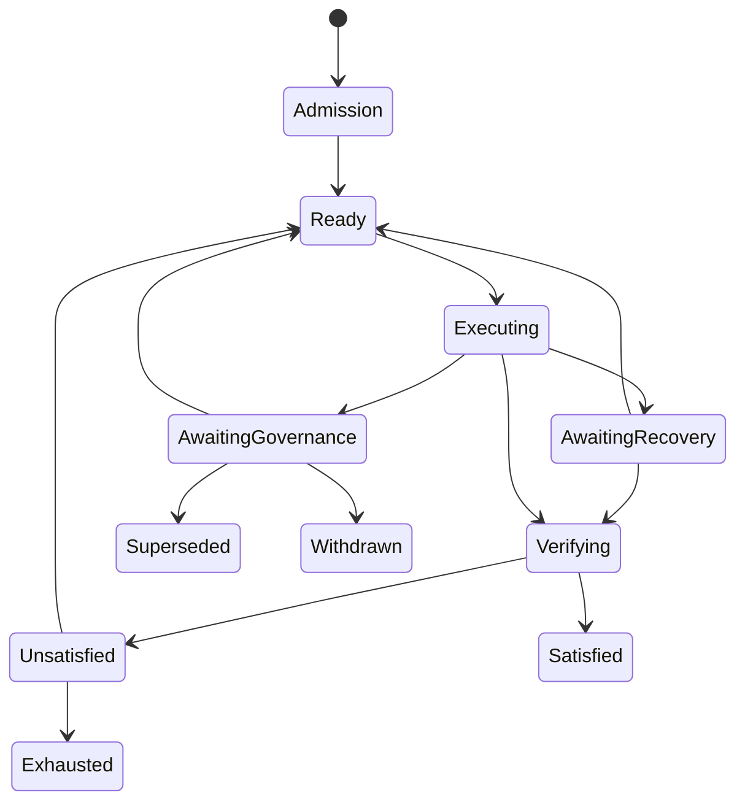
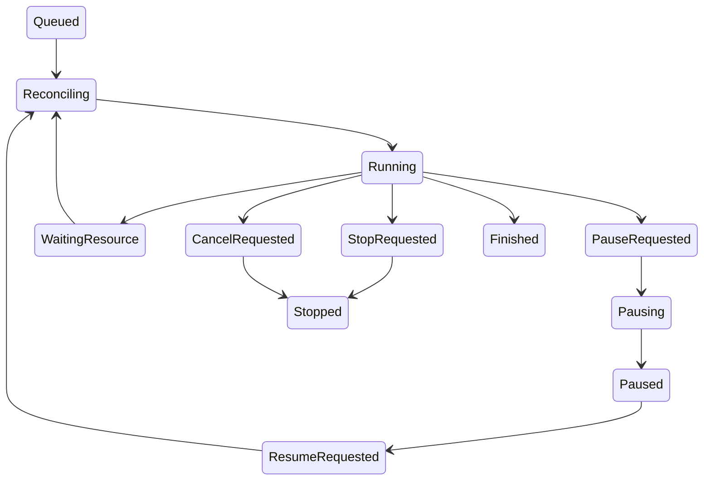

# Watt-native Executor — Lifecycle, Contracts and Recovery

Date: 2026-09-11. Status: **PROPOSED FOR HUMAN ARCHITECTURE CLOSURE**. Normative companion to the [Blueprint](watt-native-executor-blueprint.md); no implementation or migration is supplied here. The main document owns topology, retention and data shape. This document owns transition semantics and recovery behavior. Qualification references the transition and fault IDs below.

## Transition conventions

Every table row specifies trigger, precondition/authority, durable writes/event, side effects and failure. Unlisted transitions are rejected. State names belong to separate aggregates; no global runtime enum is introduced.

Common rules apply to **every** transition:

- Caller must be authenticated and authorized for the exact subject; request carries command_id, request digest and expected current versions. Worker actions additionally carry Attempt generation/worker epoch/control version. Wrong authority, subject, expected version or state returns CONFLICT/DENIED and performs no new effect.
- Mutable projection + immutable transition/action record + outbox event commit in one PostgreSQL UnitOfWork. `E(name)` below means that durable event with full lineage/sequence, not an in-memory notification.
- `F0`: failed validation/SQL rollback leaves prior committed state unchanged; no action scheduled. `F1`: uncertain commit response requires query by idempotency key, not blind execution. `F2`: external action may have begun; preserve intent/receipt, record uncertainty, quarantine affected scope and reconcile. Each row lists its applicable failure behavior.
- External side effects occur after committed intent and outside the transaction. A durable request acknowledgment is not a completion acknowledgment. Duplicate commands return their original result only when actor, digest and subject match.
- Events and receipts are immutable. Current state is a versioned projection; resolving uncertainty appends a resolution, never edits the historical UNKNOWN record. A historical failure or satisfaction can remain true while current applicability changes.

## L1. PWU production lifecycle

`disposition`: OPEN, SATISFIED, EXHAUSTED, SUPERSEDED, WITHDRAWN. OPEN has a `phase`: ADMISSION, READY, EXECUTING, AWAITING_RECOVERY, AWAITING_GOVERNANCE, VERIFYING, UNSATISFIED. Terminal contract-version decisions have no live phase; old phase remains in history. A new contract revision may reopen the same meaningful PWU under explicit admission. A changed meaningful objective requires Steering replacement/decomposition instead.

The diagram shows principal routes; the table defines all allowed routes including governance from other OPEN phases.

| ID / transition and trigger | Preconditions / authority | Durable writes and event | External side effects | Failure outcome |
|---|---|---|---|---|
| P01 create → OPEN/ADMISSION; admitted Steering production decision | Work Reality/decision current; SPG validates meaningful objective and contract, Human authority already sufficient. | PWU/link + contract v1 + transition; E(pwu.admitted). | Queue readiness preparation only. | F0/F1; no executable grant on incomplete admission. |
| P02 ADMISSION → READY; preparation satisfied | Exact Assets/source/context, finite resource profile, capabilities and qualification prerequisites available; SPG. | Readiness basis + current pointer; E(pwu.ready). | None. | F0/F1; missing input stays ADMISSION with recorded blockers. |
| P03 READY → EXECUTING; grant/start admitted | Current contract, no live writable grant, allowed cumulative budget; SPG. | Attempt/binding/current generation + queue + phase; E(execution.queued). | Supervised worker claims later. | F0/F1; duplicate cannot create second Attempt. |
| P04 EXECUTING → AWAITING_RECOVERY; uncertain effects/ownership | Coordinator emits current attributable recovery finding; SPG projection. | Recovery case + phase + admission barrier; E(pwu.recovery_required). | Quiesce/query through host. | F2; keep scope quarantined. |
| P05 AWAITING_RECOVERY → EXECUTING; proven retained grant resumes | Same valid binding; recovery has resolved relevant effects; SPG/coordinator under admitted recovery policy. | Resolution + phase + resume intent; E(pwu.continuation_admitted). | Worker hydrate through L4. | F0/F1; new uncertainties remain recovery. |
| P06 AWAITING_RECOVERY or UNSATISFIED → READY; successor eligible | Reconciled output/residuals, old grant terminal, policy/budget sufficient; SPG. | Fresh readiness and recovery decision referencing predecessor; E(pwu.retry_ready). | Prepare successor workspace if needed. | F0/F1/F2 on allocation; useful old output retained. |
| P07 EXECUTING or AWAITING_RECOVERY → VERIFYING; exact result selected | Current contract/vector, no relevant unresolved effect, producer grant released/quiescent or attributed recovery claim; SPG. | Selected claim, independent observation/Completion request, phase; E(pwu.verification_requested). | Independent observer/verifier reads immutable output and scratch. | F0/F1; structural failure remains recovery or UNSATISFIED; never PASS. |
| P08 VERIFYING → UNSATISFIED; NOT_PRODUCED or FAIL | Exact-subject independent evaluation; SPG. | Evaluation/failed obligations + applicability; E(pwu.unsatisfied). | Bounded repair scheduling can follow P06. | F0/F1; historical evaluation immutable. |
| P09 VERIFYING → SATISFIED; all gates pass | PRODUCED, all required independent Verification PASS and admissibility; current contract/vector; SPG only. | Satisfaction fact + disposition/version; E(pwu.satisfied). | Candidate sealing is a separate command. | F0/F1; INCONCLUSIVE never satisfies. |
| P10 any OPEN phase → AWAITING_GOVERNANCE; material boundary finding/Stop disposition | Authenticated Human control or attributable scope/risk/intent finding; SPG. | Blocking reason + phase + control barrier; E(pwu.governance_required). | Stop new effects; settle active effects via L4/L5. | F2 if active effects; also recovery flag until safe. |
| P11 AWAITING_GOVERNANCE → READY or EXECUTING; decision resolved | SPG admits same-contract continuation/new readiness; old grant valid for EXECUTING, otherwise READY. | Decision/applicability + phase; E(pwu.governance_resolved). | Resume/prepare only through runtime rules. | F0/F1; unresolved uncertainty takes recovery precedence. |
| P12 UNSATISFIED or AWAITING_GOVERNANCE or AWAITING_RECOVERY → EXHAUSTED | SPG concludes no permitted productive continuation under current contract/policy, all ongoing effects classified and no active writer. Attempt budget exhaustion alone insufficient. | Exhaustion decision, residual obligations, retained artifact refs; E(pwu.exhausted). | Release remaining grants/resources safely. | F0/F1; unsafe ambiguity stays recovery. |
| P13 any OPEN phase → SUPERSEDED; replacement/decomposition admitted | Steering/Work decision identifies successor PWUs and residual allocation; no active writer after barrier. | Supersession links, closed contract disposition; E(pwu.superseded). | Safely release old grant; successor execution separate. | F0/F1/F2; no implicit completion or discarded output. |
| P14 any OPEN phase → WITHDRAWN; Human withdraws production | Exact Human decision, stop initiated and active effects classified; SPG. | Withdrawal and preserved findings/outputs; E(pwu.withdrawn). | Resource release/retention, no rollback. | F0/F1/F2; unresolved effects retained even after withdrawal. |
| P15 current contract revision → new OPEN/ADMISSION revision | Human/Steering admits changed constraints while meaningful objective remains same; fence/release old grant first. Applies also after SATISFIED/EXHAUSTED/WITHDRAWN, never reopens a superseded lineage. | New immutable contract revision, current pointer, carry-forward applicability findings; E(pwu.contract_revised). | Readiness recomputed. | F0/F1; no reuse of old PASS without explicit exact-subject applicability. |

Resource waits and PAUSED do not change OPEN/EXECUTING by themselves. Multiple simultaneous blockers are a set of facts; the displayed production phase has priority AWAITING_RECOVERY over AWAITING_GOVERNANCE over runtime wait. Work, delivery acceptance and target integration states are separate projections. A source/verification freshness problem discovered after satisfaction blocks Candidate/integration and records stale applicability; it does not mutate the historical SATISFIED decision.

## L2. Execution Session

Session has OPEN/CLOSED condition, `current_bundle_id`, `current_working_state_version`, and optional parent bundle/Session. Hot/cold storage is a workspace/retention concern, not a third kind of Session truth.

| ID / transition and trigger | Preconditions / authority | Durable writes and event | External side effects | Failure outcome |
|---|---|---|---|---|
| S01 absent → OPEN; first native binding | PWU admitted, exact context; coordinator acting on SPG grant admission. | Session ID/parent refs + initial frontier; E(session.opened). | None. | F0/F1. |
| S02 OPEN → OPEN; append Step/context/checkpoint | Valid attached Attempt/epoch; sequence and current frontier match; runtime. | Append facts + CAS frontier; E(session.frontier_advanced). | Only separately admitted tools. | F0/F1; stale append forensic only. |
| S03 OPEN → OPEN; attach successor Attempt | Old grant terminal, committed portable bundle and current PWU authority; SPG/coordinator. | New Attempt link; preserve all earlier links; E(session.attempt_attached). | New workspace/provider session via services. | F0/F1/F2; never reuse old credentials. |
| S04 OPEN/CLOSED parent → new OPEN child; fork/reset approach | Named committed parent bundle, valid PWU policy, separate writable authority; SPG/coordinator. | Child Session + parent lineage + fork decision; E(session.forked). | Isolated child workspace. | F0/F1/F2; parent untouched. |
| S05 OPEN → CLOSED; explicit retirement/PWU closure | No live grant, in-flight effects or unapplied admitted updates; coordinator reconciles pending updates first. | Closure reason/frontier, retained refs; E(session.closed). | Release ephemeral resources. | F0/F1/F2; does not satisfy PWU. |
| S06 CLOSED → CLOSED; audit or further continuation request | Audit authorized; continuation requires new child Session and grant, not reopening. | Audit optional; closure history unchanged. | None for audit; S04 for continuation. | F0; no execution under closed Session. |

## L3. Attempt grant and terminal outcomes

Grant state is GRANTED, RELEASED or FENCED. Terminal outcomes are RESULT_READY, UNABLE_TO_COMPLETE, BOUNDARY_CROSSING_REQUIRED, BUDGET_EXHAUSTED, STOPPED, CANCELLED, UNKNOWN. A FENCED Attempt carries UNKNOWN unless a definitive previously admitted terminal outcome already exists. Runtime mode in L4 is orthogonal. Terminal outcome belongs to this execution grant; it does not decide PWU satisfaction.

| ID / transition and trigger | Preconditions / authority | Durable writes and event | External side effects | Failure outcome |
|---|---|---|---|---|
| A01 absent → GRANTED/QUEUED; execute admission | Exact current binding/source/contract, no live writable Attempt; SPG. | Existing Attempt identity/generation + native binding/envelope + dispatch/queue; E(attempt.granted). | Allocation/claim later. | F0/F1; unique current-grant prevents duplicates. |
| A02 GRANTED → GRANTED; model/tool retry or safe worker epoch rotation | Binding/current grant unchanged, policy valid; coordinator. | Retry/delivery/lease facts; budget preserved; E(attempt.continuity_retained). | Classified request retry or worker rehydrate. | F0/F1/F2; loss of proof leads A06. |
| A03 GRANTED → RELEASED/RESULT_READY | Quiescent exact bundle, updates applied, current claim passes structural gate; coordinator releases, SPG later evaluates. | Immutable terminal claim/outcome, queue removal, current-grant release; E(attempt.result_ready). | Independent evaluation only. | F0/F1; no trust; incomplete bundle rejects publication. |
| A04 GRANTED → RELEASED/bounded outcome | Unable/boundary/exhaustion proven, settled effects and final bundle; coordinator under SPG policy. | Outcome + findings/residuals + release; E(attempt.released). | Resource cleanup only after pins. | F0/F1/F2; uncertain effects use UNKNOWN. |
| A05 GRANTED → RELEASED/STOPPED or CANCELLED | Authenticated control; future authority revoked; effects confirmed settled. | Outcome + control/termination receipts; E(attempt.stopped or attempt.cancelled). | No rollback; pin output. | F0/F1; unconfirmed effects instead A06. |
| A06 GRANTED → FENCED/UNKNOWN or RELEASED/UNKNOWN | Grant/generation invalidated or continuity unprovable; SPG/coordinator. | Terminal outcome, fence/control version, recovery case, scope quarantine; E(attempt.unknown). | Enter CANCEL_REQUESTED to terminate/query remaining actors; C11 may later acknowledge local STOPPED without changing UNKNOWN outcome. | F2; no overlapping successor until safe. |
| A07 RELEASED/FENCED → unchanged; late receipt/reconciliation | Host/reconciler identity valid, old basis tagged; coordinator accepts forensic facts only. | Late receipt + resolution link, no outcome rewrite; E(recovery.late_evidence_recorded). | Queries/independent observation only. | F0/F1; stale current-state publication rejected. |
| A08 terminal predecessor → new GRANTED successor | R1–R7 complete for relevant scope, current PWU, new binding/resource admission; SPG policy or material Human decision. | New generation/attempt, predecessor/reason/bundle refs; E(attempt.successor_granted). | New isolated workspace and provider session. | F0/F1/F2; old identity/outcome immutable. |

One backend dispatch belongs to one Attempt; many native Steps and effect deliveries occur within it. Material model/provider/effort/backend, contract/source or resource-envelope replacement uses A08. Credential refresh and worker restart alone can use A02 only if scoped authority and continuity remain exact. The cumulative PWU envelope and recovery cap are never reset by A08.

## L4. Runtime control: pause, resume, stop and cancel

Modes: QUEUED, RECONCILING, RUNNING, WAITING_RESOURCE, PAUSE_REQUESTED, PAUSING, PAUSED, RESUME_REQUESTED, STOP_REQUESTED, CANCEL_REQUESTED, STOPPED, FINISHED. `effect_uncertainty` and blocker sets are orthogonal. STOPPED means no remaining local actor is known authorized/alive after control; unresolved remote effects may remain, explicitly flagged. PAUSED requires no relevant active/uncertain mutation and a quiescent bundle.

| ID / transition and trigger | Preconditions / authority | Durable writes and event | External side effects | Failure outcome |
|---|---|---|---|---|
| C01 QUEUED/RESUME_REQUESTED → RECONCILING; worker claims | Current grant, no conflicting writer, eligible resources; coordinator. | Lease/epoch + mode; E(execution.reconciling). | Observe/hydrate; no new productive mutation. | F0/F1/F2; never skip recovery. |
| C02 RECONCILING → RUNNING | Valid binding/frontier, capabilities and budget; no unresolved relevant mutation; recovery/coordinator. | Reconciliation result + control/basis check + mode; E(execution.running). | Kernel may admit next Step. | F0/F1; stays blocked/reconciling on invalidity. |
| C03 RUNNING/WAITING_RESOURCE/QUEUED/RECONCILING/RESUME_REQUESTED → PAUSE_REQUESTED | Authenticated Human or admitted pause policy; not terminal. | Control_version increment + no-new-effects barrier; E(execution.pause_requested). | Signal worker/tool host. | F0/F1; acknowledgment says request recorded only. |
| C04 PAUSE_REQUESTED → PAUSING | Coordinator acknowledges barrier; host ownership known. | Active-effect frontier and settle plan; E(execution.pausing). | Drain bounded in-flight calls, stop write-capable services/processes. | F2; uncertain effects remain named. |
| C05 PAUSING → PAUSED | All relevant effects settled; QUIESCENT bundle committed; no writable service survives; coordinator. | Bundle pointer + mode + lease release + credential suspension; E(execution.paused). | Tear down ephemeral container/services as needed. | F0/F1; uncertainty forbids PAUSED. |
| C06 PAUSED → RESUME_REQUESTED | Authenticated request or explicitly pre-admitted scheduled policy; retained grant not terminal. | Request + control version + queue; E(execution.resume_requested). | C01 loads/revalidates later. | F0/F1; invalid grant returns successor-required outcome. |
| C07 RUNNING → WAITING_RESOURCE | Reservation/provider/quota/capacity/storage block; resource service/coordinator. | Reason/next eligibility + checkpoint intent; E(execution.resource_blocked). | Settle active effects; release worker after safe bundle, preserve grant. | F2; unresolved effects also require recovery. |
| C08 WAITING_RESOURCE → RECONCILING | Resource service proves eligible within unchanged envelope; cumulative policy permits wake. | Wake receipt + lease/epoch + queue/mode; E(execution.resource_resuming). | Rehydrate/checkpoint validation. | F0/F1; same block does not busy-loop. |
| C09 RUNNING/RECONCILING/WAITING_RESOURCE/PAUSE_REQUESTED/PAUSING/PAUSED/RESUME_REQUESTED/QUEUED → STOP_REQUESTED | Authenticated Stop or admitted terminal stop rule; coordinator. | Close admissions, increment control version, request receipt; E(execution.stop_requested). | Graceful interrupt then bounded escalation. | F0/F1/F2; stop is not rollback. |
| C10 same nonterminal modes, including STOP_REQUESTED → CANCEL_REQUESTED | Authenticated Cancel/emergency policy; coordinator fences worker access. | Immediate admission closure/fence + receipt; E(execution.cancel_requested). | Hard kill/query host; bypass slow WIC interpretation. | F0/F1/F2; external side effects may remain. |
| C11 STOP_REQUESTED/CANCEL_REQUESTED → STOPPED | Local termination proven; terminal outcome/effect uncertainties recorded; coordinator. | A05 or A06 + mode, recovery/pins if needed; E(execution.stopped). | Only reconciliation may run next. | F2 if host termination unknown: remain request mode, quarantine. |
| C12 RUNNING → FINISHED | A03/A04 released exact grant, no active productive effect. | Mode + terminal outcome/event in same transaction. | Assessment may run independently. | F0/F1; final prose alone cannot trigger. |
| C13 RUNNING/WAITING_RESOURCE/RECONCILING/PAUSING → RECONCILING; lost owner or newly uncertain effect | Coordinator establishes barrier/epoch fencing; current grant still potentially retainable. | Recovery case, mode, quarantine refs; E(execution.recovery_required). | R1–R7; do not revive cancelled control. | F2; if grant is fenced use A06 and successor path. |
| C14 paused/terminal duplicate command → unchanged | Same command or already achieved control state, same actor/subject. | Return original receipt; contradictory or stale command gets conflict. | None. | F0; no implicit resume. |
| C15 QUEUED/RECONCILING/WAITING_RESOURCE/PAUSED → FINISHED; non-result bounded release | A04 releases grant under admitted stop/exhaustion/boundary policy; all relevant effects settled and final bundle retained where materialized. | Terminal outcome + mode + release event in same transaction. | Safe resource release only; no productive action. | F0/F1; uncertain effects use A06/C10/C11 instead. |

A requested pause persists across worker restart: reconstruction reads desired control before choosing a runnable mode. After C13, a retained pause follows C03 → C04 → C05; retained Stop/Cancel follows C09/C10 → C11. C02 is legal only when desired control is RUN and resource blockers are clear. If resources remain blocked, the coordinator retains RECONCILING with that blocker until eligibility permits C02 or a control request takes precedence. `RECONCILING` is never permission to ignore a more restrictive desired control.

When A06 already fixed the terminal outcome as UNKNOWN, C11 only records physical/control settlement and preserves that original outcome. It cannot replace it with CANCELLED merely because a later kill succeeded. An unallocated queued grant may be released with a recorded no-workspace/no-effect frontier rather than inventing an artifact bundle.

## L5. Worker ownership and fencing

Ownership states: UNOWNED, LEASED, QUIESCING, QUARANTINED. Grant generation and worker epoch are different. Tool host must validate current admission, and retains started-operation identity independently of worker memory.

| ID / transition and trigger | Preconditions / authority | Durable writes and event | External side effects | Failure outcome |
|---|---|---|---|---|
| O01 UNOWNED → LEASED; claim | Grant current, queue eligible, safe conflict domains; coordinator. | CAS owner/epoch+1/deadline; E(worker.claimed). | Worker starts reconciliation. | F0/F1; one claim wins. |
| O02 LEASED → LEASED; heartbeat | Same owner/epoch, not expired/revoked, grant valid; coordinator clock. | Lease renewal/health; coalesced heartbeat, durable ownership remains. | None. | F0/F1; failure immediately stops new admissions. |
| O03 LEASED → QUIESCING; lease expiry/death/control fence | Coordinator finds expiry or revocation; DB authority closes old epoch. | Epoch fence + control barrier + quiesce request; E(worker.ownership_lost). | Host stops old mutating operations, revokes credentials. | F2; DB lease alone not termination. |
| O04 QUIESCING → UNOWNED | Host termination and effect settlement proven; recovery/coordinator. | Termination receipt + cleared active-owner reservation; E(worker.released). | New claim only after reconciliation eligibility. | F0/F1; unresolved domain uses O05. |
| O05 QUIESCING → QUARANTINED | Old process/external effect cannot be proven stopped/reconciled. | Quarantine scope + reason + recovery case; E(scope.quarantined). | Bounded query/kill/inspection only. | F2; no new overlapping writer. |
| O06 QUARANTINED → UNOWNED | Independent evidence proves safe termination/reconciliation or isolated domain replacement; coordinator/SPG policy. | Resolution and scope release, history retained; E(scope.reconciled). | New grant/claim may follow. | F0/F1; Human risk label alone does not kill a process. |
| O07 LEASED → UNOWNED; graceful release | Quiescent committed checkpoint/terminal result, no retained writer; coordinator. | Release owner + mode event; E(worker.released). | Drop credentials/ephemeral resources. | F0/F1/F2; failed teardown retains resource pin. |
| O08 any → unchanged; stale publication/unlock | Producer old epoch or wrong owner; coordinator. | Rejection/late-evidence record, no current-state mutation; E(worker.stale_publication_rejected). | None. | F0/F1; never release current owner's reservation. |

## L6. Step and effect lifecycle

Step categories: INFERENCE, PLAN_UPDATE, TOOL_INVOCATION, OBSERVATION, CONTEXT_APPLICATION, CHECKPOINT, RECOVERY, HANDOFF. A tool completion receipt is an immutable subfact closing its TOOL_INVOCATION Step, not a second product-level task. Each category has typed request/result schemas. Token deltas and polling are never Steps.

| ID / transition and trigger | Preconditions / authority | Durable writes and event | External side effects | Failure outcome |
|---|---|---|---|---|
| K01 absent → PREPARED; next accountable work | Kernel sequence matches, current control/binding, resources reserved; coordinator. | Step request/blob refs + sequence; E(step.prepared). | None yet. | F0/F1. |
| K02 PREPARED → RUNNING; start | Exact Step and current epoch; coordinator/tool host. | Start fact + required effect intent; E(step.started). | Inference or tool follows its journal protocol. | F1/F2; start uncertainty is explicit. |
| K03 RUNNING → COMPLETED; complete result stored | Complete normalized response/receipt/observation persisted and attributable; coordinator. | Result/evidence + ledger + frontier; E(step.completed). | Dependent Step may now be prepared. | F0/F1; no next tool on uncommitted response. |
| K04 PREPARED/RUNNING → FAILED; deterministic error | Failure known; effect certainty separately recorded; coordinator. | Failure result and residual; E(step.failed). | Local repair can be a new Step. | F0/F1/F2 if effects also uncertain. |
| K05 RUNNING → INTERRUPTED; cancellation/death/incomplete inference | Host or coordinator evidence, partial results retained. | Interruption + pending-effect refs/unknown usage; E(step.interrupted). | Stop/query effects; no partial model proposal execution. | F2; classification not inferred from text. |
| K06 terminal Step → unchanged; replay/read | Result exact subject still applicable; runtime/reconciler. | Reuse decision/new consuming Step link if needed. | No re-invocation of settled mutations. | F0/F1; stale result not reused as current check. |

Effect class is immutable: READ_ONLY, IDEMPOTENT, RECONCILABLE_MUTATION, NON_REPLAYABLE. READ_ONLY requires host proof; IDENTITY alone does not make an API idempotent. IDEMPOTENT specifies stable provider key/precondition, scope, validity window and response-query behavior. RECONCILABLE_MUTATION supplies a concrete before/after/query strategy. NON_REPLAYABLE uses no automatic resubmission after uncertain acceptance.

Effect states: INTENDED, STARTING, ACTIVE, SETTLED, UNKNOWN; settled result details are NOT_STARTED, SUCCEEDED, FAILED or CANCELLED with observed effects. A settled FAILED may have known partial changes. Resolutions append to UNKNOWN and update its projection; old receipt remains.

| ID / transition and trigger | Preconditions / authority | Durable writes and event | External side effects | Failure outcome |
|---|---|---|---|---|
| E01 absent → INTENDED; proposed tool admitted | Exact schema/scope/preconditions/reservation, current control/epoch; trusted gateway. | Effect semantic ID, request, class, domain reservation, admission token; E(tool.intended). | None before commit. | F0/F1. |
| E02 INTENDED → STARTING; host delivery | Matching request digest/current authority; no existing execution for same delivery; host. | Host spool STARTING, delivery nonce and DB start projection; E(tool.starting). | Launch/submission may follow. | F2 at ambiguous launch; never assume no effect. |
| E03 STARTING → ACTIVE; process/provider acknowledged | Stable process/container/operation identity observed by host. | Operation ref/start receipt; E(tool.started). | Active operation continues within scope/deadline. | F2; lost acknowledgment queried by ID. |
| E04 INTENDED → SETTLED/NOT_STARTED; denied/revoked before acceptance | Host proves no submission/start; coordinator. | No-effect receipt + reservation release; E(tool.not_started). | None. | F0/F1; missing STARTED alone insufficient proof. |
| E05 STARTING/ACTIVE → SETTLED; result/termination proven | Trusted receipt, output persisted, actual effect certainty recorded. | Receipt/evidence + consumed usage + conflict release when safe; E(tool.finished). | No further effect except explicit cleanup. | F0/F1; lost DB ack query receipt key. |
| E06 STARTING/ACTIVE → UNKNOWN; timeout/crash/lost response | Effect could have started; host/reconciler. | Uncertain receipt + scope quarantine + recovery case; E(tool.unknown). | Cancel/query/observe through reconciler. | F2; no blind mutation retry. |
| E07 UNKNOWN → SETTLED projection; reconciliation | Effect-specific evidence proves result/absence and safe scope; recovery service. | Immutable resolution referencing unknown receipt; E(tool.reconciled). | None or separately authorized residual action. | F0/F1; unresolved stays UNKNOWN. |
| E08 INTENDED/UNKNOWN/SETTLED → same semantic effect, new delivery | Allowed only if absence proven, or endpoint key guarantees safe deduplication within window; exact same intent/precondition remains valid, resource reservation allowed. | New delivery ID/retry reason linked to original; E(tool.delivery_retried). | Bounded resubmission. | F2 if outcome again unknown; repeated UNKNOWN is not infinite authority. |
| E09 any → unchanged; duplicate delivery/result | Same effect/delivery/request identity; host/gateway. | Return existing operation/receipt, no double debit or publication. | None. | Digest mismatch denied; stale epoch forensic only. |

Changing command, target, source preconditions or desired semantic result creates a new effect with explicit `replaces/reconciles` relationship. Provider-generated tool-call IDs are stored only as correlation. A read rerun can be safe but must identify the observation frontier; a test may mutate scratch and is not automatically read-only. A later independently repeated read/test is a new semantic observation, not reuse of an old provider call ID.

## L7. Workspace and retention lifecycle

States: ALLOCATING, READY, SEALED, HIBERNATED, QUARANTINED, RETIRING, DELETED. Workspace ownership and process state remain in L5/L6; READY does not by itself grant a writer. RETIRED in the main object overview means entering RETIRING with all use ended, not an additional persisted state.

| ID / transition and trigger | Preconditions / authority | Durable writes and event | External side effects | Failure outcome |
|---|---|---|---|---|
| W01 absent → ALLOCATING | Exact manifest/source, storage allowance, SPG grant; workspace service. | Workspace/mount IDs + allocation intent; E(workspace.preparing). | Private clone/files/resource creation. | F2; cleanup incomplete allocation by ID, preserve source. |
| W02 ALLOCATING → READY | Object closure, mount scopes, environment and source checks pass; host. | Materialization/inventory receipt + binding; E(workspace.ready). | Worker may claim/use via grants. | F0/F1; partial allocation remains blocked. |
| W03 READY → READY; safe mutation checkpoint | Current lease/effects settled for named frontier; host/checkpoint service. | Inventory delta/materialization version, bundle references; E(workspace.frontier_recorded). | Snapshot immutable content. | F2; unquiesced snapshot cannot become Candidate. |
| W04 READY → SEALED; result freeze/terminal export | Quiescent writer, exact output vector, no in-flight mutation; coordinator/observer. | Sealed inventory + immutable output refs/pins; E(workspace.sealed). | Revoke write access; preview uses separate scratch copy. | F0/F1/F2; cannot seal uncertain output. |
| W05 READY/SEALED → HIBERNATED; hot retention expires | No lease/process, full recoverable export, all required content pinned; retention service. | Hibernate plan and verified bundle; E(workspace.hibernated). | Delete only hot materialization after verification. | F2; retain last usable copy if deletion/export incomplete. |
| W06 HIBERNATED → ALLOCATING → READY; eligible resume | Valid retained bundle; grant continuity/resource policy validated; workspace service. | Rehydrate intent + new materialization locator/version. | Restore exact content and environment recipe. | F2; no claim to restore live handles; missing content recovery fault. |
| W07 ALLOCATING/READY/SEALED/HIBERNATED → QUARANTINED | Unknown writer, corrupt content or scope violation; host/coordinator. | Quarantine reason/frontier and pins; E(workspace.quarantined). | Stop/query actors, independent inspection. | F2; refuse new overlapping writers. |
| W08 QUARANTINED → READY/SEALED/HIBERNATED | Proven safe resolution and correct manifest; recovery/coordinator selects observed destination. | Resolution and applicability; E(workspace.reconciled). | None or explicitly recorded reconstruction. | F0/F1; lost materialization gets successor identity if continuity lost. |
| W09 unleased READY/SEALED/HIBERNATED → RETIRING | Retention elapsed, no active/recovery/Candidate/Verification/preview pins, no unique unexported output; retention service. | Cleanup plan, last pin check, barrier; E(workspace.retiring). | Delete named physical resources idempotently. | F0/F1/F2; new pins cannot race past barrier. |
| W10 RETIRING → DELETED | Physical cleanup confirmed; retained lineage/tombstone exists. | Delete receipt/tombstone; E(workspace.deleted). | None. | F2; incomplete cleanup stays RETIRING and retries by plan ID. |

New grants cannot attach a RETIRING/DELETED workspace. A successor Attempt normally gets a new workspace_id from a complete retained checkpoint; same-identity rehydration is only for a valid still-continuous Attempt and materialization loss explicitly classified as safe hot eviction. Unplanned loss of its writable state ends Attempt continuity.

## L8. Resource and budget state

Resource projection is AVAILABLE, RESERVED, BLOCKED, RECONCILING_USAGE or EXHAUSTED; individual reservations and ledger entries remain separate. Multiple blocking resources may coexist.

| ID / transition and trigger | Preconditions / authority | Durable writes and event | External side effects | Failure outcome |
|---|---|---|---|---|
| B01 AVAILABLE → RESERVED; upcoming request/tool | Exact profile/finite envelope, sufficient PWU pool, conservative reservation; resource service. | Reservation keyed by Step/request, shared-pool debit; E(resource.reserved). | None before admission. | F0/F1; insufficient becomes B04. |
| B02 RESERVED → AVAILABLE or EXHAUSTED; known usage settles | Attributable provider/host report with estimate/actual labels. | Append usage, release only proven unused allowance; E(resource.accounted). | None. | F0/F1; no double debit on duplicate receipt. |
| B03 RESERVED → RECONCILING_USAGE; usage unknown | Request may have been charged, report missing; adapter/resource service. | UNKNOWN consumption, reservation retained; E(resource.usage_unknown). | Query accounting only where supported. | F0/F1/F2; never set consumption to zero. |
| B04 AVAILABLE/RESERVED/RECONCILING_USAGE → BLOCKED | Capacity/quota/permission/storage or allowance prevents next action. | Reason, eligibility evidence, next permissible query and checkpoint request; E(resource.blocked). | Quiesce/park; no silent provider switch. | F2 for unsettled effects; preserve all reservations. |
| B05 BLOCKED → AVAILABLE/RECONCILING_USAGE; eligibility restored | Trusted reset/capacity/capability evidence, unchanged admitted policy; resource service. | Wake decision and remaining balance; E(resource.available). | Queue reconciliation, not immediate blind retry. | F0/F1; no clock-only proof of external quota reset if unverified. |
| B06 RECONCILING_USAGE → AVAILABLE/EXHAUSTED; late usage | Attributable accounting evidence; resource service. | Append adjustment against original request; E(resource.usage_reconciled). | None. | F0/F1; original UNKNOWN history retained. |
| B07 any live state → EXHAUSTED; finite bound reached | Configured active/request/tool/time/cost limit observed; resource service. | Exhaustion evidence + control/checkpoint; E(resource.exhausted). | Stop further spending; preserve useful output. | F2 if active operation; no PWU auto-satisfaction. |
| B08 BLOCKED/EXHAUSTED → successor allocation | Material expansion/profile change explicitly admitted; SPG/Human policy. | New envelope revision + successor Attempt; cumulative PWU accounting retained. | A08/C01; no purchase automatically. | F0/F1; insufficient authority remains blocked. |

Capacity is eligible for bounded automatic recheck; unmeasurable spend, authentication/configuration and material allowance expansion require their owning decision. Exponential backoff is not a lifecycle owner. Failed implementation may consume resources but stays ordinary engineering repair until bounds fire.

## L9. Checkpoint and compaction publication

| ID / transition and trigger | Preconditions / authority | Durable writes and event | External side effects | Failure outcome |
|---|---|---|---|---|
| J01 absent → PREPARING; checkpoint barrier | Exact frontier/control and declared consistency class; checkpoint service. | Bundle intent and three frontier references; E(checkpoint.started). | Quiesce/capture content. | F2; previous committed bundle remains current. |
| J02 PREPARING → COMMITTED | All blobs/object closure verified, context/effect/frontier versions match, consistency constraints pass. | Immutable bundle plus CAS current pointer + pins; E(checkpoint.committed). | Memory hydrates committed pointer only afterward. | F0/F1; orphan blobs safe; query commit key. |
| J03 PREPARING → ABORTED | Capture/CAS/validation failure or intervening material update. | Failure/unused content refs; E(checkpoint.failed). | None; cleanup unreferenced content later. | F0/F1; never erase old checkpoint. |
| J04 absent → PREPARING; compaction requested | Frozen context/input frontier and reserved budget; context service. | Compaction intent + inference Step; E(context.compaction_started). | Candidate projection inference. | F2 for unknown charge, old context remains. |
| J05 PREPARING → COMMITTED; compaction replacement | Mandatory exact capsule preserved, references validated, blobs durable and current control/context CAS matches. | New projection + CAS pointer + provenance; E(context.compaction_completed). | Swap worker memory after DB commit. | F0/F1; crash before commit uses old, after commit uses new. |
| J06 PREPARING → ABORTED/BLOCKED; compaction failure | Error, stale frontier, invalid summary or no context fit. | Failure reason/candidate ref; retain current projection; E(context.compaction_failed). | At most bounded recompute or park; no implementation replay. | F0/F1/F2 usage retained; capsule too large blocks inference. |

ABORTED is an operation outcome; BLOCKED is the resulting runtime context-capacity blocker, not a partially committed projection. A generic bundle may be RECOVERY_REQUIRED with named exceptions; PAUSED and RESULT_READY always require QUIESCENT. A committed bundle's metadata cannot be edited to remove exceptions; reconciliation produces a new bundle.

## L10. Recovery case lifecycle

Case states: OPEN, FENCING, INSPECTING, CLASSIFIED, PRESERVING, DECIDED, BLOCKED, CLOSED. These track recovery work, not Attempt success. Multiple cases may reference a PWU, but only the current exact basis can admit continuation.

| ID / transition and trigger | Preconditions / authority | Durable writes and event | External side effects | Failure outcome |
|---|---|---|---|---|
| R01 absent → OPEN | Attributable unknown/lost-owner/stale/budget salvage trigger; coordinator/SPG. | Case and affected domains/basis; E(recovery.opened). | Close relevant action admissions. | F0/F1. |
| R02 OPEN → FENCING | Current affected owner/scope known. | Epoch/control barrier and quarantine plan; E(recovery.fencing). | Terminate/query old actor. | F2; no successor write. |
| R03 FENCING → INSPECTING | Quiescence proven or inspection strictly read-only on quarantined scope. | Frontier loaded + inspection plan; E(recovery.inspecting). | Independent inventories/operation queries. | F2; classify ongoing effects separately. |
| R04 INSPECTING → CLASSIFIED | Available observations retained, gaps explicit. | Versioned NO_EFFECT/COMPLETE/PARTIAL/STALE/LOST/UNRESOLVED assessment; E(recovery.classified). | None. | F0/F1; stale assessment re-inspects, never reused by ID alone. |
| R05 CLASSIFIED → PRESERVING | Useful output attributable; capture is safe or diagnostic-only class explicit. | Salvage manifest/residuals/export intent; E(recovery.preserving). | Freeze/export output, no trusted ref update. | F2; cannot call unstable capture quiescent. |
| R06 CLASSIFIED/PRESERVING → DECIDED | Exact evidence and current governance/capability/resource basis; SPG/recovery policy. | Decision = RESUME_GRANT / SUCCESSOR / SUBMIT_OBSERVED_RESULT / NO_CONTINUATION; E(recovery.decided). | Enqueue named action only after commit. | F0/F1; material new authority returns BLOCKED. |
| R07 FENCING/INSPECTING/CLASSIFIED/PRESERVING → BLOCKED | Unsafe ambiguity/missing content/material decision or unavailable resource. | Block reason, retained pins and query/escalation policy; E(recovery.blocked). | Bounded safe queries only. | F2; never auto-abandon unresolved mutation. |
| R08 BLOCKED → INSPECTING | New evidence/decision/resource availability changes basis. | New assessment version, old blocked history retained; E(recovery.reassessment_started). | Inspect exact current Reality. | F0/F1/F2. |
| R09 DECIDED → CLOSED | Chosen action durably admitted or explicit governed no-continuation decision; all relevant scopes safe/resolved. | Action receipts and closure links; E(recovery.closed). | Normal runtime/Verification proceeds independently. | F0/F1; incomplete action retries its command, not original mission. |

The seven-step algorithm in Blueprint N maps R1→R02, R2/R3/R4→R03, R5→R04, R6→R05, R7→R06/R09. An EFFECT_UNRESOLVED case cannot close merely because its Attempt was cancelled. Complete useful output from a terminal UNKNOWN Attempt may create a `recovery_result_claim` under a **read/observation recovery authorization**, with old Attempt provenance and current contract/source applicability, without reopening the old execution grant or spending inference resources.

## L11. Formal fault taxonomy

In this table AUTO means bounded under previously admitted authority, not unlimited retry. HUMAN means a material risk/scope/cost/intent decision; OPERATOR means required service/configuration/storage repair, not routine Human button-pushing. All cases preserve exact binding, historical outcomes and available evidence.

| ID / failure | Detection / effect certainty | Recovery owner and escalation | Retained state | Terminal semantics |
|---|---|---|---|---|
| F01 transient connection | Adapter send/accept phase and request trace; code effects absent if no accepted actions, charge possibly unknown. | Adapter/coordinator AUTO bounded retry with reservations. | Request/frontier/partial stream/usage uncertainty. | Nonterminal until bounds; never deterministic task failure. |
| F02 service capacity | Typed provider response or classified error with raw evidence. | Resource service AUTO backoff/park; permitted replacement via successor only. | Objective, request count, workspace and bundle. | PWU stays open; no new Work. |
| F03 provider quota | Provider quota/reset evidence, possible charge. | Resource service park/query; HUMAN only for unadmitted spend/profile changes. | Useful edits, checks, unknown reservations. | Attempt may remain parked or release BUDGET_EXHAUSTED/UNKNOWN truthfully. |
| F04 admitted budget/time exhausted | Ledger/monotonic counter, known bounds. | Coordinator AUTO quiesce/salvage; HUMAN material allowance extension. | Full residual work and resource provenance. | Does not exhaust/satisfy PWU by itself. |
| F05 authentication / permission | Typed refusal/expired handle. | Broker automatic same-scope refresh; OPERATOR/HUMAN if configuration/authority missing. | Refusal and secret-free capability identity. | Resource path blocked; no repeat unchanged forbidden call. |
| F06 invalid model/request | Schema/profile/adapter error before/after submission. | Adapter bounded format repair where applicable; OPERATOR for invalid profile. | Request/version/error; actual usage availability. | Local error/block, not permission to change provider. |
| F07 context overflow | Profile estimator or provider rejection. | Context service AUTO bounded compaction/selection; HUMAN only if required intent/scope must change. | Exact protected capsule and prior projection. | CONTEXT_BLOCKED if cannot fit. |
| F08 compaction failure | Inference failure, validation/CAS failure, invalid source references. | Context service AUTO recompute within cap/park. | Old usable projection + input frontier + unused candidate. | No execution restart; unknown charge retained. |
| F09 deterministic implementation/test failure | Exit/status/assertions independently observed. | Kernel AUTO repair inside envelope; SPG decides further production. | Failed check subject and logs. | Local FAILED; PWU UNSATISFIED only by evaluation. |
| F10 tool/process timeout | Supervisor deadline, exit/process-group observations. | Host AUTO interrupt/kill/inventory; recovery for uncertainty. | Before state, output spool, descendants/termination receipts. | Known partial effect or UNKNOWN, not no-effect from timeout. |
| F11 external API lost response | Sent/accepted request, operation/key/query contract. | Reconciler AUTO query; HUMAN for irreducible risk decision. | Intent, key, request/receipt, quarantine. | Remains UNKNOWN until evidence resolves. |
| F12 worker crash | Heartbeat/process supervisor/lease expiry. | Coordinator/host AUTO fence+quiesce+R1–R7. | PostgreSQL frontier, retained files, host spool. | Same grant only after proof; otherwise terminal UNKNOWN + successor. |
| F13 browser/API client loss | Socket loss/reconnect cursor. | Event service AUTO snapshot/replay. | Durable command/event identities. | No Attempt transition and no new dispatch. |
| F14 filesystem full/IO/corruption | Host capacity checks, failed flush/rename/hash mismatch. | Storage service AUTO stop admissions; OPERATOR restore capacity; no silent deletion. | Last verified bundle and available spool/material. | Recovery block; cannot acknowledge durable result. |
| F15 workspace lost/unattributable edits | Missing materialization, unexpected writer, digest/basis mismatch. | Workspace/recovery AUTO reconstruct if exact export; HUMAN if unsafe adoption required. | Old source, preserved observations and gaps. | Attempt continuity lost, successor needed. |
| F16 repository/source drift | Independent exact ref/tree/pointer comparison. | SPG AUTO assess; rebase/rework only within admitted correction policy, new binding/evidence; HUMAN material changes. | Prior outputs and immutable PASS as historical evidence. | Current applicability stale; no automatic integration. |
| F17 database outage | Commit/connection failure, heartbeat/authority query unavailable. | Coordinator/host AUTO fail closed, watchdog quiesce, OPERATOR availability. | Host spool/intents and last committed state. | Recovery required; new side-effect admissions forbidden. |
| F18 uncertain DB commit | Client timeout around commit. | Store AUTO query command/effect unique key. | Same request identity and content refs. | Do not allocate replacement IDs until absence established. |
| F19 checkpoint incomplete/missing content | PREPARING without commit or referenced blob validation failure. | Checkpoint/recovery AUTO use valid prior frontier plus receipts; OPERATOR if sole content lost. | Prior bundle, effect journal and orphan content. | Incomplete bundle never current; corrupt committed bundle blocks proof. |
| F20 stale/fenced worker late result | Epoch/generation/control mismatch. | Gateway rejects current publication, recovery may ingest forensic evidence. | Late payload and old producer metadata. | No current success/lease unlock; no history rewrite. |
| F21 verification unavailable/forged/stale | Independent identity/subject/check constraints or failed verifier execution. | Verification service bounded infrastructure retry; reject forgery; SPG repair for FAIL. | Exact assessment request, output and method. | INCONCLUSIVE/FAIL; no satisfaction/authorization shortcut. |
| F22 partial multi-repo integration | Per-target CAS/query states differ or DB commit missing. | Integration AUTO authorized forward recovery; HUMAN new vector/compensation/risk. | Whole Candidate/authorization and every target receipt. | PARTIAL/BLOCKED; whole Runtime Commit forbidden until all converge. |
| F23 host/machine/disk loss | Host storage inaccessible or destroyed. | OPERATOR; remote recovery not promised initially. | Only copies actually surviving; no invented recovery state. | Outside initial guarantee; report explicit data loss/availability. |
| F24 malicious repository/package/tool output | Scope denial, traversal/network test, policy violation, unexpected side effect. | Host denies/fences, independent finding; HUMAN material policy decision only. | Denial/effect receipts and attributable content. | Never upgrades repository instructions to authority. |

## L12. Crash-frontier decision table

This table forbids “the worker crashed, therefore rerun the whole mission”. Each row uses the latest durable fact, not a guessed process stack.

| Crash frontier | Surviving evidence | Required recovery decision |
|---|---|---|
| Before Step/effect intent transaction commits | No committed admission for that command; source/frontier retained. | Query command key; if absent and host cannot have accepted an admission, prepare it once. |
| DB intent committed, host has no accepted delivery | Immutable INTENDED; host has authoritative no-start receipt. | May deliver same effect with valid refreshed authority; absence of local log alone is not sufficient if host storage unavailable. |
| Host STARTING persisted, before stable operation identity | Submission may or may not have happened. | Inspect launcher/container/provider under original key; UNKNOWN/quarantine until known. No automatically repeated shell/API. |
| Active tool mutating files | Before snapshot, intent, container/process ID, output spool and retained partial files. | Fence old worker, stop/settle tool; snapshot actual state; preserve attributable partial work and residual checks. |
| Mutation complete, host receipt not yet durable | Actual files/refs may reflect completion but no authoritative execution result. | Effect-specific before/after inspection; don't infer test PASS from code existence; query remote effects. |
| Host receipt durable, PostgreSQL receipt missing | Fsynced receipt/output + matching intent/delivery. | Import same receipt through current reconciler, append late provenance if epoch changed, never execute again. |
| PostgreSQL receipt committed, checkpoint incomplete | Durable Step/effect result beyond previous bundle plus retained workspace. | Reconstruct from prior bundle + committed journal suffix; inspect consistency; build new bundle, preserve successful work. |
| Blobs written, bundle pointer not committed | Orphan candidate bundle/content; previous pointer valid. | Load previous pointer; validate suffix, retry same checkpoint command or discard orphan, never assume new bundle current. |
| Bundle pointer committed, worker memory not updated | Complete DB/content bundle. | Hydrate committed bundle and next boundary; no repeat of completed effect. |
| Provider response incomplete/unstored | Request/partial response and uncertain charge; no admitted tool proposals from it. | Discard partial actions, keep usage reservation, bounded fresh inference from portable state. |
| Provider complete response stored, no tool Step yet | Exact action proposals and context basis. | Revalidate current basis and apply once using Watt effect IDs; obsolete proposals are not executed after corrections. |
| Pause requested, tool still running | Control barrier + effect identity. | Reconstruct PAUSING/settle; never RUNNING or false PAUSED because worker changed. |
| Stop committed, effect previously admitted | Control barrier and pre-stop effect intent. | Reject any new admission; stop/query previously admitted operation. Report pre-stop in-flight effects truthfully. |
| One of two repository refs advanced | Immutable vector/authorization, per-target effect intents and observed refs. | PARTIAL; query each target, finish authorized remaining CAS only if exact basis still valid; no partial trusted pointer update. |
| All refs advanced, aggregate DB commit uncertain | Authorized target receipts and commit key. | Query commit; if absent revalidate refs/pointer versions and atomically commit vector; never reapply all Git changes. |
| Event committed, relay or UI died | Outbox and canonical sequence. | Replay from cursor/snapshot; duplicates deduped, no execution restart. |

## L13. Internal commands and query contracts

These are implementation interfaces, not final product API names. Internal HTTP transport follows these typed messages; in-process tests call the same service boundary. Common command envelope: schema_version, command_id, authenticated caller (server-derived), Work/PWU subject, expected versions/basis digests, causation/correlation IDs, payload digest. Worker requests add generation/epoch/control token. Secret material is excluded.

Command response: receipt_id, subject IDs, status ACCEPTED/ALREADY_APPLIED/REJECTED/CONFLICT/UNSUPPORTED, current version, event cursor, typed reason and effect/operation reference. ACCEPTED means durable intent only unless an explicit completion receipt is returned. Retries must preserve command ID; changed payload under the same ID is CONFLICT. Queries do not mutate execution or acquire production authority.

| Contract | Request / response beyond common envelope | Owner, idempotency and authority |
|---|---|---|
| `execute_pwu` | Exact contract revision, source/context/binding/profile/envelope/capability refs, optional parent bundle → Attempt/Session/dispatch/queue receipt. | SPG/coordinator; unique current grant. Native backend selected by immutable binding, not latest config. |
| `observe_execution` | PWU/Attempt and optional as-of cursor → production disposition, runtime mode, blockers, phase/action, latest bundle/claim, resource/lease/uncertainty summary. | Read model; does not query model or resend mission. |
| `pause_execution` | Attempt + expected control version → request receipt, later quiescent bundle/PAUSED event. | Authenticated Human or admitted control policy; C03–C05. |
| `resume_execution` | Attempt + retained bundle + expected context/control → accepted reconciliation or successor-required. | C06/C01; never widen grants. |
| `stop_execution` / `cancel_execution` | Exact subject and reason/control intent → recorded barrier and later termination/uncertainty receipt. | Immediate authenticated control; bypass WIC inference only for control, not scope. |
| `submit_human_input` | Interaction record and Work focus → WIC processing receipt. | Existing WIC admission; raw text is not executable update. |
| `admit_execution_update` | WIC assessment + exact current basis + typed admitted meaning → update_id/disposition. | Work/SPG authority; P/C tables; material changes not delegated to kernel. |
| `apply_execution_update` | update_id + expected frontier → APPLIED/DEFERRED/REJECTED/SUPERSEDED receipt. | Coordinator commits before future inference/tool admission. |
| `request_context` | Contract/current manifest + missing facts/Asset refs + purpose/sensitivity → candidate context package/finding. | Context assembler; new authority-sensitive facts still require admission; no hidden Asset expansion. |
| `claim_or_renew_worker` | Attempt, worker/service identity, expected lease epoch → scoped ownership token. | Coordinator O01/O02; DB time and unique owner. |
| `prepare_step` / `record_step_result` | Typed request/result blobs, context frontier and resource refs → Step sequence/result receipt. | Runtime gateway; native worker limited to own execution. |
| `invoke_tool` | Step, tool/schema, exact input digest, desired footprint → admitted effect and delivery ID/operation. | Tool host validates host-derived footprint/class and capability, E01–E03. |
| `query_tool` / `record_tool_result` | effect/delivery/operation + result receipt/digests → status/frontier. | Host identity; late result goes to forensic inbox if owner stale. |
| `control_process` | process_id/start nonce, effect and desired interrupt/kill → request/termination receipt. | Host checks actual instance/container; never PID-only kill. |
| `create_checkpoint` | Named repository/execution/context frontiers + consistency class → bundle receipt. | Checkpoint service J01–J03; content-before-pointer ordering. |
| `reconcile_unknown` | Recovery subject and expected assessment basis → case/actions/residuals/decision. | Recovery/SPG; R01–R09, automatic only within admitted policy. |
| `submit_result_ready` | QUIESCENT bundle, vector/evidence manifest, claimed residuals → structural acceptance/obsolete finding. | Coordinator locks same control row as updates; SPG selects and independently evaluates. |
| `submit_recovery_result` | Terminal Attempt provenance, exact independent observations, current applicability and read/observation recovery authority → result claim. | Reconciler/SPG; cannot reopen terminal grant, declare PASS or bypass verification. |
| `query_evidence` / `query_lineage` | Exact subject/digest, requester visibility → immutable manifest/blob or explicit unavailable/tombstone. | Read capability; no secrets/provider-private state by default. |
| `subscribe_events` / `execution_snapshot` | PWU + last sequence/cursor → ordered events or consistent snapshot(high-water)/RESET. | Event service; read-only, at-least-once dedup, no cancellation on disconnect. |
| `request_preview` | Exact Candidate/artifact vector and permitted recipe → preview record/access state. | Separate preview service; no integration/acceptance authority. |
| `integrate_candidate_vector` | Exact manifest/authorization + target scope → integration-set ID and per-target convergence. | Existing integration owner; effect intents and CAS; never model-exposed universal Git tool. |
| `commit_runtime_vector` | CONVERGED set + expected pointer vector/versions → aggregate Runtime Commit. | Runtime Commit owner; all-or-none PostgreSQL pointer transaction, not all-or-none Git. |

### Backend compatibility contract

`ExecutionBackend.capabilities` declares protocol/schema support, control/recovery features, max writable mounts, allowed resource/environment profiles and evidence completeness. `start(dispatch_id, binding)` returns a stable execution handle immediately after durable acceptance; `observe(handle)` returns meaningful current/terminal state; `control(handle, command)` returns a capability-checked receipt. An optional synchronous `wait_terminal` is a caller convenience with timeout returning STILL_RUNNING, never a fabricated terminal result.

Legacy Codex implements this through a supervised job around its synchronous v1 dispatch; pause/native checkpoint/multi-write support remain false. Native implements the full contract. A disconnected caller reuses handle/dispatch_id. Binding validation rejects native-only requirements on legacy before execution. Terminal compatibility reports are immutable, emitted once; native intermediate Steps never become separate SPG Attempts.

### Reconciliation worked examples

**Quota after edits:** Attempt A has committed patch effects and one test PASS against output tree T1. A later inference hits quota. Runtime parks with UNKNOWN consumption and retained workspace. The reconciler inventories T1, confirms no active writer, identifies a second required test as missing, and preserves the first result only if its subject/environment still match. If further inference requires a new profile, SPG admits Attempt B on the same PWU/Session from the salvage bundle; B inherits cumulative resource accounting. Independent Verification still evaluates the final exact vector. A's original outcome/usage facts never change into success/zero.

**Two repositories, interrupted integration:** Candidate vector `(API=a2, client=b2)` verified against sources `(a1,b1)` is authorized. CAS A succeeds; CAS B is uncertain. Aggregate state is PARTIAL, trusted pointers remain `(a1,b1)`, physical-ref observation shows A at a2. Query B: if b2, record converged observation; if b1, permitted forward CAS may run; if b3, block and prepare an explicitly authorized recovery vector, never force b2. Only after all current exact checks succeed may PostgreSQL admit the aggregate trusted vector. No code Executor is granted write access to those authoritative refs.

**Worker replacement during mutation:** epoch 7 owns a process still writing mount A. Heartbeats expire; epoch 7 loses future admissions, but scope A stays quarantined until host termination and inventory prove what happened. Epoch 8 may inspect but cannot launch an overlapping mutator. If the grant stayed valid and all effects become known, it can resume the same Attempt from a new bundle. If the Attempt was fenced/closed UNKNOWN, epoch 8 instead belongs to a successor Attempt. These alternatives depend on explicit grant facts, not on whether the old process happens to respond again.
