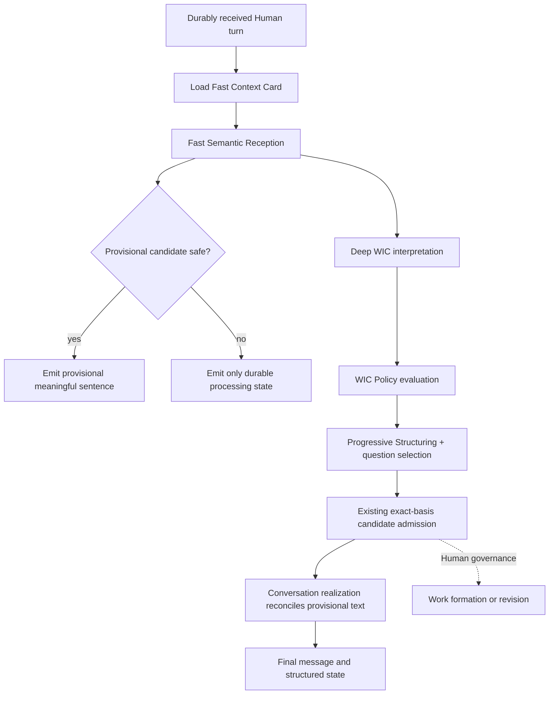

# WIC Intelligence Reconstruction Blueprint

Status: **SLICE_3_IMPLEMENTED / READY_WITH_FINDINGS**
Architecture basis: `watt-wic-intelligence-architecture-closure.md`
Behavioral basis: `OPEN_WIC_BASELINE_2026-09-15`

This blueprint defines how to reconstruct WIC intelligence without reopening
the closed Work, Design, Plan, Authority, Evidence, or Runtime ownership model.
WIC vNext now has an explicit controlled activation mode; legacy and shadow
modes remain available. Human Product Acceptance is still pending.

## Implementation Reality — Slice 3

As of 2026-09-16, all three reconstruction slices are implemented:

- Slice 1: exact-basis Fast Context Card, deterministic Fast Reception,
  fail-closed grounding and a provider-neutral Fast seam;
- Slice 2: progressive semantics, typed deltas, correction supersession,
  question-value policy, safe inference and transition-specific readiness;
- Slice 3: one evolving response identity, durable replayable response events,
  conservative Human-visible deterministic Fast, explicit Fast/Deep
  reconciliation, policy-governed final realization, browser TTFMS evidence,
  and reversible legacy/shadow/controlled modes.

Migration `20260915_41` adds the Turn's selected WIC mode and append-only
response-lifecycle evidence. `InteractionTurn.id` is the response identity;
provisional UX evidence never becomes assessment or Work truth. In controlled
mode Deep raw prose is buffered until the typed semantic state and deterministic
authority/Repository Reality policy have produced the accepted Human-facing
response.

The bounded deterministic-visible sample met the browser target with TTFMS P50
152.65 ms and P95 171.8 ms across eight completed real integrated trials. TTCR
P50 was 10.916 s and P95 was 17.830 s. The sample is qualification evidence,
not a population SLA. The hosted `deepseek-flash/low` Fast profile remains
unqualified and disabled. See
[Slice 3 Qualification](../evidence/wic-human-visible-reconstruction-slice-3-qualification.md).

## Architectural boundary

WIC owns turn interpretation: what the Human means now, how it relates to the
current Motive-bound Work, which facts and constraints are relevant, what is
uncertain, and what candidate change may need governance. Conversation owns the
Human-facing expression of those semantics. Guided Design owns structure and
progression. Work Formation and Work Revision own admission. The Human owns
material decisions. Runtime owns execution truth.

The reconstruction must keep these invariants:

1. Work identity remains bound to Motive. No Project concept is introduced.
2. A model result is advisory until the existing application admission checks
   accept it against the exact, current basis.
3. A correction supersedes prior advisory understanding without deleting its
   history.
4. Repository observations may correct a factual premise but cannot silently
   redefine the Human's Motive.
5. Material scope, authority, privacy, cost, and destructive choices remain
   Human decisions.
6. A fast result is provisional and read-only. It cannot form Work, revise Work,
   change a Plan, dispatch production, or satisfy a governance gate.
7. Provider capability and policy selection remain replaceable configuration;
   no self-hosted model is required.

## Current Reality and weaknesses

The product already has strong separation of durable receipt, exact-basis
interpretation, candidate validation, assessment persistence, Work admission,
Work revision, and production. The main intelligence and experience gaps sit
inside the interpretation interval:

- pre-Work uses one large prompt/output envelope, while active Work serializes a
  full semantic request and a second natural-response request;
- the first Human-meaningful sentence waits for Provider reasoning and large
  structured output;
- the current readiness profile checks only Motive, desired outcome, and
  unresolved questions;
- question selection is implicit in Provider prompting rather than governed by
  expected information value and decision ownership;
- corrections, low-risk inference, distinct new Motives, and brownfield fact
  conflicts rely heavily on one generative judgment;
- pipeline timing is process-local and end-to-end browser TTFMS is absent;
- failed calls can lose complete usage and stage provenance;
- current output can sound capable while crossing authority boundaries, as OW-F
  did when it chose customer-data access and retention defaults.

These findings support additive reconstruction rather than another top-level
architecture layer.

## Target processing model

Fast reception and deep interpretation are two resolutions of the same turn,
not two independent agents. They share the exact turn id, interaction id, basis
fingerprint, context-card revision, language, and active Work reference. The
deep result either confirms or supersedes the provisional result. The UI shows
one evolving Watt response rather than two competing answers.

## Fast Semantic Reception

### Purpose

Fast Semantic Reception should produce the first useful, content-grounded
sentence before deep WIC completes. Its target is semantic reassurance: the
Human can see that Watt caught the object, correction, constraint, or question
that matters. It is not a miniature final answer.

Examples of permitted provisional forms:

- “我先按‘开发推广运营后台’来理解，重点不是策划一次活动。”
- “我已把‘登录后保留当前位置’作为当前 Work 的新增约束。”
- “这涉及客户数据外发；权限和保留期需要由你决定，我不会先替你定。”

Each sentence conveys a captured meaning and its authority status. Empty
acknowledgements such as “收到，我来看看” do not satisfy the fast path.

### Same-turn contract

`FastReceptionCandidate` should contain:

- interaction id, turn id, source record id, and exact basis fingerprint;
- context-card revision and active Work revision, if any;
- provisional turn intent;
- captured object or current focus;
- detected correction and constraints;
- detected Human-owned decision;
- confidence and the reason fast emission is allowed;
- one localized meaningful sentence;
- Provider/profile/provenance and timings;
- `authority = PROVISIONAL_READ_ONLY` and expiration/supersession state.

Emission is forbidden when the candidate cannot ground every asserted noun and
constraint in the latest Human turn or Fast Context Card, when it proposes a
material decision, or when its basis is already stale. A forbidden candidate is
retained as diagnostic evidence but never shown as semantic content.

### Reconciliation

Deep WIC receives the provisional candidate as advisory context alongside the
original evidence. It may confirm, refine, or reject it. Confirmation lets the
Conversation layer continue the same response. Refinement replaces the pending
text with a clear continuation. Rejection emits a brief correction such as “我
重新核对后，需要修正刚才的理解：…”. The existing admitted assessment remains
the first durable semantic truth; provisional content never enters Work Reality.

### Fast-path Provider recommendation

The controlled visible path currently uses deterministic explicit reception.
DeepSeek `deepseek-flash/low` with a small, strict reception schema was tested
as a hosted Fast candidate and produced zero qualified candidates across eight
frozen cases, so it remains disabled. The Deep WIC profile still uses that
model/effort for full interpretation. Changing the model name alone does not
solve the reception contract.

Qualification must compare at least:

- deterministic local extraction for explicit corrections, constraints, and
  direct questions;
- the small `deepseek-flash/low` reception call;
- no semantic emission when neither path meets grounding thresholds.

Selection should be owned by capability/policy configuration. A different hosted
Provider can be admitted later through the same profile contract after privacy,
latency, structured-output, and quality qualification. No self-hosted dependency
is part of this blueprint.

## Fast Context Card

The Fast Context Card is a small, rebuildable projection, not a new source of
truth. It should be refreshed whenever its source revisions change and loaded by
key without reconstructing the full conversation.

Recommended fields:

- interaction id and open/archive condition;
- current Motive and desired outcome;
- active Work id/revision and satisfaction state;
- current design object/focus and Plan step references;
- top material facts, constraints, requests, and unresolved Human decisions;
- last explicit correction and what it superseded;
- relevant repository Reality references;
- recent turn-intent summary, response language, and detail preference;
- source revision ids, source fingerprint, built-at time, and stale flag.

Every value must retain source references. The card is invalid when its Work
revision, interaction sequence, or governed reference set differs from the turn
basis. Missing or stale cards fall back to the current full-basis path; they
never justify an assumption.

## Progressive Structuring

WIC should accumulate meaning in increasing levels of commitment:

1. **Reception:** explicit object, correction, constraint, question, and active
   Work relationship from the current turn.
2. **Working understanding:** provisional Motive, outcome, facts, constraints,
   requests, uncertainty, and evidence links.
3. **Design framing:** object type, users, behaviors, boundaries, and success
   signals owned by existing Design Intent and Guided Design contracts.
4. **Governance candidate:** an exact Work formation, Work revision, new-Work
   recommendation, or no-change disposition.

Later levels may reuse earlier values only with provenance and staleness checks.
They must not copy a mistaken early inference merely for conversational
continuity.

## Adaptive patterns and question value

Pattern recognition belongs behind a policy seam and remains advisory. The first
implementation should support evidence-backed signals rather than a large named
taxonomy: correction, bounded change, constraint addition, direct question,
recommendation request, new long-lived object, high-impact ambiguity, and
brownfield fact conflict.

A question is justified only when its expected decision value exceeds its Human
cost. The policy evaluates:

- whether the answer can change Work identity, scope, safety, acceptance, or
  implementation direction;
- whether the answer already exists in Human history or governed Reality;
- whether a reversible low-risk default is available;
- whether Watt is authorized to choose the default;
- whether the question blocks the current useful next step;
- the cognitive cost of asking now rather than later.

Low-risk presentation details can use visible, reversible defaults. Customer
data access, retention, external disclosure, destructive operations, cost, and
authority cannot. OW-B's fallback location is a defensible material question;
OW-F's access and retention choices are not safe defaults.

## Readiness and governance

The final readiness algorithm is deferred, but its seam is defined. Readiness
should consume structured understanding plus policy findings and return:

- readiness for the next specific transition, not one global “ready” bit;
- satisfied evidence, missing evidence, unresolved Human decisions, and risks;
- whether useful design work may continue while admission remains blocked;
- profile and policy version;
- exact basis fingerprint.

Separate profiles are expected for Work Formation, Work Revision, design
progression, and production handoff. Existing Human-governed endpoints remain
the only admission authority.

## Artifacts, deltas, and revisions

WIC should emit typed candidates rather than rewriting whole state:

- added, revised, or superseded facts and constraints;
- correction links from new meaning to prior meaning;
- design-frame deltas;
- candidate Work-revision field changes;
- no-change and new-Work recommendations;
- evidence and confidence for every delta.

The current `InteractionAssessment`, `WorkEvolutionCandidateChange`, immutable
`WorkRealityRevision`, and `WorkTransitionRecord` remain the integration points.
New delta artifacts must be append-preserving and admitted through current Human
governance. Full snapshots remain useful as projections, but provenance lives in
the delta/revision chain.

## Capability and policy seam

Provider invocation should be selected from an explicit `WicCapabilityRequest`:

- purpose: fast reception, deep semantics, response realization, or evaluation;
- latency and output budget;
- schema/structured-output requirements;
- active Work sensitivity and allowed data class;
- reasoning need;
- fallback permission;
- required provenance and observability.

`WicPolicy` decides whether a capability may run and whether its result may be
shown, progressed, or proposed for governance. `ModelRuntime` remains responsible
for Provider routing and exact profiles. Policy must not be embedded solely in
prompts.

## Concrete module impact map

| Area | Current module | vNext impact | Authority/migration |
|---|---|---|---|
| Turn receipt/orchestration | `src/spg/application/interaction.py` | Insert reception after exact basis creation; reconcile before final message | preserve existing admission and turn state machine |
| Interaction contracts | `src/spg/domain/interaction.py` | Add provisional reception, semantic delta, and readiness-decision contracts | additive schema version |
| Conversation | `src/spg/domain/conversation.py`, `src/spg/application/conversation.py` | Realize/reconcile one evolving response from typed semantics | expression only |
| DeepSeek WIC | `src/spg/providers/deepseek_interaction.py` | Add small fast-reception schema and retain complete failure provenance | provider adapter only |
| Existing WIC prompt path | `src/spg/providers/interaction_contract.py` and `src/spg/providers/deepseek_interaction.py` | Consume typed policy/context inputs through API-key provider contracts | no coding-agent SDK fallback |
| Model routing | `src/spg/domain/model_runtime.py`, `src/spg/infrastructure/model_runtime.py` | Add `WIC_FAST_RECEPTION` purpose and bounded profile | configured hosted Providers |
| Composition | `src/spg/application/bootstrap.py` | Compose capabilities independently of persistence via the new seam | current behavior already regression-tested |
| Context projection | new `application/wic_context.py` | Build and validate Fast Context Card | rebuildable, no truth ownership |
| Policy | new `application/wic_policy.py` | Question value, safe inference, authority, emission rules | versioned deterministic policy |
| Reception | new `application/wic_reception.py` | Run, validate, expire, and reconcile provisional candidates | no admission methods exposed |
| Persistence | interaction store/schema plus new migration | Optional context-card and reception-observation records | additive tables; rollback by disabling reads |
| HTTP/SSE | `src/spg/api/http.py`, DTOs | Add provisional/reconciled event types and durable timing correlation | no new mutation endpoint |
| Web client | `src/spg/web/*` | Morph one pending response and show provisional status accessibly | feature-gated rollout |
| Evaluation | `src/spg/evaluation/open_wic_baseline.py` | Preserve baseline and later compare vNext runs | offline only |

Native Executor, Work identity, production orchestration, repository integration,
and Trusted Baseline modules require no architectural change.

## Migration strategy

1. **Preserve and observe.** Keep the frozen baseline immutable. Persist complete
   per-request stage, usage, failure, first-delta, server-TTFMS, SSE-send, and
   browser-receipt correlation. No user-visible change.
2. **Shadow reception.** Add contracts, Fast Context Card, policy, and fast-path
   capability behind a disabled-by-default runtime flag. Run shadow candidates;
   never emit or admit them.
3. **Governed display rollout.** Enable provisional display for qualified intent
   types, reconcile with deep WIC, and retain the existing path as rollback.
4. **Progressive semantics.** Add typed deltas, correction links, question-value
   policy, and transition-specific readiness while dual-writing projections.
5. **Cutover and removal.** Compare against OPEN_WIC and Human acceptance, then
   switch reads. Remove the legacy path only in a separate, explicitly governed
   mission after rollback evidence is sufficient.

All database changes are additive. A rollback disables vNext reads/emission and
returns to the current assessment path; new observation and candidate rows can
remain inert. No migration rewrites existing Interaction, Work, or revision
history.

## Proposed major slices

### Slice 1 — Reception and observability

Implement durable end-to-end timing, Fast Context Card, fast-reception contracts,
shadow execution, grounding policy, failure provenance, and benchmark comparison.
Pass when no production mutation is possible, browser TTFMS is measured, and a
qualified fast profile materially improves the first meaningful sentence.

Implementation reality (2026-09-15): Fast Context Card, typed read-only
candidate, deterministic grounding and authority policy, independent shadow
runtime, hosted DeepSeek candidate, failure provenance, and browser timing are
implemented. Deterministic reception safely covered six of eight frozen cases;
two suppressed output. `deepseek-flash/low` with the tiny 256-token schema
returned `incomplete` in all eight hosted trials and is not qualified.
Production visibility remains shadow-only; browser/server observability is
materially narrowed pending persisted live-browser samples.

### Slice 2 — Progressive intelligence and governance policy

Implement semantic deltas, correction supersession, question-value decisions,
safe-inference boundaries, adaptive signals, and transition-specific readiness.
Pass against A–H plus expanded adversarial and continuity cases, including OW-F
authority preservation.

Implementation reality (2026-09-15): `wic-assessment-v4` persists one
progressive semantic projection through additive migration `20260915_40`.
Versioned deterministic policy owns correction supersession, constraint
preservation, safe versus Human-owned inference, highest-value question
selection, advisory pattern signals, consumer-bound artifact recommendations,
and transition-specific readiness. Provider prose remains evidence rather than
policy authority: the real A–H run retained an OW-F authority violation, OW-H
factual misunderstanding, and OW-D contract failure while policy constrained the
corresponding governance candidates.

### Slice 3 — Human experience integration and cutover

Implement single-response reconciliation in SSE/UI, shadow comparison, feature
rollout, operational dashboards, rollback rehearsal, and Human acceptance
runtime. Cut over only after technical and Human gates pass.

`RECONSTRUCTION_EXECUTION_MODE = TWO_OR_THREE_MAJOR_SLICES` because fast-path
latency, persisted provenance, policy semantics, and UI reconciliation can each
be independently tested and rolled back, while combining all of them in one
change would make authority and migration failures hard to isolate.

## Risks and pass conditions

Principal risks are premature semantic emission, two conflicting Watt voices,
stale context cards, Provider cost multiplication, corrections copied forward,
policy hidden in prompts, incomplete failure accounting, and user-visible speed
gains that disappear at the browser.

Reconstruction is ready to start when Slice 1 uses this baseline unchanged. The
full reconstruction passes only when:

- all A–H cases and added adversarial cases retain intent, constraints,
  corrections, active-Work relationship, and Human decision ownership;
- browser-observed TTFMS improves without empty acknowledgement text;
- total completion time and content depth remain proportional;
- provisional output cannot mutate or authorize any governed Reality;
- every provisional statement is source-grounded and reconciled;
- Provider calls, usage, failures, and retries are durable and attributable;
- current Work/Design/Plan/Runtime ownership remains intact;
- rollback to the current WIC path is demonstrated;
- Human Product Acceptance is performed separately.

## Decision record

| Required classification | Decision |
|---|---|
| `OPEN_WIC_BASELINE` | `CAPTURED` |
| `CURRENT_WIC_REALITY` | `MAPPED` |
| `FAST_SEMANTIC_RECEPTION_INSERTION` | `IDENTIFIED` |
| `TTFMS_OBSERVABILITY` | `GAP_IDENTIFIED` |
| `WIC_VNEXT_MODULE_IMPACT` | `MAPPED` |
| `MIGRATION_STRATEGY` | `DEFINED` |
| `RECONSTRUCTION_EXECUTION_MODE` | `TWO_OR_THREE_MAJOR_SLICES` |
| `RECONSTRUCTION_READINESS` | `READY_WITH_FINDINGS` |

The retained Provider failures, unsafe OW-F choice, incomplete failed-call
accounting, and missing browser TTFMS are non-blocking findings and explicit
targets for the first two slices.
