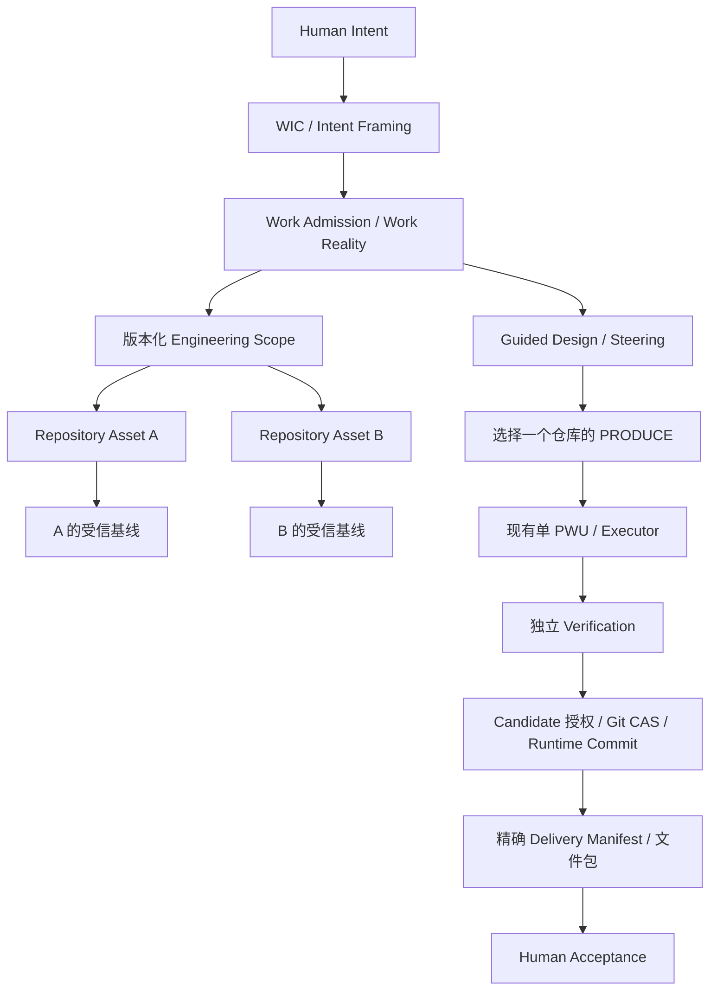

# Work-to-Delivery：同一运行时多仓库实施设计

日期：2026-09-10。实施基线：`d8aece326366ef329d15c1bc0a6779f59be9ec46`。

Human 已明确选择同一运行时多仓库，并澄清继续原实施任务，无需在设计阶段暂停。本文件替代早期提案，描述实际实现。验证、运行信息和人工验收见 [实施报告](../validation/work-to-delivery-first-slice.md)。**HUMAN PRODUCT ACCEPTANCE PENDING**。

## A. Architecture Design

Work 是中心；没有引入 Project。WIC/Intent Framing 解释意图，Work Admission 拥有 Work 和资产范围准入，Guided Design 持久化设计，Steering 决定 WHAT NEXT，现有单 PWU/Executor 执行，现有独立 Verification 和 SPG 授权/受信提交链治理产物，Delivery 提供精确产物与独立 Human 接受记录。Guardian Core、ECF 和 Executor 生命周期未扩展。

### 仓库事实与隔离

原 SPG 只有 `singleton_id = 1` 指针，Work/Steering/恢复路径读取全局基线。实际扩展直接把 `current_trusted_baseline_pointer` 主键改为 `(repository_identity, repository_ref)`。**没有另建 Namespace 实体，也没有给历史 Run/Snapshot 增加可独立选择的 namespace ID**。Namespace 是既有不可变仓库身份/ref 的组合，Run/PWU/Attempt/Candidate 从精确 source snapshot 继承归属。这样减少重复身份及历史指纹迁移。

`RuntimeStore.current_pointer` / `RuntimeService.current_baseline` 接受仓库身份/ref 或 `source_baseline_id`。两种依据冲突即拒绝；无参只兼容零或一个 namespace，多个时明确报歧义。生产、治理、集成、提交、恢复调用都从确切主体传入 source。新 Run 请求允许 `source_baseline_id`，并核对 artifact/change/production-plan 契约的来源一致且当前。

数据库通过 Snapshot `(id, repository_identity, repository_ref)` 唯一键、同仓库 predecessor FK 和 pointer composite FK 拒绝跨仓库关联。pointer 更新还要求 expected source/version CAS。Git 集成按仓库/ref 获得 PostgreSQL session advisory lock，沿用旧 ref CAS、PREPARED/CONVERGED effect 和独立观测协议；数据库连接结束会释放互斥。指针在 Run/PWU 写锁之前取得，Work scope 准入仅读取指针并以 Work revision 串行化。不同仓库可以独立前进；同源竞争的后继只能有一个通过现有 CAS，失败结果不能复用旧授权自动重基。

Recovery assessment、reconciliation、attempt recovery、maintenance recovery 和 Runtime Commit 都解析自己的来源仓库。已写 Git 而尚未提交数据库的窗口仍由旧恢复协议处理，没有新增跨系统“原子”状态。Executor 继续使用独立 Attempt workspace；本资产 adapter 每个 resource 只开放一个权威 ref。

### 迁移与历史

`20260910_30` 从旧指针对应 Snapshot 回填仓库/ref，替换 singleton PK，增加同仓库约束。`31` 放宽 Work Reality 的仓库字段并增加来源类型及 intake receipt。`32` 增加交付表。历史 fingerprint、authorization/evidence 内容不重算；旧来源默认 `INTERACTION_ASSESSMENT`。迁移需停写，由 Alembic 事务执行；不维护双写指针。

多于一个仓库指针时拒绝回退 migration 30；存在无仓库/资产准入历史时拒绝回退 31。升级生产历史库前应备份，不能把多仓库强行折叠成旧单仓库。旧文档中的“每 runtime 一个受信仓库”只描述先前版本；本扩展改变寻址与隔离，未改变 PWU 生命周期。

## B. Work Model Changes

WIC 准入显式接受可选 `engineering_resource_id`。HTTP 不回退默认资源；无资产仍可创建 READY 长生命周期 Work 和空的 admitted Engineering Scope。Motive/outcome 与 WIC exact READY assessment 规则保持不变。生产前必须选定真实资产与受信基线。

Work Reality 仓库字段是整体可空，不能用占位 ID。`source_kind` 区分 `INTERACTION_ASSESSMENT` 与 `ASSET_SCOPE_ADMISSION`，后一种不得伪造 assessment。API 同样允许无仓库字段并显示来源类型。Work 身份和状态枚举不变。

资产 scope 准入由 WorkApplicationService 执行：锁定 Work，核对 expected current revision、资源和 exact observation fingerprint，检查实际 ref 等于该仓库受信基线，再产生新 scope、Work Reality 和治理记录。保留此前全部资产 bindings，当前 revision 的资源字段表示后续生产目标。重复同一请求幂等；旧请求不能覆盖新范围。已存在 runtime binding 保持原周期来源；清除未准入的旧生产建议，Steering 重新评估。

## C. Asset Model

复用 EngineeringResource 与 EngineeringScope，新增 `repository_intakes` 保存 request、资源 ID、观察及初始化 receipt。仓库观察包含 source、title/description、identity/ref/revision/tree、时间、最多 200 个目录条目和上下文文档路径及 SHA-256 指纹。它是证据，不是 Human Intent。

支持无凭据 HTTP(S) Git 克隆、配置的 import root 内本地仓库，以及创建独立受管本地 Git 仓库。服务端 UUID 路径避免名称拼接；禁用 Git hooks，不启动导入项目脚本或 submodule。首版要求至少一个 Markdown 上下文文件。新建只写通用 README 初始化事实；设计正文必须走后续受治理生产。

同一 canonical source 的 intake 通过 advisory lock 复用资源；同一 request ID 的不同 body 拒绝。有效的中断后仓库可以按 receipt 重试认领，异常目录明确失败且不删除覆盖。URL 别名（例如不同远端地址指向同一仓库）不做远端身份归一；每个克隆是独立受管 checkout。首版不提供远端建库、push、SSH/私库凭据管理、解绑或资产删除 UI。列表显示全部 Work 资产及当前生产目标。

## D. Delivery Target Model

DeliveryTargetKind 定义 Web/Mobile/Mini Program/API/Backend/Library/Automation/Document Package/Other Software Artifact 九种概念，当前唯一可执行 adapter 是 **DOCUMENT_PACKAGE**，其余明确拒绝。Work 的 target 保存 title、acceptance criteria、authority 和时间；首版每 Work 一个不可变 target，相同请求幂等，修改目标需后续扩展版本机制。

DeliveryManifest 绑定 Work Reality revision、target、精确 runtime binding、Runtime Commit、repository identity/revision、Verification IDs 和 artifacts(path/media type/size/SHA-256)。Run/PWU/scope/source/tree 可通过精确 binding/commit lineage 追溯，不复制第二套权威事实。

发布要求当前 Work revision 的生产周期、全部 Verification PASS 和可信 Runtime Commit。清单 ID 从内容指纹导出；重复发布不重复创建。只读取批准路径对应 exact commit 的 UTF-8 Markdown 常规 Git blob，拒绝链接、submodule、路径逃逸、未入清单路径、替换对象及任意工作树内容。每文件上限 1 MiB、包上限 10 MiB。下载 ZIP 包含文件、target 和 manifest。

Human acceptance 使用 exact manifest fingerprint、identity、decision、rationale、时间，接受和请求修改都不可变、重复相同请求幂等。新 Work revision/生产周期使旧清单仅为历史，不能接受过期清单。首版每 manifest 一个决定，不支持在同一版本上覆盖/反转决定；请求修改后返回 WIC 对话提出后续修改并形成新的生产周期，Delivery 不自行改动 Work 或 PWU。

## E. Existing Repository Flow

在资产页接入已有 Git 来源并观察；在对话中说明当前软件和继续研发方向，WIC 采用已有产品演进语义。准入 Work 时选择该资产，或在 Work 创建后显式绑定。Guided Design 使用该仓库的上下文和现实，后续生产仍由 Work/Steering/SPG 准入。

仓库 bootstrap 是工程事实的采纳，不等同批准仓库中的产品方向。创建多个仓库时各自拥有基线；同一列表和同一数据库中的 A/B 不共享“默认当前基线”。

## F. New Work Flow

先通过 WIC 澄清运营管理平台目的、角色、约束和成果，准入无仓库 Work。Guided Design 持久化结构与语义结果；没有仓库时仍可推进 DESIGN/REFINE，不能形成可执行 production proposal。

通过资产页新建仓库，绑定到该 Work 并指定后续生产目标。设计结果以确切 semantic result ID、summary/decisions 追加到文档 production objective，随待审建议、Steering 契约进入 Executor，生成已讨论的设计正文。原设计历史仍保留，不通过初始化脚本伪装设计生产。

## G. End-to-End Production Flow

Guided Design 完成议题 → reviewable proposal → Human proposal approval → Steering 的 PRODUCE admission → 单 PWU → 现有 Executor → Completion/独立 contract-driven Verification → Candidate Human Authorization → Git Integration → Runtime Commit → Delivery publish/preview/download → Human Product Acceptance。

文档包不需要部署成应用。Watt 自身运行版本投影仍属于健康/部署信息，不作为文档交付条件。Guardian Core 未实现，本切片报告的是现有 Verification 证据。

入口：`/app` 对话和 Guided Design；`/delivery?work=<id>` 资产、现有 Attention、生产计划、target、manifest 与接受记录。接口：`/api/repository-assets`、`/intake`、`/api/works/{id}/asset-scope-admissions`、`/delivery-target`、`/delivery`、`/deliveries`，以及 manifest 下的 `/artifact`、`/download`、`/acceptance`。沿用原 Attention resolve 接口，无旁路 executor endpoint。

## H. Automated Validation

见 [实施报告](../validation/work-to-delivery-first-slice.md)。测试数据库与人工验收数据库分离。确定性 provider 的真实 PostgreSQL/Git 链、真实 Provider、浏览器和 Human 接受分别报告，不混称同一种证明。

## I. Runtime Acceptance Environment

独立 compose：`compose.delivery.yaml`；同一 app/DB 支持两个以上仓库。页面 `http://127.0.0.1:8009/app` 与 `/delivery`。具体启动和样例 ID 见实施报告。

## J. Human Acceptance Checklist

- [ ] A：已有仓库能识别、绑定到 Work、继续设计，目录观察可查。
- [ ] B：无仓库 Work 可先准入并形成设计，再新建/绑定仓库。
- [ ] A/B 同处一个运行时，各自基线、生产目标、产物不串用。
- [ ] C：检查设计来源、待审生产计划、单 PWU、执行和独立验证。
- [ ] Candidate 授权之后，产品接受仍然待定。
- [ ] 预览并下载 exact commit 的文件包，对照验收标准。
- [ ] 在界面明确接受或请求修改，刷新后决定与理由仍保留。
- [ ] 文档包没有被称为已实现完整运营平台，自动测试没有代替 Human 接受。

## K. Documentation Updates

本设计、实施验收报告、AI_context 和主 Roadmap 更新本切片事实。旧 CLOSED/PASS 检查点保留原范围。未来资产 adapter、交付 adapter、ECF、Guardian 和企业权限不纳入本次实现。

## L. Commit / Push

源代码与文档提交信息在实施报告记录。无论 Git 提交、自动检查和运行时状态如何，完整产品验收仍须 Human 明确授权，当前保留 **HUMAN PRODUCT ACCEPTANCE PENDING**。
