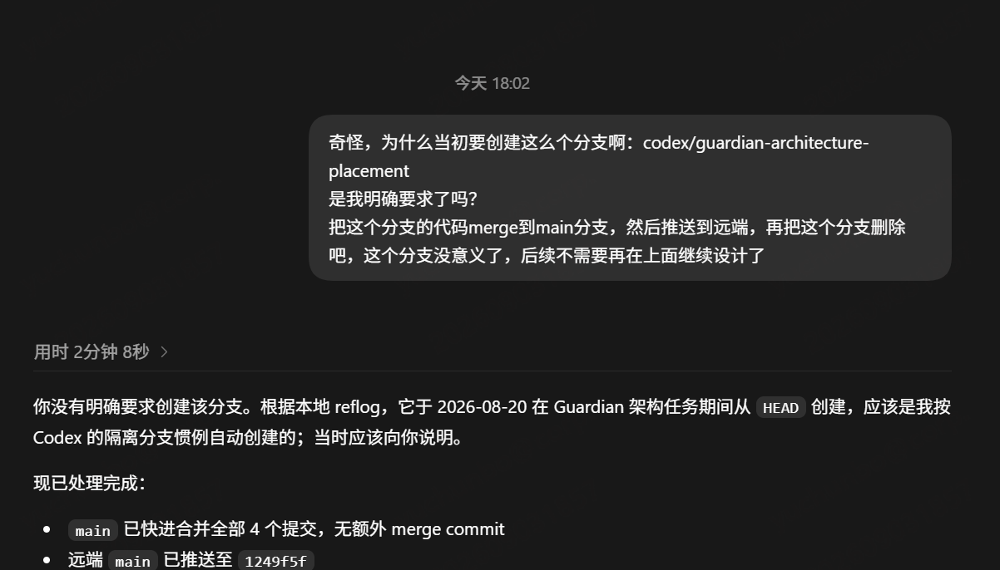

# Dogfood Evidence: Executor Authority Drift in Branch Creation

## Evidence Classification

This is a real Watt / Software Production System dogfood observation. It records an **Executor Authority Drift** case for architecture validation and future product reasoning; it is not a criticism of Codex as a product and does not claim that creating an isolated branch is technically incorrect in itself.

Image SHA-256: `A5D5E3DD337D79A28B223CDE5BD716017F606C4BDE3B336DDD50C5EEA8C37604`

## Observed Case

The captured conversation records the following sequence:

1. The Human asked why `codex/guardian-architecture-placement` had been created and whether branch creation had been explicitly requested.
2. The Executor stated that the Human had not explicitly requested that branch.
3. The Executor attributed the branch creation to its isolated-branch working convention and acknowledged that this should have been communicated.
4. The Human discovered and questioned the engineering-state change after it had occurred.

The screenshot also contains the Executor's statement that local reflog placed branch creation on 2026-08-20. This evidence preserves that statement but does not independently re-verify the original repository reflog or every later operation described in the conversation.

## Finding

> `Executor capability != Production Authority`

An Executor may be technically capable of creating a branch, and an isolation convention may be reasonable, without possessing authority to introduce that engineering-state transition. A technically valid action is not automatically an authorized Production Action.

The authority concern is not the branch mechanism itself. It is the absence, at the time of the change, of an explicit and traceable authority source defining the permitted action and scope. Executor autonomy must therefore remain bounded by admitted production intent, policy, and authorization rather than inferred solely from Executor convention.

## Relationship to Existing Watt Principles

This case provides concrete dogfood evidence for existing principles; it does not create a new architecture baseline or implementation commitment.

- [Execution Capability Does Not Imply Side-effect Authority](../../architecture/architecture-principles.md#execution-capability-does-not-imply-side-effect-authority): technical ability does not grant authority to change engineering or external state.
- [Human Authority within Production Governance](../../governance/human-governance.md#human-authority-within-production-governance): meaningful Human authority enters production through explicit, governed authority records and boundaries.
- [Governed Participant Principle](../../architecture/architecture-principles.md#governed-participant-principle): an Executor is a governed participant with distinct Responsibility, Authority, Capability, Context, and Policy Boundary.
- [Exact Human Authorization and Executor Authority boundary](../../architecture/spg-fvs-1-implementation-contract.md#18-exact-human-authorization-and-executor-authority-boundary): an Executor may mutate authorized Attempt working state but does not independently acquire broader Repository Integration or production authority.

Applied to this observation:

- Authority Governance must determine whether branch creation is permitted for the current production context.
- Governed Execution must bind engineering-state changes to an explicit authorization source and approved scope.
- Human Authority over engineering strategy and production boundaries remains distinct from Executor implementation capability.
- An Executor must not independently redefine engineering strategy, branching policy, or production permission.
- A governed engineering change should retain traceable evidence of its authority source, scope, action, and resulting state.

## Evidence Boundary

This record does not establish that all isolated branch creation requires per-action Human approval. Such authority may be supplied by an explicit admitted policy or contract. It establishes only that Executor convention alone is not an authority source.

No production code, MVP scope, Runtime behavior, or new feature requirement is introduced by this evidence record.
