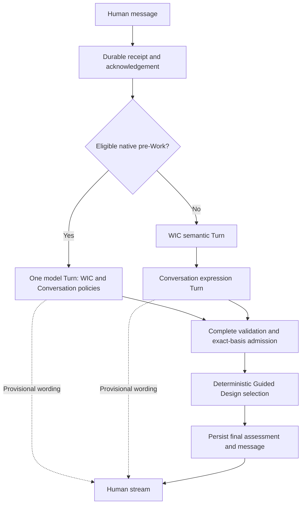

# Human collaboration pipeline architecture review and optimization

Date: **2026-09-09**. Engineering validation: **PASS**. Human product acceptance:
**PENDING**. Existing running acceptance applications were not deployed or changed.

## A. Current architecture assessment

The original pipeline had **two serial Provider Turns, not four**:

`durable Human receipt -> background WIC interpretation + Design Intent Frame
-> Conversation expression -> exact-basis admission -> final Watt message`.

Guided Design schema selection/readiness is deterministic. Framing was already
inside WIC. The original 202 acknowledgement and SSE lifecycle worked; meaningful
text waited for full semantic JSON generation and a second client/Turn startup.
The browser additionally waited for a projection refresh before subscribing.

The [architecture assessment](../architecture/human-collaboration-pipeline-review.md)
was recorded before implementation; its measured refinement addendum preceded
single-call implementation. It reviews the lifecycle, provider graph, context,
persistence and streaming boundaries, including alternatives and caching.

## B. Root causes

- Semantic interpretation and expression were separate physical calls despite
  both producing one advisory pre-Work conversation. Serialized semantic output
  delayed all wording; lower reasoning effort alone did not reliably fix it.
- Expression used stale prior candidate facts/constraints/requests and retained
  only one previous Watt response, weakening corrections and follow-up context.
- Semantic transport repeated storage metadata and every schema's first focus,
  introducing size and inappropriate initial-agenda priming.
- Schema routing inspected business-context technical vocabulary, which could
  select a technical methodology for an otherwise general product subject.
- Prompt behavior remains somewhat formal and can combine multiple unknowns
  under one question mark. The model was not assumed to be the sole quality cause.

## C. Recommended and implemented architecture

For native pre-Work conversations with matching configured models **and** efforts:

`durable receipt -> one Provider Turn (shared interpretation + expression)
-> stream natural_response -> validate complete semantic envelope
-> existing exact-basis admission -> persisted final message`.

The envelope is `{natural_response, semantics}`; the unchanged semantic schema
belongs to WIC and shared expression policy belongs to Conversation Intelligence.
Requesting wording first removes the need to serialize the entire semantic ledger
before beginning the reply. Field order affects latency, never safety: reversed
order still validates, and incomplete/invalid semantics never creates a final reply.

Active Work, different models/efforts, explicitly replaced provider/context seams,
or `SPG_WIC_COALESCE_PRE_WORK=false` retain the staged pipeline. This preserves
independent provider selection and the future context-provider seam.

No new intelligence module, agent hierarchy, Project concept, or Truth owner was
introduced. WIC and framing should remain one interpretation responsibility;
Guided Design consumes structured understanding and owns deterministic structure;
Conversation owns grounded expression and turn-taking, not production decisions.

## D. Implemented changes

- Coalesced eligible pre-Work inference; retained standalone adapters and staged
  compatibility with honest one-call/two-call provenance.
- Passed current semantics to staged expression, replacing stale candidates while
  keeping admitted Work facts/constraints/requests separate.
- Loaded eight actual chronological dialogue messages using a bounded SQL query;
  preserved the latest Human input on legacy source-only paths. All Human source
  records, references and exact basis fingerprints remain intact.
- Removed redundant metadata and first-focus priming; routed methodology by the
  framed subject alone; distinguished promotion audience from system operators.
- Attached SSE immediately after acknowledgement, rendered the acknowledged Human
  message immediately, and protected against a stale projection completion race.
- Added independent collaboration timeout/reasoning settings and bounded ephemeral
  receipt, first-event, first-text and committed-terminal measurements. Both effort
  defaults remain unspecified; no default model replacement was made.

The existing exact-basis assessment reuse remains the cache boundary. No hidden
provider memory, cross-correction response cache, extra summarizing model, or
parallel dependent model calls were added.

## E. Latency evidence

All measurements used `gpt-5.6-sol`, five identical English Human inputs, fresh
isolated databases and real loopback HTTP/SSE. Baseline and final used unspecified
SDK effort. Each case ran once; this is a measured sample, not p95, an SLA or a
factor-isolated experiment. Generated prior dialogue naturally differs.

| Scenario | Baseline first text | Coalesced first text | Baseline completion | Coalesced completion |
| --- | ---: | ---: | ---: | ---: |
| 1 | 45.63 s | 27.17 s | 48.89 s | 49.63 s |
| 2 | 59.56 s | 15.57 s | 63.84 s | 47.01 s |
| 3 | 58.45 s | 20.63 s | 63.55 s | 59.12 s |
| 4 | 49.89 s | 23.44 s | 52.55 s | 67.82 s |
| 5 | 67.69 s | 18.55 s | 82.15 s | 74.55 s |
| **Median** | **58.45 s** | **20.63 s** | **63.55 s** | **59.12 s** |

Median first text improved **64.7%**. Provider Turns fell from
**10 to 5** for the five-message sequence. Median completion improved only
**7.0%**; the first-goal and direct-question completions regressed, and full
semantic finalization can still exceed a minute. Do not describe this as uniform
end-to-end speedup. The user can see useful text while full validation continues.

Client acknowledgement medians were 17.5 ms
and 26.1 ms; first SSE event medians were
24.7 ms and
34.0 ms. Fast receipt was preserved,
not newly invented. Every final sample emitted real text before terminal commit.

The intermediate two-stage low/low trial is retained: median first text
61.36 s and completion
63.78 s. It did not
justify lowering the default reasoning budget and motivated call coalescing.

## F. Conversation quality evidence

| Scenario | Observed result |
| --- | --- |
| Operations management platform | Product/system framing and useful first design focus preserved. |
| Watt promotion, individual developers/small teams | Platform stays the object; promotion and audience remain context; operator is not silently assumed. |
| Correction to Web application system | Correction accepted; current frame is a Web system; historical assessments remain append-only. |
| Direct question about design-document output | Answer first; states there is no pre-Work artifact path and invents none. |
| Detailed explanation | Expanded, ordered guidance covers workflow, scope, journeys, data, integrations, access and governed next steps. |

All five intents and frames passed; each persisted exactly one final Watt message
matching the completed stream, with zero Work/runtime facts. Final detail response
was 1490 characters versus 245 for
the direct answer. The [retained samples](human-collaboration-pipeline-samples.json)
allow independent language review.

These samples do **not** establish mature-assistant quality or Human acceptance.
Wording remains formal (for example, repeated classification/next-decision framing),
and early cases still bundle operator and workflow questions. The direct answer
uses procedural terms such as “Pre-Work Guided Design”; concrete proactive
recommendations are not consistently stronger than the baseline. The final detailed
answer is more scan-friendly, while conversational naturalness needs Human review.
Deterministic context/authority repairs are stronger evidence than a subjective
claim that every answer improved.

## G. Architecture boundary review

WIC owns interpretation and its advisory frame. Guided Design owns schema,
structure and readiness. Conversation owns expression policy. Work remains the
production center. Plan Steering owns WHAT NEXT; SPG governs production; Human
owns Authority. No Work lifecycle, PWU, Executor, Guardian, production contract,
Runtime state or Trusted Baseline implementation was changed. No migration was
needed. SQL changes are bounded read projections only.

Partial text is presentation, never admitted Truth. The complete envelope must
validate and the exact current source basis must pass existing admission checks.
Tests prove late semantic failure yields FAILED with no assessment/final Watt
message/production effect, including after restart. Custom context/providers keep
their staged path; no replacement seam is silently bypassed.

## H. Validation and provenance

- **94** related Python contract tests passed.
- **39** isolated PostgreSQL integration tests passed; **7** separately gated real
  provider tests were deselected in that regression run.
- **25** JavaScript tests passed, including live subscription/projection ordering.
- Real baseline: **5 Human messages / 10 Provider Turns / PASS**.
- Intermediate low/low trial: **5 / 10 / completed**, latency hypothesis not supported.
- Final coalesced sample: **5 / 5 / PASS**, no Work or Runtime rows.

Real socket tests hold Provider output and database commit gates; they prove early
acknowledgement/status, real text before completion, no premature success, failure,
disconnect/reconnect and restart behavior. Synthetic clock tests isolate the
removed serial boundary; they are not presented as real-provider timings.

Baseline commit: `af1d29595a8f352d0fa0ec6135612895c0347623`.
Sampled coalesced source fingerprint: `091f8c2495d1b989c7d995a3c2d7357b9c68acf5b0435d35c3e307f1dfdb3894`.
Final source fingerprint: `71dae23d4bee0f1444b4d4873786d14e400e9cca3443103059b69f7a21fcb5e6`.

After the real probe snapshot, only `spg/providers/codex_interaction.py` changed:
a native-only dispatch guard preserves custom provider/context seams. Five new
regressions plus the final 94-test contract run cover that compatibility guard;
the built-in branch exercised in the real sample is unchanged. Source hashes and
all three measured conditions are preserved in the sample artifact. Raw local
reports remain under `.spg/validation-evidence/` and contain full provider IDs;
repository samples omit those IDs and contain no credentials.

Residual limitations: a single service worker serializes unrelated interactions;
startup is outside per-stream timeout; semantic source history is not token-capped;
SSE polls synchronous database reads; no cross-process claim lease was added.
These are explicit follow-up concerns, not hidden evidence of completed hardening.

## I. Documentation updates

Updated the architecture assessment, Conversation Intelligence and Design Intent
Framing architecture records, README, environment configuration examples and
benchmark instructions. Added this report, retained comparison samples, and
current-status pointers in AI_context and the roadmap. Historical evidence was
preserved. The reusable probe records source and script fingerprints and refuses
non-isolated/product databases or existing interactions.

## J. Commit / Push

Starting and current HEAD: `af1d29595a8f352d0fa0ec6135612895c0347623` on
`feature/spg-first-vertical-slice`. Changes remain in the working tree; no commit,
push, runtime deployment or Trusted Baseline transition was performed.
