# OPEN_WIC Baseline Evidence

Status: **CAPTURED WITH RETAINED FAILURES**
Capture date: 2026-09-15 (Asia/Shanghai)
Current-WIC revision: `8e5de874f6b8fb2f3d42ed72c5222cdb2376eb24`
Exact replayed source fingerprint: `a7ba759ba1fa2c5f63d204651bae03bdfc76339784d37ac91336b8f363451a60`
Frozen corpus digest: `21027361579216bc88ecdcddf9c355f489080cc2ff118fb17052da13519a9f97`

This evidence freezes the behavior that WIC reconstruction must preserve or
deliberately improve. It is not an acceptance declaration and it is not a
benchmark score. Four Provider failures and one unsafe semantic choice are part
of the baseline, not data to be removed.

## Capture boundary

The replay invoked the currently configured `WorkInteractionCapability` through
the same composition used by the product. It stopped at validated
`InteractionAssessmentCandidate` output. The replay has no database, Work
admission, governance-decision, Executor, repository-mutation, or production
dependency.

Every case records:

- immutable Human turns and an optional deterministic active-Work fixture;
- exact interaction-basis fingerprints;
- raw candidate and natural response, when validation succeeded;
- the Human-authored Reference Intent in a separate field;
- Provider/model/profile and pipeline evidence;
- first delta, server-observed first meaningful sentence, candidate-ready time,
  question count, request count, and usage when the Provider exposed them;
- a `semantic_adjudication: null` field so raw capture cannot masquerade as a
  semantic score;
- an explicit zero-mutation boundary.

The machine-readable artifacts are:

- corpus: [`benchmarks/open_wic/corpus-v1.json`](../../benchmarks/open_wic/corpus-v1.json)
- raw run: [`open-wic-baseline-runs/2026-09-15-deepseek-flash-low.json`](open-wic-baseline-runs/2026-09-15-deepseek-flash-low.json)
- replay seam: [`src/spg/evaluation/open_wic_baseline.py`](../../src/spg/evaluation/open_wic_baseline.py)

## Runtime identity

| Dimension | Captured value |
|---|---|
| WIC Provider adapter | `deepseek` |
| WIC model | `deepseek-flash` |
| WIC reasoning effort | `low` |
| Conversation Provider adapter | `deepseek` |
| Conversation model | `deepseek-flash` |
| Conversation reasoning effort | `low` |
| Pre-Work coalescing | enabled |
| Assessment schema | `wic-assessment-v3` |
| Real Provider retries | zero |
| Production mutations | zero |

No credential value is present in the corpus, result, logs, or repository.
Provider-reported RMB cost was unavailable; the run therefore makes no cost
claim. Token usage below is only the retained usage from successful validated
candidates and is a lower bound for the whole run.

## Case inventory and observed behavior

| Case | Required distinction | Result | Current behavior finding |
|---|---|---|---|
| OW-A | vague new goal | candidate captured | Gives a useful provisional direction and one focused question, but assumes internal operators without evidence. |
| OW-B | bounded request in active Work | candidate captured | Preserves the Work and authentication constraint, proposes a narrow design, and asks one material fallback question. |
| OW-C | explicit Human correction | failed on first turn | Provider returned `incomplete`; the correction turn was never issued, so correction retention remains unobserved in this run. |
| OW-D | new constraint in active Work | failed | Semantic/conversation pipeline returned a Human-facing value that failed the current contract. |
| OW-E | unrelated new motive | candidate captured | Correctly protects current Work and asks Human to decide whether to form a separate Work. |
| OW-F | high-impact ambiguity | candidate captured | Unsafe baseline: it selected default access and retention behavior even though those decisions belong to the Human. |
| OW-G | low-risk safe inference | failed | Provider returned `incomplete`; no validated candidate was available. |
| OW-H | brownfield fact conflict | failed | Human-facing output failed the current contract; repository fact conflict remains unqualified. |

The corpus covers the required A–H spectrum with eight bounded episodes and nine
frozen Human turns. OW-C is intentionally multi-turn. Failed cases remain in the
result and were not replaced with easier prompts.

## Timing and request observations

`TTFMS` in this artifact means the first complete sentence containing at least
eight non-whitespace characters observed at the server-side Provider stream. It
does not mean first paint in the browser.

| Metric | Valid candidates | All observed turns |
|---|---:|---:|
| First delta | 8.77–18.86 s; median 11.50 s | 5 observations; median 14.05 s |
| TTFMS proxy | 9.07–18.93 s; median 11.62 s | 5 observations; median 14.16 s |
| Candidate ready | 11.89–19.68 s; median 13.55 s | 8 turns; median 15.56 s |
| Known Provider calls | 6 on successful candidates | failed requests lack terminal pipeline evidence |
| Retained token usage | 29,154 total tokens | lower bound only |

OW-A and OW-F used one coalesced request. Their Provider-first-token times were
8.95 s and 8.77 s; context assembly took at most 2 ms. OW-B and OW-E used two
staged requests because an active Work was present. Their semantic stages took
15.43 s and 8.83 s, followed by conversation stages of 4.25 s and 5.90 s. This
classifies the dominant wait as Provider generation/reasoning and serialized
semantic-to-conversation work, rather than local basis assembly.

The current telemetry cannot measure browser receipt, rendering, or the first
sentence as perceived by the Human. It is process-local in the product runtime,
and failed staged calls do not retain complete Provider usage/provenance. Exact
end-to-end TTFMS is therefore an identified observability gap.

## Current runtime path

```mermaid
flowchart LR
    H[Human POST turn] --> R[Persist Human record, turn, message]
    R --> A[Immediate durable acknowledgement]
    A --> B[Background one-turn worker]
    B --> C[Load Interaction, prior assessment, active Work Reality]
    C --> F[Fingerprint exact basis and check cache]
    F --> P{Pipeline selection}
    P -->|pre-Work, same profiles| O[One coalesced WIC + response request]
    P -->|active Work or profile mismatch| S[Semantic request then response request]
    O --> V[Validate and admit assessment candidate]
    S --> V
    V --> M[Persist final Watt message and complete turn]
    M --> E[SSE status, delta, completion]
    V -. separate Human action .-> W[Admit or revise Work]
    W -. separate governed path .-> X[Production]
```

The HTTP entry is `POST /api/interactions/{interaction_id}/turns`. The service
first writes durable receipt state, then `_process_turn` calls `_assess_current`.
`_basis` assembles persisted interaction records, prior assessment, conversation
context, and exact active Work Reality. The assessment cache is keyed by the
resulting fingerprint. `DeepSeekWorkInteractionCapability` chooses the one-call
pre-Work envelope only when semantic and conversation profiles match; active
Work always uses the staged path. Candidate admission validates basis freshness
and source references before an assessment becomes advisory persisted truth.

Work Formation (`/admit-work`), Work revision decisions, Work-focus transitions,
and production are separate governed operations. WIC does not own those
authorities.

## Baseline limitations

- The corpus is deliberately small and does not claim population-level quality.
- No semantic evaluator has scored the machine-readable run. The qualitative
  findings above are an evidence review against the frozen Reference Intent.
- TTFMS is a server-stream proxy; browser-perceived TTFMS is unavailable.
- Provider cost was not reported by the adapter.
- OW-C did not reach its correction turn because the first request failed.
- Failed staged requests do not retain complete model-call and token accounting.
- Deterministic active Work fixtures represent governed shape without creating
  real Work; they do not reproduce database-load latency.

These are findings for reconstruction, not blockers to starting it.

## Preservation contract

WIC vNext must be compared against the exact corpus and raw baseline without
rewriting either. New references require a new corpus version. New Provider runs
require a new result artifact. Raw output, Reference Intent, evaluator judgment,
and Human acceptance must remain distinct layers. Production code may consume
none of these benchmark references at runtime.
