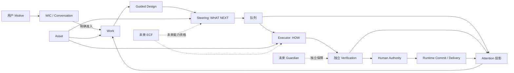

# Watt 首发版用户旅程与信息架构

## 1. 状态、目的与边界

```text
文档类型
    产品旅程架构 / 首发版体验规划

旅程状态
    已提出 / 待可点击原型校准

生产实现授权
    无
```

本文定义 Watt 首发版的目标用户旅程、用户心智模型与信息架构。方案以当前代码库和 UI Reality 为依据，但不把当前 UI 当作目标。本文不改变生产 UI、API、Schema、Runtime 行为、Work 语义或 Executor 架构。

配套文档：

- [首发版场景清单](watt-first-release-scenario-inventory.md)
- [可点击原型范围、验收与实施计划](watt-clickable-prototype-plan.md)
- [用户旅程架构张力登记表](watt-human-journey-architecture-tensions.md)

必需交付物的组织方式如下：

| 交付物 | 所在位置 |
|---|---|
| A. 首发版用户旅程地图 | 本文第 3–9 节 |
| B. 场景清单 | 首发版场景清单 |
| C. 信息架构方案 | 本文第 5–6 节 |
| D. 用户心智模型 | 本文第 4 节 |
| E. 原型范围 | 原型计划第 1–5 节 |
| F. 原型场景包 | 原型计划第 4 节 |
| G. 架构张力登记表 | 用户旅程架构张力登记表 |
| H. 原型验收计划 | 原型计划第 6 节 |
| I. 正式实施计划 | 原型计划第 7–8 节 |

产品原则保持不变：

> 人定义意图，AI 放大能力，系统保障可信。

## 2. 已审查的代码库 Reality

本方案核对了 Motive 与 Work 形成、WIC、Conversation Intelligence、Guided Design、Steering、SPG/PWU、Watt-native Executor、队列与容量、Verification、Candidate 与 Human Authorization、Runtime Commit、Delivery、恢复、Human Attention、Control Room 以及代码库资产等当前事实来源。

主要 Reality 参考：

- [Watt 产品北极星](../architecture/watt-product-north-star.md)
- [Motive / Work / Plan 概念校准](../architecture/motive-work-plan-concept-calibration.md)
- [Work 交互与闭环细化](../architecture/work-interaction-closed-loop-refinement.md)
- [Human–Watt Conversation Intelligence](../architecture/human-watt-conversation-intelligence.md)
- [Guided Design Core](../architecture/guided-design-core.md)
- [Reality-driven Plan Steering 原则](../architecture/reality-driven-plan-steering-principles.md)
- [SPG 核心架构模型](../architecture/SPG_Core_Architecture_Model.md)
- [Watt-native Executor 生命周期](../architecture/watt-native-executor-lifecycle.md)
- [Watt-native Executor 容量调度](../architecture/watt-native-executor-capacity-scheduling.md)
- [完成与信任](../architecture/spg-completion-trust.md)
- [对账与恢复](../architecture/spg-reconciliation-recovery.md)
- [Human Governance](../governance/human-governance.md)
- [代码库资产与托管执行工作区](../architecture/repository-asset-and-managed-execution-workspace.md)
- [Work-to-Delivery 多代码库方案](../architecture/work-to-delivery-multi-repository-spg-proposal.md)
- [Control Room 信息架构](software-production-control-room-mvp-information-architecture.md)
- [Control Room 状态体验](software-production-control-room-state-experience.md)
- [Work 准入前形成审阅](work-formation-review-before-admission.md)
- [软件制品交付验证](../validation/software-artifact-delivery-slice.md)

当前架构已经守住必要的所有权边界：

- Conversation 是表达与溯源，不是受治理的事实。
- 第一次输入可以停留在 Work 之前；Work Admission 必须明确发生。
- Work 与 Motive 相互独立；Work 后续可以继续细化或重新进入。
- Guided Design 负责组织设计，Steering 决定下一步应该做什么。
- PWU 是有意义的生产成果；Execution Slice 是内部资源时间片。
- Executor 产出 `RESULT_READY` 声明；独立 Verification 和 Human Authority 与执行保持分离。
- `UNKNOWN` 必须对账，绝不允许盲目重放。
- Asset 从属于 Work。准入时可以没有代码库；生产就绪时，Watt 可以分配本地托管工作区。
- 队列、暂停、恢复、检查点、重新入队、容量等待和恢复都有持久化 Runtime 支持。
- Delivery 区分已生成材料、已验证 Candidate、已授权集成、Runtime Commit、Trusted Baseline、活跃 Runtime 与 Human 产品验收。

当前 `/app` 是一个信息密集、以 Work 为中心的 Control Room：侧栏包含 Goal 和 Work，主区域包含 Conversation 与 Shared Understanding，选中 Work 后还会展示生产、方向、信任、Attention、队列及工程详情。`/delivery` 是独立的资产与交付页面。当前 UI 已经投射了不少有用的治理事实与控制能力，但仍直接暴露设计 Schema 标识、Candidate 标签和原始生命周期状态等技术语言，品牌标题仍为 `TNGA Software Production`。目前也没有一个连贯的回访首页，用于汇总发生了什么、哪些 Work 正在推进、什么需要用户处理。以上仅描述当前 Reality，不代表目标体验。

一项既有产品发现仍是本方案的核心：`PRE_AUTHORIZATION_WORK_PREVIEW_REQUIRED`。Guided Design 已有范围受限的“设计到生产”审阅，但更广义的 Work 形成预览仍未完成。因此，目标旅程要求在 Work Admission 前展示拟议的 Work 目标、预期结果、范围、约束、预期制品和生产边界。

## 3. 首发版用户模型

首发版服务一个主要角色：对结果负责的个人或小团队操作者。他们有一个想法、问题或预期结果，并始终保留 Human 决策权。用户可能带来已有资产，也可能在没有代码库的情况下让 Watt 创建新的软件成果。他们期待 Watt 澄清目标、推荐方向、在已准入权限内自主生产、只在真正需要时请求决策、授权前展示证据，并最终交付可用结果。

原型可以把操作者标记为“你”。首发版不虚构企业组织、角色管理、审批链、共享收件箱或 IAM 策略编辑器。已有 authority identity 可以在工程详情中出现，但默认体验只假设一个负责的操作者。

## 4. 用户心智模型

### 4.1 普通用户需要理解的概念

| 用户概念 | 在产品中的含义 | 帮助回答的问题 |
|---|---|---|
| 对话 | 表达、澄清、纠正和讨论的地方 | “Watt 理解我了吗？” |
| Work | 围绕一个预期结果持续存在的协作 | “我们正在实现什么？” |
| 方向 | Watt 对下一步及其理由的当前建议 | “为什么接下来做这个？” |
| 阶段 | 通往 Work 结果途中一个有意义的成果 | “什么已经完成，还剩什么？” |
| 队列 | 已经可以推进，但仍在等待容量或前置条件的工作 | “为什么还没开始？” |
| 需要我 | 只有用户才能解决的决策或授权边界 | “现在需要我做什么吗？” |
| 结果 | Watt 产出的内容，以及预览、检查、限制和风险 | “究竟改了什么，值得信任吗？” |
| 交付 | 完成必要授权后可用的成果及其历史 | “完成的东西在哪里？” |
| 资产 | 某个 Work 使用或生成的代码库、文档、设计、运行目标、外部系统或制品 | “这个 Work 使用或产出了什么材料？” |

“阶段”是有意义 PWU 的用户表达。工程详情可以展示正式术语“生产单元”，默认界面则应该直接说出成果，例如“完成账号设置”或“验证部署结果”。

### 4.2 默认体验中隐藏的概念

Attempt、Step、Effect、Execution Slice、CandidateVector、checkpoint schema version、lease epoch、provider request、reasoning effort、migration head、transport retry、原始 SPG/PWU 标识和 Runtime Commit 内部细节，都应留在工程详情中。这些信息可以支持追踪或高级诊断，但不应成为导航对象，也不应成为普通产品决策的前提。

产品不能让用户混淆以下不同事实：

```text
Watt 生成了结果
    != 检查通过
    != 用户授权集成
    != 可信基线已推进
    != 活跃运行环境与结果一致
    != 用户已经验收产品
```

默认界面应把它们转译为简洁的信任叙事，并允许用户按需查看精确证据。

## 5. 以对话作为交互平面

Conversation 应成为新 Motive 的统一入口，也是澄清、纠正、细化、获取建议和讨论决策的持续交互平面。它在每个 Work 内以及 Work 完成后都应继续可用。

当用户需要检查结构化事实时，对话退居次要位置。队列位置、阶段历史、资产绑定、结果比较、验证证据、交付清单和历史版本更适合结构化呈现。用户可以在对话中讨论决策，但真正的授权动作必须放在它所治理的精确方案或结果旁边。

对话不适合作为事实、进度或授权的唯一载体。用户不应通过翻找聊天记录来确认当前范围、生产是否在等待或自己究竟要批准什么。

建议采用：

```text
一个对话入口
    + 一个 Work 上下文
    + 随状态变化的结构化投影与治理动作
```

这样既不会产生重复交互渠道，也不会把 Watt 做成只有聊天的产品。

## 6. 全局信息架构方案

首发版顶层区域保持精简：

| 区域 | 用户问题 | 包含 | 不包含 |
|---|---|---|---|
| 首页 | “现在什么最重要，我该从哪里继续？” | 新 Motive 入口、回访摘要、最近变化、活跃 Work、需要我、近期交付 | 工程仪表盘、原始日志、重复的 Work 详情 |
| Work | “Watt 和我正在共同实现什么？” | 对话、共同理解、形成审阅、方向、阶段、上下文 Attention、结果、Work 资产与历史 | Project 实体、全局容量管理、无关审批 |
| 队列 | “什么正在等待或运行，为什么？” | 跨 Work 的就绪/等待/运行视图、容量原因、顺序、受治理的暂停/恢复、Work 深链 | Execution Slice、Provider 请求、重试控制台、第二套生命周期事实 |
| 交付 | “我已经有哪些可用成果？” | 当前和历史交付、运行/打开/下载动作、信任摘要、关联 Work、再次细化 | 未验证的生产中结果、通用文件管理、内部 CandidateVector 记录 |

“需要我”不是第五个顶层目的地，而是首页、Work 和队列中的投影。每一项都深链到准确的 Work 上下文，解释为什么需要行动，并在那里提供受治理的动作。消除通知不等于解决底层决策。

资产位于其所属 Work 内，因为它的权限与意义都依赖上下文。跨 Work 资产搜索可以以后增加，但首发版不能让资产成为与 Work 竞争的顶层组织模型。

### 6.1 新用户首页

新用户首先看到一个平静的问题：“你想实现什么？”并可选择查看少量示例。第一次回复应该是有价值的对话，而不是创建 Work 的表单。Watt 可以给出暂定理解、判断和一个高价值的下一步。用户无需先选择 Goal、代码库、Provider、生产模式或 Schema。

当理解已经可以转化为行动时，Watt 展示 Work Formation Review。用户可以继续细化、拒绝、稍后决定或准入。适用的权限尚未明确前，不应出现仿佛已经开始生产的行为。

### 6.2 回访用户首页

回访用户首先看到：

1. 哪些事情需要自己处理，并按后果而非技术时间排序；
2. 上次离开后发生了什么；
3. 活跃 Work 及当前有意义的活动；
4. 正在排队或恢复的 Work，以及通俗的原因；
5. 最近交付，以及继续或细化的明确入口。

首页不展示虚假的完成百分比，而应展示已完成阶段、当前活动、下一阶段，以及真实的等待或恢复说明。

### 6.3 Work 上下文

Work 界面使用稳定的页头展示结果目标、当前状况、信任摘要和相关控制。主体根据 Reality 调整重点：

- 形成阶段突出共同理解与 Work 形成审阅；
- 设计阶段突出当前决策与 Watt 的建议；
- 规划阶段突出方向、有意义的阶段和理由；
- 生产阶段突出当前活动、排队/等待原因和里程碑；
- Attention 阶段突出决策、影响、选项和授权边界；
- 结果审阅阶段突出预览、变化、检查、限制和动作；
- 完成阶段突出交付、已实现结果和“继续细化这个 Work”。

Conversation 始终可见或一步可达，但不能遮蔽当前受治理的事实。

## 7. 主端到端旅程

| 阶段 | 用户目标 | Watt 的职责 | 用户看到什么、能做什么 | 自动行为 / 用户权限 | 现有事实依据 | 进入、成功与重要出口 |
|---|---|---|---|---|---|---|
| 1. 表达 Motive | 说明想法、问题或疑问 | 给出有用回应并形成暂定解释 | 自然回复；补充、纠正、提问、探索或离开 | 解释可以更新；不会创建 Work 或生产权限 | Interaction/WIC | 从首页或新对话进入；形成有用共同方向即成功；可作为单纯问答或暂存 Motive 退出 |
| 2. 细化理解 | 确认 Watt 理解真实结果 | 保留纠正、揭示假设、给建议而非盘问 | 共同理解、已确认事实、开放问题；可继续、不同意或推迟 | WIC 可细化解释；用户拥有意图 | Interaction、interpretation candidate、design intent | 实质歧义足够少即成功；可转向另一解释或新 Motive |
| 3. 审阅拟议 Work | 理解准入 Work 的真实含义 | 把理解转成目标、范围、约束、预期制品与生产边界 | 审阅、细化、拒绝、推迟或准入 | Watt 起草；用户明确准入 | 拟议形成投影、Human governance | 达到 readiness 后进入；知情准入或明确不准入都属于有效结果 |
| 4. 准入 Work | 建立持续、受治理的协作 | 从精确审阅方案创建 Work 并保留溯源 | 新 Work 上下文和已准入目标 | 准入需要用户授权；生产权限仍独立 | Work revision、admission decision | 失败则方案仍停留在 Work 之前；成功后开启持续 Work |
| 5. 建立资产 | 提供所需材料，或让 Watt 负责配置 | 发现需求、检查能力、解释权限，只绑定已授权资产 | 资产清单；添加、授权、选择托管工作区、处理不支持项 | 安全发现可以自动进行；外部访问和绑定需要相应权限 | Work asset scope、repository intake、capability observation | 可以有零个、一个或多个资产；未解决需求可等待或使用托管工作区 |
| 6. Guided Design | 把结果目标转成可实现设计 | 给出判断、理由和关键决策，并记住约束 | 当前设计重点、建议、备选方案；接受或修改 | Watt 组织和引导；用户决定重要业务或风险事项 | Guided Design issue/revision | 所需设计领域得到满足即成功；未决事项进入“需要我” |
| 7. 确定方向与计划 | 知道接下来做什么以及为什么 | 把当前 Reality 转成有意义的结果阶段，并在 Reality 变化时重新评估 | 阶段计划、理由、依赖、未解决事项 | Steering 提议 WHAT NEXT；用户治理重大目标/范围变化 | Steering plan/revision、Work Reality | 产出生产就绪方案即成功；也可返回重新设计或变更审阅 |
| 8. 审阅生产方案 | 确认下一次生产边界 | 说明预期输出、资产目标、验证方式和重要影响 | 通俗方案；接受、细化或拒绝 | Preparation 可安全检查；需要时生产权限必须明确 | Plan/PWU contract、source 和 asset binding | 失败返回设计/计划；成功后形成可运行的受治理工作 |
| 9. 进入队列 | 知道工作已就绪，只是在正常等待 | 只准入一次，显示原因与诚实预期并保留顺序 | 就绪/排队状态、原因和相关暂停/取消控制 | Scheduler 分配容量；普通容量等待不需要用户行动 | Queue entry、capacity allocation、PWU identity | 分配成功后退出；也可能进入资源等待、用户等待或取消 |
| 10. 执行与继续 | 让 Watt 工作而不必守着 | 执行 HOW、保存有价值的检查点、展示有意义的活动 | 当前阶段/活动、耗时、已完成里程碑；可暂停或稍后回来 | Executor 运行、让出并恢复；用户无需转发调试信息 | Session/Attempt/Step/Effect、checkpoint、queue lease | 到达 result-ready 前沿即成功；中断后可检查点、重新入队、恢复或对账 |
| 11. 对账异常 | 确认系统安全，以及是否需要自己处理 | 区分已知/未知影响，阻断不安全继续，在允许范围内自动恢复 | “正在恢复”及影响；或需要用户处理的精确决策与安全选项 | 安全残余工作可继续；`UNKNOWN` 禁止盲目重放；重大权限仍归用户 | Recovery case、evidence、checkpoint、trusted baseline | 恢复一致前沿即成功；也可能需要新执行、新计划或用户决策 |
| 12. 验证 | 确认输出是否满足已准入结果 | 独立观察并检查精确结果 | 检查状态、通过/失败义务；安全时可看到正在修正 | Verification 独立进行；常规修正可形成受治理后续 | Completion、Verification、evidence lineage | 通过后进入结果审阅；失败后返回生产，或因目标变化进入“需要我” |
| 13. 预览结果 | 授权前理解实际产出 | 展示可运行/可检查结果、变化、检查、限制、风险与资产影响 | 打开预览、比较、检查证据；要求修改、拒绝或继续 | 预览隔离运行且不能集成；用户判断是否可接受 | 不可变 result/Candidate、preview record | 形成知情决定即成功；修改会创建新的精确结果版本 |
| 14. 授权集成 | 批准一个精确、有意义的结果及目标集合 | 把决策绑定到精确结果并解释影响 | 清楚看到“什么将在哪些位置发生变化”；授权或拒绝 | 必须有精确 Human Authority；旧授权不覆盖新版结果 | Candidate/aggregate manifest、authorization | 漂移或过期后重新验证；多目标部分状态进入收敛处理 |
| 15. 提交可信结果 | 推进受治理目标，不隐藏部分事实 | 应用已授权的精确变化；查询不确定影响；安全收敛或阻断 | 提交进度和每个目标的结果 | Integration/Runtime Commit 遵循已授权限；禁止盲目重复 | Integration effect、Runtime Commit、Trusted Baseline | 成功后推进可信基线；部分收敛保持可见、可恢复 |
| 16. 交付 | 获取并使用成果 | 生成交付清单和真实的访问动作 | 打开运行环境、下载输出、检查代码库更新和交付历史 | 满足信任要求后可自动打包；外部发布可能需要独立授权 | Delivery manifest、trusted baseline、active Runtime | 约定的可用形态存在即成功；活跃 Runtime 不一致时必须如实展示 |
| 17. 用户审阅与满意 | 判断真实结果是否足够好 | 将技术信任与产品满意分开 | 接受、要求修改或说明未满足之处 | 产品验收必须由用户明确作出；技术 PASS 不能代替 | Human acceptance、Work satisfaction | 满意 Work 仍可继续对话；要求修改则重新进入设计/生产 |
| 18. 重新进入 | 细化已实现 Work，或开始不同 Motive | 恢复历史，区分继续、范围变化与新 Work | 看到历史结果和交付；描述新需求；必要时选择继续或新建 Work | Watt 建议关系；用户确认重大转向 | Interaction relationship、Work revision、satisfaction history | 继续时保留身份；无关 Motive 不会静默改变原 Work |

## 8. 管理与控制旅程

### 8.1 查找并继续 Work

首页提供最近使用和“上次离开后的变化”；Work 区支持搜索，并按活跃、暂停、需要我和已完成筛选。用户可以重命名 Work、切换时保留草稿、从默认列表隐藏/归档、查看历史交付，并重新进入已完成 Work。Goal 可以继续作为当前 Reality 中的可选元数据，但不是导航前提。

### 8.2 管理容量，而非操作基础设施

队列展示竞争容量的有意义 Work 阶段、等待原因、当前活动，以及下一步由 Watt 还是用户负责。只有在存在受治理语义时，才展示暂停、恢复、停止和取消。普通用户不选择 Provider 请求、reasoning effort、worker、lease 或 Execution Slice。

### 8.3 在上下文中管理资产

每个 Work 都有自己的资产区域，区分输入、生产目标、生成输出和交付。它使用用户语言说明能力与访问丢失。添加代码库不会使其成为 Work 身份；没有代码库也不会阻止设计或托管生产。

### 8.4 分配用户注意力

Attention 根据所需动作与后果分成三级：

- **立即处理：** 当前路径被受治理决策、凭据、授权或未解决的不安全状态阻断。
- **尽快审阅：** 结果已就绪，或重要选择等待用户决定。
- **仅供知悉：** Watt 正在恢复，或某个不阻断的条件发生变化。

每一项都要回答发生了什么、为什么重要、Watt 已经做了什么、用户可以选择什么、接下来会怎样。“仅供知悉”绝不能伪装成必须执行的任务。

## 9. 分支与恢复模型

体验把所有中断归入三种用户契约：

| 契约 | 产品行为 | 示例 |
|---|---|---|
| Watt 自行恢复 | 平静、真实地展示状态；保留进度；只有具备实际价值时才通知 | 策略内的短暂 Provider 失败、带检查点的 worker 重启、浏览器断连、安全重新入队 |
| 告知用户，无需行动 | 解释影响和下一步，不给用户制造任务 | 容量等待、自动验证修正、Runtime 重启恢复 |
| 需要用户行动 | 深链到受治理上下文，说明选项与后果 | 需要凭据/访问、重大范围变化、不安全歧义、对账失败、精确结果授权 |

浏览器断连绝不取消 Work。用户长时间离开后回来，首先看到根据持久事件和当前投影生成的变化摘要。执行决策前必须重新验证过期浏览器状态。多代码库部分收敛时，要展示哪些目标已推进、哪些未推进、原授权是否仍允许向前完成，以及为什么可能需要新授权。

## 10. 依赖关系图



| 场景族 | WIC | Work | Guided Design | Steering | Queue | Executor | Verification | Human Authority | Delivery | Assets | 未来 Guardian | 未来 ECF |
|---|---:|---:|---:|---:|---:|---:|---:|---:|---:|---:|---:|---:|
| Work 前探索 | 主要 | — | 建议性 | — | — | — | — | 仅准入时 | — | 候选引用 | 不需要 | 不需要 |
| Work 形成/准入 | 主要 | 主要 | — | — | — | — | — | 主要 | — | 可选 | 不需要 | 不需要 |
| 设计与规划 | 上下文 | 主要 | 主要 | 主要 | — | — | — | 重大决策 | — | 输入/目标 | 不需要 | 未来增强 |
| 队列与生产 | 上下文 | 主要 | — | 决定方向 | 主要 | 主要 | 提供证据 | 需要时控制 | — | 生产范围 | 不需要 | 未来增强 |
| 恢复 | 上下文 | 主要 | 可能重新进入 | 重新规划 | 重新入队 | 残余工作 | 重新观察 | 不安全/重大事项 | 保留 | 重新验证 | 未来增强 | 未来增强 |
| 结果审阅 | Conversation | 主要 | 可能修正 | 后续方向 | — | 仅声明 | 主要 | 精确结果决策 | 预览上下文 | 结果向量 | 不需要 | 不需要 |
| 提交与交付 | 上下文 | 主要 | — | — | — | — | 必需依据 | 主要 | 主要 | 目标/输出 | 不需要 | 不需要 |
| 完成与重新进入 | 主要 | 主要 | 细化时 | 重新评估 | — | — | 历史信任 | 需要时重新授权 | 历史 | 历史/当前 | 不需要 | 不需要 |

Guardian 和 ECF 都是未来的独立能力。首发版旅程和原型 PASS 不依赖于假装其中任何一个已经存在。

## 11. 用户语境中的“完成”

对首发版而言，“完成”表示：约定的结果已经以约定的可用形态提供；必要检查和精确授权步骤都已完成；交付可以打开或取得；已知限制仍然可见；用户已经判断当前 Work 令人满意。在全部条件达成前，产品必须使用更准确的词语，例如“已生成”“检查通过”“待你审阅”“已授权”或“已交付”。

完成不会关闭 Conversation 或历史。用户可以回到同一个 Work，查看已接受的依据，并开始新的受治理细化周期。
