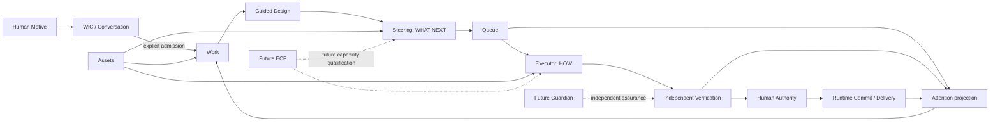

# Watt First-release Human Journey and Information Architecture

## 1. Status, purpose, and boundary

```text
Document type
    PRODUCT JOURNEY ARCHITECTURE / FIRST-RELEASE EXPERIENCE PLAN

Journey status
    PROPOSED FOR CLICKABLE-PROTOTYPE CALIBRATION

Production implementation authority
    NONE
```

This document defines the target first-release Human journey, mental model, and
information architecture for Watt. It is grounded in current repository and UI
Reality, but it does not make the current UI the target. It does not change
production UI, APIs, schemas, Runtime behavior, Work semantics, or Executor
architecture.

The companion documents are:

- [First-release Scenario Inventory](watt-first-release-scenario-inventory.md)
- [Clickable Prototype Scope, Acceptance, and Implementation Plan](watt-clickable-prototype-plan.md)
- [Human Journey Architecture Tension Register](watt-human-journey-architecture-tensions.md)

The required deliverables are organized as follows:

| Deliverable | Location |
|---|---|
| A. First-release Human Journey Map | Sections 3–9 of this document |
| B. Scenario Inventory | First-release Scenario Inventory |
| C. Information Architecture Proposal | Sections 5–6 of this document |
| D. Human Mental Model | Section 4 of this document |
| E. Prototype Scope | Prototype Plan sections 1–5 |
| F. Prototype Scenario Packs | Prototype Plan section 4 |
| G. Architecture Tension Register | Human Journey Architecture Tension Register |
| H. Prototype Acceptance Plan | Prototype Plan section 6 |
| I. Formal Implementation Plan | Prototype Plan sections 7–8 |

The product principle remains:

> Human defines intent. AI amplifies capability. System ensures trust.

## 2. Repository Reality reviewed

The plan was checked against the current sources of truth for Motive and Work
formation, WIC, Conversation Intelligence, Guided Design, Steering, SPG/PWU,
Watt-native Executor, queue and capacity, Verification, Candidate and Human
Authorization, Runtime Commit, Delivery, recovery, Human Attention, Control
Room, and repository assets.

Primary Reality references include:

- [Watt Product North Star](../architecture/watt-product-north-star.md)
- [Motive / Work / Plan Concept Calibration](../architecture/motive-work-plan-concept-calibration.md)
- [Work Interaction and Closed-loop Refinement](../architecture/work-interaction-closed-loop-refinement.md)
- [Human–Watt Conversation Intelligence](../architecture/human-watt-conversation-intelligence.md)
- [Guided Design Core](../architecture/guided-design-core.md)
- [Reality-driven Plan Steering Principles](../architecture/reality-driven-plan-steering-principles.md)
- [SPG Core Architecture Model](../architecture/SPG_Core_Architecture_Model.md)
- [Watt-native Executor Lifecycle](../architecture/watt-native-executor-lifecycle.md)
- [Watt-native Executor Capacity Scheduling](../architecture/watt-native-executor-capacity-scheduling.md)
- [Completion and Trust](../architecture/spg-completion-trust.md)
- [Reconciliation and Recovery](../architecture/spg-reconciliation-recovery.md)
- [Human Governance](../governance/human-governance.md)
- [Repository Asset and Managed Execution Workspace](../architecture/repository-asset-and-managed-execution-workspace.md)
- [Work-to-Delivery Multi-repository Proposal](../architecture/work-to-delivery-multi-repository-spg-proposal.md)
- [Control Room Information Architecture](software-production-control-room-mvp-information-architecture.md)
- [Control Room State Experience](software-production-control-room-state-experience.md)
- [Work Formation Review Before Admission](work-formation-review-before-admission.md)
- [Software Artifact Delivery Validation](../validation/software-artifact-delivery-slice.md)

Current architecture already preserves the necessary ownership boundaries:

- Conversation is expression and provenance, not governed truth.
- A first utterance may remain pre-Work; Work Admission is explicit.
- Work and Motive remain distinct. Work may later be refined or re-entered.
- Guided Design structures the design; Steering decides what should happen next.
- A PWU is a meaningful production outcome. An Execution Slice is an internal
  resource interval.
- Executor produces a `RESULT_READY` claim. Independent Verification and Human
  Authority remain separate from execution.
- `UNKNOWN` requires reconciliation and never permits blind replay.
- Assets are subordinate to Work. A repository is optional at admission, and
  Watt can allocate a managed local workspace when production becomes ready.
- Queue, pause, resume, checkpoint, requeue, capacity wait, and recovery have
  durable Runtime support.
- Delivery distinguishes generated material, verified Candidate, authorized
  integration, Runtime Commit, Trusted Baseline, active Runtime, and Human
  product acceptance.

The current UI at `/app` is a dense Work-oriented Control Room with Goals and
Works in a sidebar, Conversation and Shared Understanding in the main surface,
and production, direction, trust, attention, queue, and engineering details in
the selected Work. `/delivery` is a separate asset and delivery surface. The UI
already exposes useful governed projections and controls, but it also exposes
technical language such as design-schema identifiers, candidate labels, and
raw lifecycle states. Its brand header still says `TNGA Software Production`.
There is no coherent returning-user home that summarizes what changed, active
Work, and required attention. These observations describe current Reality only.

One prior accepted product finding remains central:
`PRE_AUTHORIZATION_WORK_PREVIEW_REQUIRED`. Guided Design has a bounded
design-to-production review, while the broader pre-Work formation preview is
still open. The target journey therefore shows the proposed Work objective,
outcome, scope, constraints, expected artifact, and production boundary before
Work Admission.

## 3. First-release user model

The first release serves one primary role: an individual or small-team operator
who has an idea, problem, or desired outcome and remains the Human decision
authority. The operator may bring existing assets, or ask Watt to create a new
software outcome without a repository. They expect Watt to clarify the goal,
recommend a direction, produce autonomously inside admitted authority, surface
only meaningful decisions, show evidence before authorization, and make the
result usable.

The prototype can label the acting person as `You`. It should not invent
enterprise organizations, role administration, approval chains, shared inboxes,
or IAM policy editors. Existing authority identities may appear in engineering
detail, but the default experience assumes one accountable operator.

## 4. Human mental model

### 4.1 Concepts an ordinary user needs

| Human concept | Meaning in the product | What it helps answer |
|---|---|---|
| Conversation | The place to express, clarify, correct, and discuss | “Does Watt understand me?” |
| Work | A durable collaboration around one intended outcome | “What are we working toward?” |
| Direction | Watt's current recommendation for what should happen next and why | “Why this next?” |
| Stage | A meaningful outcome on the way to the Work result | “What has finished, and what remains?” |
| Queue | Work ready to proceed but waiting for capacity or a prerequisite | “Why has it not started?” |
| Needs me | A decision or authority boundary that only the Human can resolve | “Do I need to act?” |
| Result | What Watt produced, with preview, checks, limits, and risks | “What actually changed, and can I trust it?” |
| Delivery | The usable output and its history after the required authority steps | “Where is the finished thing?” |
| Asset | A repository, document, design, runtime target, external system, or generated artifact used by one Work | “What material does this Work use or produce?” |

`Stage` is the Human-facing expression of a meaningful PWU. The product may
show the formal term “production unit” in engineering detail, but the default
surface should name the outcome, such as “Build account setup” or “Verify the
deployment.”

### 4.2 Concepts kept out of the default experience

Attempt, Step, Effect, Execution Slice, CandidateVector, checkpoint schema
version, lease epoch, provider request, reasoning effort, migration head,
transport retry, raw SPG/PWU identifiers, and Runtime Commit internals remain
engineering detail. They may support traceability or advanced diagnostics, but
they are not navigation objects and must not be required to make an ordinary
product decision.

The product does not ask the Human to equate these distinct statements:

```text
Watt generated something
    != checks passed
    != Human authorized integration
    != trusted baseline advanced
    != active runtime matches
    != Human says the product is accepted
```

It translates them into a short trust story and provides exact evidence on
demand.

## 5. Conversation as the interaction plane

Conversation should be the universal entry for a new Motive and the persistent
plane for clarification, correction, refinement, recommendation, and decision
discussion. It should remain available inside every Work and after completion.

Conversation is secondary when the Human needs to inspect structured facts.
Queue position, milestone history, asset bindings, result comparison,
verification evidence, delivery manifests, and prior versions work better as
structured contextual projections. A decision may be discussed in conversation,
but the resulting explicit authority action belongs beside the exact proposal or
result it governs.

Conversation is inappropriate as the only representation of truth, progress,
or authorization. Chat history must not be mined by the Human to discover the
current scope, whether production is waiting, or exactly what is being approved.

The recommendation is therefore:

```text
One conversation entry
    + one Work context
    + state-aware structured projections and governed actions
```

This avoids duplicate interaction channels without turning Watt into a chat-only
product.

## 6. Proposed global information architecture

The first-release top level is deliberately small.

| Area | User question | Contains | Does not contain |
|---|---|---|---|
| Home | “What matters now, and where should I continue?” | New-Motive entry; returning summary; recent changes; active Work; Needs me; next delivery | Engineering dashboards, raw logs, a duplicate Work detail view |
| Work | “What are Watt and I trying to make happen?” | Conversation; shared understanding; formation review; direction; stages; contextual attention; result; Work assets and history | A Project entity, global capacity administration, unrelated approvals |
| Queue | “What is waiting or running, and why?” | Cross-Work ready/waiting/running view; capacity reason; ordering; pause/resume where governed; links into Work | Execution Slices, provider calls, retry consoles, a second source of lifecycle truth |
| Deliveries | “What usable outcomes do I have?” | Current and prior deliveries; runtime/open/download actions; trust summary; related Work; refine again | Unverified work in progress, generic file management, internal CandidateVector records |

“Needs me” is not a fifth destination. It is a projection on Home, Work, and
Queue. Every item deep-links to the exact Work context, explains why action is
needed, and presents the governed action there. Dismissing a notification does
not resolve the underlying decision.

Assets live inside their Work because their authority and meaning are contextual.
An optional cross-Work asset finder can arrive later, but first release must not
turn assets into a competing top-level organizing model.

### 6.1 New-user Home

A new user sees one calm prompt: “What would you like to make happen?” with a
few optional examples. The first response is useful conversation, not a Work
creation form. Watt can offer a provisional understanding, a judgment, and one
high-value next move. No Goal, repository, provider, production mode, or schema
choice is required.

When understanding becomes actionable, Watt presents a Work Formation Review.
The user can refine it, decline it, postpone it, or admit it. Nothing that looks
like production begins before the applicable authority is clear.

### 6.2 Returning-user Home

A returning user first sees:

1. what needs their action, ordered by consequence rather than technical time;
2. what changed since their last visit;
3. active Work and its current meaningful activity;
4. queued or recovering Work with plain reasons;
5. recent deliveries and an obvious way to continue or refine.

The page avoids fake percentages. It uses completed stages, current activity,
next stage, and honest waiting or recovery language.

### 6.3 Work context

The Work surface keeps a stable header with outcome, current condition, trust
summary, and relevant controls. Its main body changes emphasis with Reality:

- formation emphasizes shared understanding and formation review;
- design emphasizes the current decision and Watt's recommendation;
- planning emphasizes direction, meaningful stages, and rationale;
- production emphasizes current activity, queue/wait reason, and milestones;
- attention emphasizes the decision, impact, options, and authority boundary;
- result review emphasizes preview, changes, checks, limitations, and action;
- completion emphasizes delivery, achieved outcome, and “refine this Work.”

Conversation remains visible or one action away without displacing the current
governed state.

## 7. Primary end-to-end journey

| Stage | Human goal | Watt responsibility | Human sees and can do | Automatic work / Human authority | Existing truth basis | Entry, success, and important exits |
|---|---|---|---|---|---|---|
| 1. Express Motive | Explain an idea, problem, or question | Respond usefully and form a provisional interpretation | Natural reply; add context, correct, ask, explore, or leave | Interpretation may update; no Work or production authority | Interaction/WIC | Enter from Home or new conversation; succeed when useful shared direction exists; exit as question-only or dormant Motive |
| 2. Refine understanding | Know that Watt understands the real outcome | Preserve corrections, expose assumptions, recommend rather than interrogate | Shared understanding; confirmed facts; open question; continue, disagree, or defer | WIC may refine interpretation; Human owns intent | Interaction, interpretation candidates, design intent | Succeeds when material ambiguity is low enough; branches to alternate interpretation or new Motive |
| 3. Review proposed Work | Understand what admitting Work would mean | Translate understanding into objective, scope, constraints, expected artifact, and production boundary | Review; refine; reject; postpone; admit | Watt drafts; Human explicitly admits | Proposed formation projection; Human governance | Enter on readiness; success is informed admission or deliberate non-admission |
| 4. Admit Work | Establish a durable governed collaboration | Create Work from the exact reviewed proposal and preserve provenance | New Work context and admitted objective | Admission transition requires Human authority; production remains separate | Work revision and admission decision | Failure leaves proposal pre-Work; success opens durable Work |
| 5. Establish assets | Supply or let Watt allocate needed material | Discover need, inspect capability, explain access, bind only authorized assets | Asset list; attach; authorize; select managed workspace; resolve unsupported item | Safe discovery may be automatic; external access/binding requires appropriate authority | Work asset scope, repository intake, capability observations | Zero, one, or many assets; unresolved asset need may wait or use managed workspace |
| 6. Guided Design | Turn outcome into an implementable design | Lead with judgment, show rationale and decisions, remember constraints | Current design focus; recommendation; alternatives; accept or change | Watt structures/facilitates; Human decides material business or risk choices | Guided Design issues/revisions | Success when required design areas are satisfied; unresolved decisions enter Needs me |
| 7. Set direction and plan | Know what will happen next and why | Convert current Reality into meaningful outcome stages and reassess when Reality changes | Stage plan, rationale, dependencies, unresolved items | Steering proposes WHAT NEXT; Human governs material destination/scope changes | Steering plan/revision and Work Reality | Success is a production-ready proposal; branch to redesign or scoped change review |
| 8. Review production proposal | Confirm the next production boundary | Explain intended output, asset targets, verification, and material effects | Plain proposal; accept, refine, or decline | Preparation may inspect safely; production authority is explicit where required | Plan/PWU contract, source and asset bindings | Failure returns to design/plan; success creates runnable governed work |
| 9. Enter Queue | Understand that ready work is waiting rather than stuck | Admit once, show reason and honest expectation, preserve ordering | Ready/queued state; reason; relevant pause/cancel controls | Scheduler allocates; no Human action for ordinary capacity wait | Queue entry, capacity allocation, PWU identity | Succeeds on allocation; branches to resource wait, Human wait, or cancellation |
| 10. Execute and continue | Let Watt work without babysitting | Execute HOW, checkpoint useful progress, surface meaningful activity | Current stage/activity, elapsed time, completed milestones; may pause or return later | Executor runs and yields/resumes; Human is not asked to relay debug output | Session/Attempt/Steps/Effects, checkpoints, queue lease | Succeeds at result-ready frontier; interruption may checkpoint, requeue, recover, or reconcile |
| 11. Reconcile exceptions | Know whether Watt is safe and whether action is needed | Classify known/unknown effects, fence unsafe continuation, recover autonomously where allowed | “Recovering” with impact; or exact Human decision with safe options | Safe residual work may resume; `UNKNOWN` blocks blind replay; material authority remains Human | Recovery case, evidence, checkpoints, trusted baseline | Succeeds when coherent frontier restored; may require new execution, plan, or Human decision |
| 12. Verify | Learn whether output satisfies the admitted outcome | Independently observe and check the exact result | Checking status; passed/failed obligations; correction underway when safe | Verification is independent; routine correction can form governed follow-up | Completion, Verification, evidence lineage | Pass advances to reviewable result; fail returns to production or Needs me if destination changes |
| 13. Preview result | Understand what was actually produced before approval | Present runnable/inspectable output, changes, checks, limitations, risks, and asset impact | Open preview, compare, inspect evidence; request changes, reject, or proceed | Preview is isolated and cannot integrate; Human decides acceptability | Immutable result/Candidate and preview record | Success is an informed decision; correction creates a new exact result revision |
| 14. Authorize integration | Approve an exact meaningful outcome and target set | Bind decision to the exact result and explain effect | Clear “what will change where”; authorize or decline | Exact Human authority is required; prior authorization never covers a revised result | Candidate/aggregate manifest and authorization | Drift or expiry returns to revalidation; multi-target partial state enters convergence handling |
| 15. Commit trusted result | Advance governed targets without hiding partial facts | Apply authorized exact changes, query uncertain effects, converge or block safely | Commit progress and target-specific outcome | Integration/Runtime Commit follow granted authority; no blind repeat | Integration effects, Runtime Commit, Trusted Baseline | Success advances trusted baseline; partial convergence is visible and recoverable |
| 16. Deliver | Receive and use the outcome | Produce a delivery manifest and truthful access actions | Open runtime, download output, inspect repository update and delivery history | Packaging may be automatic after trust requirements; external publishing may need separate authority | Delivery manifest, trusted baseline, active Runtime | Success means the promised usable form exists; active Runtime mismatch remains explicit |
| 17. Human review and satisfaction | Decide whether the real outcome is good enough | Keep technical trust separate from product satisfaction | Accept, request changes, or explain unmet need | Human product acceptance is explicit; technical PASS cannot claim it | Human acceptance and Work satisfaction | Satisfied Work remains open to later conversation; request changes re-enters design/production |
| 18. Re-enter | Refine an achieved Work or start a distinct Motive | Recall history, distinguish continuation from scope change/new Work | Prior outcome and delivery; describe next need; choose continue or new Work when needed | Watt recommends relationship; Human confirms material transition | Interaction relationship, Work revisions, satisfaction history | Continuation preserves identity; unrelated Motive creates no silent mutation |

## 8. Management and control journeys

### 8.1 Find and continue Work

Home provides recency and “changed since last visit”; Work provides search and
filters for active, paused, needs-me, and completed. A user can rename a Work,
switch without losing a draft, hide/archive it from the default list, inspect
prior deliveries, and re-enter a completed Work. A Goal may remain optional
metadata in current Reality, but it is not required for navigation.

### 8.2 Manage capacity without operating infrastructure

Queue shows meaningful Work stages competing for capacity, their reason for
waiting, current activity, and whether Watt or the Human owns the next action.
Pause, resume, stop, and cancel appear only when their governed semantics are
available. Normal users do not choose provider requests, reasoning effort,
workers, leases, or Execution Slices.

### 8.3 Manage assets in context

Each Work has an asset area that distinguishes input, production target,
generated output, and delivery. It can show capability and access loss in Human
language. Adding a repository does not turn it into the Work identity, and lack
of a repository does not block design or managed production.

### 8.4 Allocate Human attention

Attention has three severities based on required action and consequence:

- **Act now:** a governed decision, credential, authorization, or unresolved
  unsafe state blocks the current path.
- **Review soon:** a result is ready or a material choice awaits the Human.
- **For awareness:** Watt is recovering or a non-blocking condition changed.

Each item answers what happened, why it matters, what Watt already did, what the
Human can choose, and what follows. Awareness items never masquerade as required
actions.

## 9. Branch and recovery model

The experience classifies every interruption into one of three Human contracts:

| Contract | Product behavior | Examples |
|---|---|---|
| Watt recovers | Show calm, truthful status; preserve progress; notify only if materially useful | transient provider failure within policy, worker restart with checkpoint, browser disconnect, safe requeue |
| Human informed, no action | Explain impact and next step without creating a task for the Human | capacity wait, autonomous verification correction, runtime restart recovery |
| Human action required | Deep-link to governed context with options and consequence | credential/access needed, material scope change, unsafe ambiguity, failed reconciliation, exact result authorization |

Browser disconnect never cancels Work. Returning after a long absence starts
with a change summary derived from durable events and current projections.
Stale browser state is revalidated before a decision. Partial multi-repository
convergence shows which targets advanced, which did not, whether forward
completion remains authorized, and why a new decision may be required.

## 10. Dependency graph



| Scenario family | WIC | Work | Guided Design | Steering | Queue | Executor | Verification | Human Authority | Delivery | Assets | Future Guardian | Future ECF |
|---|---:|---:|---:|---:|---:|---:|---:|---:|---:|---:|---:|---:|
| Pre-Work exploration | Primary | — | Advisory | — | — | — | — | Admission only | — | Candidate refs | Not required | Not required |
| Work formation/admission | Primary | Primary | — | — | — | — | — | Primary | — | Optional | Not required | Not required |
| Design and planning | Context | Primary | Primary | Primary | — | — | — | Material decisions | — | Inputs/targets | Not required | Future enhancement |
| Queue and production | Context | Primary | — | Direction | Primary | Primary | Evidence input | Controls as needed | — | Production scope | Not required | Future enhancement |
| Recovery | Context | Primary | Possible re-entry | Replan | Requeue | Residual work | Re-observe | Unsafe/material cases | Preserve | Revalidate | Future enhancement | Future enhancement |
| Result review | Conversation | Primary | Possible correction | Follow-up | — | Claim only | Primary | Exact result decision | Preview context | Result vector | Not required | Not required |
| Commit and delivery | Context | Primary | — | — | — | — | Required basis | Primary | Primary | Targets/outputs | Not required | Not required |
| Completion and re-entry | Primary | Primary | On refinement | Reassess | — | — | Historical trust | New authority if needed | History | Historical/current | Not required | Not required |

Guardian and ECF are future independent capabilities. No first-release journey
or prototype PASS depends on pretending that either exists.

## 11. Done in Human terms

For the first release, “Done” means the promised outcome is available in the
agreed usable form, required checks and exact authority steps are complete, the
delivery can be opened or obtained, known limitations remain visible, and the
Human has decided the Work is currently satisfactory. The product must use more
specific language before all of these are true: “produced,” “checks passed,”
“ready for your review,” “authorized,” or “delivered.”

Completion closes neither Conversation nor history. The user can return to the
same Work, see the accepted basis, and begin another governed refinement cycle.
